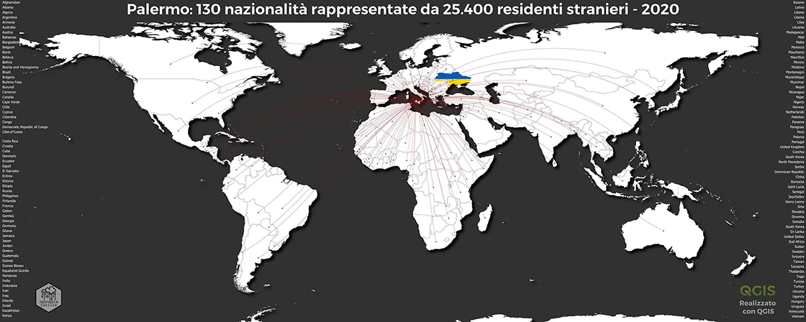
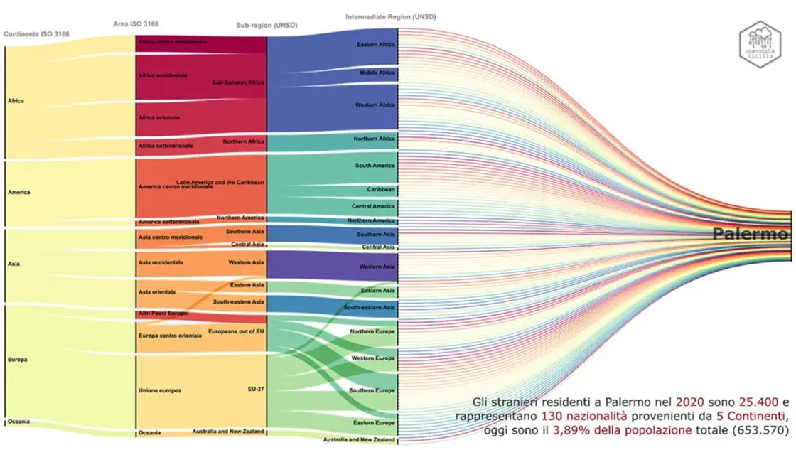
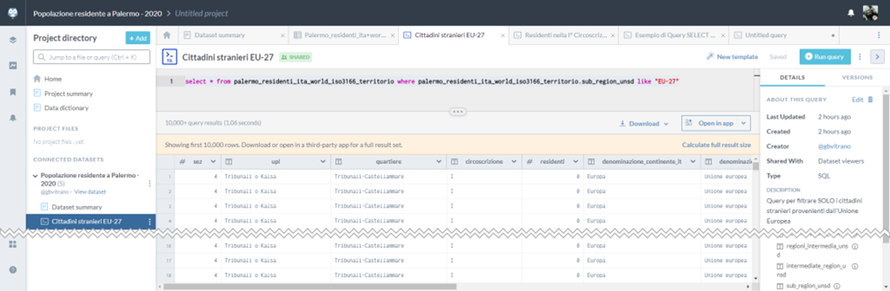
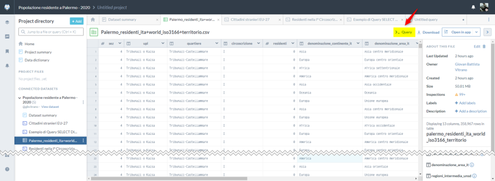
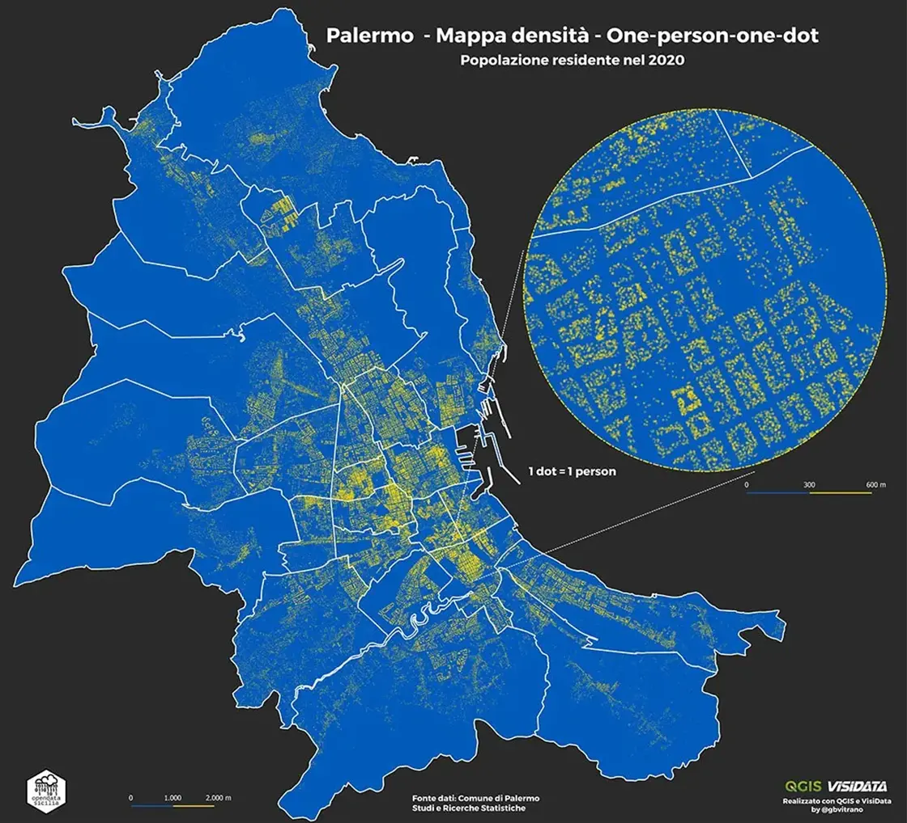
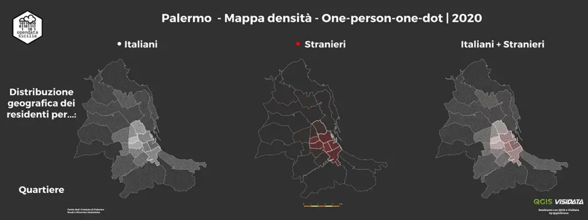

[{class="crop gray off" align=left}](index.md) 

Grazie al Dr. Girolamo D’Anneo, responsabile U.O. Studi e Ricerche Statistiche e Ciro Spataro responsabile U.O. Transizione al Digitale, entrambi funzionari del [Comune di Palermo](https://www.comune.palermo.it/), sono stati pubblicati i **[dataset](https://opendata.comune.palermo.it/opendata-dataset.php?dataset=1304)** relativi alla popolazione residente, italiana e straniera del 2020.

Dal [portale opendata](https://opendata.comune.palermo.it/index.php) del [Comune di Palermo](https://www.comune.palermo.it/) si può scaricare un file **[zip](https://opendata.comune.palermo.it/opendata-dataset.php?dataset=1304)**, con i dataset sui residenti stranieri a Palermo nel 2020 con licenza [CC BY 4.0 IT](http://creativecommons.org/licenses/by/4.0/deed.it). Il file **[zip](https://opendata.comune.palermo.it/opendata-dataset.php?dataset=1304)** contiene 14 file [csv](https://it.wikipedia.org/wiki/Comma-separated_values) con <!-- more -->i dati sui residenti stranieri (1\_2020.csv, 2\_2020.csv, ecc…) e un file formato [xlsx](https://it.wikipedia.org/wiki/Microsoft_Excel) dove vengono descritti i dataset.

La differenza principale con i dataset utilizzati nell’esercizio del [2018](https://opendatasicilia.it/2019/06/12/palermo-popolazione-residente-per-cittadinanza-upl-quartiere-e-circoscrizione-2018/) è _identificatore geografico_ (blocco/poligono) a cui i dati fanno riferimento. Nel 2018 erano i poligoni delle **UPL** (Unità di primo livello), adesso sono le **Sezioni di censimento** dell’ISTAT, che si traduce in un dettaglio maggiore dei dati.

Non era mia intenzione replicare la mappa e i dataviz fatti nel 2018, ma vista la novità la tentazione è stata forte 🙂

{ .off-glb }

### Da dove vengono gli stranieri che vivono a Palermo?
L’analisi dei dati per _Paese di provenienza_ rileva la presenza di **25.400** residenti stranieri,  provenienti da 5 [Continenti](https://it.wikipedia.org/wiki/Continente), e rappresentano **130** [Nazionalità](https://it.wikipedia.org/wiki/Geoschema_delle_Nazioni_Unite#Asia_occidentale_(Western_Asia)). Oggi sono il **3,89%** della popolazione totale (653.570) e lo 0.7% del totale nazionale, dato che colloca Palermo in **decima posizione** tra le 14 Città metropolitane per numero di residenti stranieri regolari.

{ .off-glb }

## Come è fatto?
Vista l’esperienza fatta con l’esercizio del [2018](https://opendatasicilia.it/2019/06/12/palermo-popolazione-residente-per-cittadinanza-upl-quartiere-e-circoscrizione-2018/) e seguendo i consigli di [@aborruso](https://twitter.com/aborruso) e [@totòfiandaca](https://twitter.com/totofiandaca), rispondere alla domande è stato semplice.

Per mettere ordine tra gli appunti e le tecniche utilizzate per analizzare e strutturare i dati, invece di usare il classico quaderno _Moleskine_, ho realizzato un mini sito **[Palermo Melting Pot | 2020](https://opendatasicilia.github.io/palermomeltingpot/)** con [Material for MkDocs ](https://squidfunk.github.io/mkdocs-material/)e condiviso il tutto sul repository [Github di opendatasicilia.](https://github.com/opendatasicilia/palermomeltingpot)

Nel [sito](https://opendatasicilia.github.io/palermomeltingpot/), oltre alle elaborazioni, (mappe e dataviz) c’è una **[sezione](https://opendatasicilia.github.io/palermomeltingpot/dati/dati/)** dove descrivo il lavoro e la tecnica utilizzata con alcuni [software ](https://opendatasicilia.github.io/palermomeltingpot/strumenti/)per rielaborare/trasformare il dataset inziale. Prima di realizzare mappe e grafici è fondamentale strutturare bene i dati.

{ .off-glb }

Non sono un analista di dati, ma imparare ad usare strumenti semplici come **[Visidata](https://www.visidata.org/)** per fare le _join o modificare la struttura delle tabelle_ o fare _query_ con **[Data.Worls](https://data.world/gbvitrano/popolazione-residente-a-palermo-2020)** è stato utilissimo per giocare con le mappe e i dataviz.

{ .off-glb }

{ .off-glb }

## Data.World
Il dataset rielaborato è stato condiviso su **[Data.World](https://data.world/gbvitrano/popolazione-residente-a-palermo-2020)** | **[Popolazione residente a Palermo – 2020](https://data.world/gbvitrano/popolazione-residente-a-palermo-2020)** questa volta ho soltanto condiviso la tabella base, con il _[query editor](https://opendatasicilia.github.io/palermomeltingpot/dati/query/)_  è possibile interrogare tutti i dataset pubblicati su data.world e metterli anche in correlazione tra loro.

[{ .off-glb }](https://data.world/gbvitrano/popolazione-residente-a-palermo-2020)

## One-Person-One-Dot
La mappa a densità di punti è una delle tante analisi che si possono fare con i dataset sulla popolazione.

La mappa mostra  una chiara visualizzazione della distribuzione geografica della densità di popolazione, 653.570 punti uno per ogni persona che risiede a Palermo, la geolocalizzazione dei punti **non rappresenta l’indirizzo reale**.

Sul sito **[Palermo Melting Pot | 2020](https://opendatasicilia.github.io/palermomeltingpot/)** è possibile visualizzare/scaricare altre mappe densità per Sub-Regione (Area geopolitica) di provenienza delle persone e per parte di territorio. (Circoscrizioni, Quartieri, UPL, ecc…)

{ .off-glb }

Palermo, popolazione residente nel 2020 – Distribuzione geografica per quartiere

Altro esempio di mappa a densità, _Distribuzione geografica per quartiere_ di residenti italiani e stranieri

{ .off-glb }

Dalle mappe emerge che nel centro storico (quartieri **Palazzo Reale** 2.843– **Monte di Pietà** e **Tribunali** 2.151) c’è la maggior presenza di residenti stranieri con 4.994 residenti pari al 19.62% , seguono i quartieri di:

* Oreto Stazione 4.261 residenti – 16.75%;
* Politeama 3.556 residenti – 13.98%;
* Zisa 2.511 residenti – 9.87%;
* Noce 2.226 residenti – 8.75%;
* Libertà 1.505 residenti – 5.91%.

che da soli ospitano **19.053** residenti, pari al **74.87%** del totale dei residenti (25.400)

## PalermoHub
Con i dati ricavati usando **[QGIS](https://www.qgis.org/it/site/)** e **[Visidata](https://www.visidata.org/),** oltre alla mappe statiche (immagini) ho elaborato una **[mappa dinamica](https://palermohub.opendatasicilia.it/stranieri_residenti_subregions_dot_2020.html)**, usando il servizio gratuito di  [CartoDb](https://carto.com/) e il plugin [Leaflet](https://leafletjs.com/).

<iframe src="https://palermohub.opendatasicilia.it/stranieri_residenti_subregions_dot_2020_mkdocs.html" width="100%" height="800" frameborder="0" allowfullscreen="allowfullscreen"></iframe>

La mappa è stata inserita nel contenitore di mappe di [opendatasicilia.it](https://opendatasicilia.it/), [PalermoHub](https://palermohub.opendatasicilia.it/stranieri_residenti_subregions_dot_2020.html)

## Ringraziamenti

* [Andrea Borruso](https://twitter.com/aborruso)
* [Salvatore Fiandaca](https://twitter.com/totofiandaca)

**Disclaimer:** Le informazioni visibili e condivise non comportano la visualizzazione di dati sensibili. Data la natura esclusivamente informativa degli elaborati grafici e dei testi riportati, questi non costituiscono atti ufficiali. Per accedere agli atti ufficiali si rinvia agli elaborati definitivi allegati alle specifiche deliberazioni.