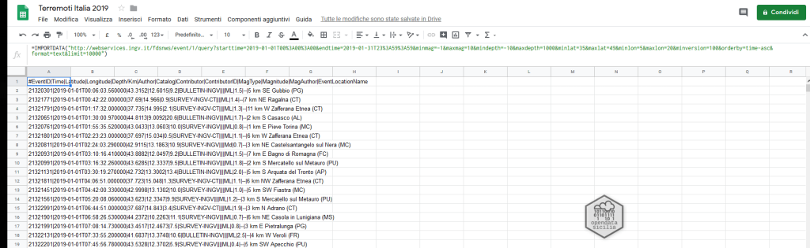

<style>
.md-typeset code { background-color: #fff0;}  
.md-typeset pre>code { background-color: #fff0;} 
</style>
[{class="crop gray" align=left}](index.md)

## La raccolta dei dati
Dopo il terremoto del [26 Dicembre 2018 a Catania](https://www.repubblica.it/cronaca/2018/12/26/news/paura_nella_notte_a_catania_forte_scossa_di_terremoto_magnitudo_4_8-215132862/) mi è venuto in mente di realizzare una [Mappa](http://u.osmfr.org/m/278617/) per monitorare gli eventi sismici giornalieri/mensili [earthquakes today] in Italia durante il 2019, in rete ho trovato molte mappe sia statiche che dinamiche, tutte ben fatte, come ad esempio la mappa dell’[INGV sui terremoti del 2018](https://ingv.maps.arcgis.com/apps/webappviewer/index.html?id=e1dc92fce0424c668c1d2ed95c02def2), ma poco _user friendly_ dal mio punto di vista.<!-- more --> Mi sono chiesto…perchè non provare a realizzare una mappa dinamica di facile utilizzo, (riutilizzando i dati resi disponibili da [IGNV – Centro Nazionale Terremoti](https://ingvterremoti.wordpress.com/)) dove è  semplice estrarre informazioni sugli eventi ad un determita ora/giorno/mese, luogo o magnitudo anche per i non addetti ai lavori…? 

Con l’aiuto di [Andrea Borruso](https://twitter.com/aborruso) e [studiando la documentazione](https://coseerobe.gbvitrano.it/mappa-terremoti-italia-2019.html) dell’[INGV CNT FDSNWS event Web Service Documentation](http://webservices.ingv.it/swagger-ui/dist/?url=http://webservices.ingv.it/fdsnws/event/1/swagger.yml) come descritto in questo breve [post](https://coseerobe.gbvitrano.it/mappa-terremoti-italia-2019.html) e usando semplicemnte Google Sheets abbiamo ottenuto i datset mensili degli eventi del 2019.

Anche se il file csv ottenuto dalla query:

```
http://webservices.ingv.it/fdsnws/event/1/query?starttime=2019-01-01T00%3A00%3A00&endtime=2019-01-31T23%3A59%3A59&minmag=-1&maxmag=10&mindepth=-10&maxdepth=1000&minlat=35&maxlat=49&minlon=5&maxlon=20&minversion=100&orderby=time-asc&format=text&limit=10000
```
_(esempio di query per gennaio 2019)_ è un csv anomalo, in quanto il separatore non è la classica _**virgola**_ [**,**] ma il _**pipe**_ [**|**] con un barbatrucco siamo stati in grado di far caricare velocemente ed automaticamente i dati a Google Sheets.

{.off-glb style="display: block; margin: 0 auto" }

IMPORTDATA(“url”) senza barbatrucco

{.off-glb style="display: block; margin: 0 auto" }

IMPORTDATA(“url”) con barbatrucco, per maggiori dettagli vi invito a leggere questo [post su tansignari](http://tansignari.opendatasicilia.it/it/latest/ricette/csv/semicoln_googlesheets.html).

Infine utilizzando [QGIS](https://www.qgis.org/it/site/) e  i [confini delle unità amministrative a fini statistici al 1 gennaio 2019](https://www.istat.it/it/archivio/222527) dell’ISTAT sono stati aggiunti le regioni e le province al dataset dell’INGV.

<hr>

## Le mappe dinamiche
Ricavati i dataset, quale applicazione/i usare per rappresentare i dati in modo semplice, veloce e dinamico i dati?

Ci sono molte applicazioni in grado di realizzare mappe e viz dinamici funzionali e gradevoli, in questo caso abbiamo scelto [flourish.studio](https://public.flourish.studio/) per ottenere mappe e grafici a scorrimento temporale e [public.tableau.com](https://public.tableau.com/) per realizzare viz interrogabili.

<hr>

## Flourish
Con Flourish sono state realizzate singolarmente le mappe e grafici a scorrimento temporale e poi assemblate in unica presentazione.

La mappa della prima slide mostra gli eventi in sequenza temporale durante i mesi dell’anno, per ottenere le informazioni sull’evento basta bloccare l’animazione e cliccare sull’evento o sulla legenda in alto a sinistra.

<div class="flourish-embed" data-src="story/164335"><script src="https://public.flourish.studio/resources/embed.js"></script></div>

<hr>

## Tableau
Usando lo stesso dataset con [Tableau](https://public.tableau.com/views/ItaliaEarthquake2019/Earthquake2019?:display_count=y&publish=yes&:toolbar=n&:origin=viz_share_link) abbiamo ottenuto una rapprensetazione diversa, non più basata sullo scorrimento temporale, (_meno effetto wow_) ma  più semplice da interrogare, usando i potenti filtri  di [Tableau](https://public.tableau.com/views/ItaliaEarthquake2019/Earthquake2019?:display_count=y&publish=yes&:toolbar=n&:origin=viz_share_link)  possiamo estrarre velocemente tutte le info su uno o più eventi sismici.

<div class='tableauPlaceholder' id='viz1697012537980' style='position: relative'><noscript><a href='#'></a></noscript><object class='tableauViz'  style='display:none;'><param name='host_url' value='https%3A%2F%2Fpublic.tableau.com%2F' /> <param name='embed_code_version' value='3' /> <param name='site_root' value='' /><param name='name' value='MappaEarthquakeItalia2019-bis&#47;Earthquake2019' /><param name='tabs' value='no' /><param name='toolbar' value='yes' /><param name='static_image' value='https:&#47;&#47;public.tableau.com&#47;static&#47;images&#47;Ma&#47;MappaEarthquakeItalia2019-bis&#47;Earthquake2019&#47;1.png' /> <param name='animate_transition' value='yes' /><param name='display_static_image' value='yes' /><param name='display_spinner' value='yes' /><param name='display_overlay' value='yes' /><param name='display_count' value='yes' /><param name='language' value='it-IT' /><param name='filter' value='publish=yes' /></object></div>                <script type='text/javascript'>                    var divElement = document.getElementById('viz1697012537980');                    var vizElement = divElement.getElementsByTagName('object')[0];                    if ( divElement.offsetWidth > 800 ) { vizElement.style.width='1120px';vizElement.style.height='2227px';} else if ( divElement.offsetWidth > 500 ) { vizElement.style.width='1120px';vizElement.style.height='2227px';} else { vizElement.style.width='100%';vizElement.style.height='2127px';}                     var scriptElement = document.createElement('script');                    scriptElement.src = 'https://public.tableau.com/javascripts/api/viz_v1.js';                    vizElement.parentNode.insertBefore(scriptElement, vizElement);                </script>

 <p Style="color: #ff0000; text-align: center; font-weight: 700; ">Viz Tableau | <a href="https://public.tableau.com/views/MappaEarthquakeItalia2019-bis/Earthquake2019?:language=it-IT&publish=yes&:display_count=n&:origin=viz_share_link" target="_blank" Title="Clicca qui per aprire il viz a schermo intero">Mappa Earthquake Italia 2019
</a></p> 

<hr>

## Conclusioni
Sicuramente le mappe ed i viz da me realizzati non sono un’analisi sugli eventi sismici avventuti in Italia nel 2019, ma sono un semplice esercizio per raccontare i dati in modo semplice anche per i non addetti ai lavori…e non è detto che sia corretto 🙂

<hr>

### Ringrazziamenti

* [Andrea Borruso](https://twitter.com/aborruso)
* [Salvatore Fiandaca](https://twitter.com/totofiandaca)
* [INGV](http://www.ingv.it/it/) per la divulgazione e la condivisione dei dati

<hr>

**Licenza:** I dati e i risultati pubblicati nelle mappe sono distribuiti [dall’Istituto Nazionale di Geofisica e Vulcanologia](http://www.ingv.it/) sotto licenza [Creative Commons Attribution 4.0 International License](http://creativecommons.org/licenses/by/4.0/). Il Gruppo di Lavoro ISIDe presso [Centro Nazionale Terremoti](https://ingvterremoti.wordpress.com/) ha beneficiato del contributo finanziario della Presidenza del Consiglio dei Ministri, [Dipartimento della Protezione Civile](http://www.protezionecivile.gov.it/).

<hr>
**Disclaimer:** Le informazioni visibili e condivise non comportano la visualizzazione di dati sensibili. Data la natura esclusivamente informativa degli elaborati grafici e dei testi riportati, questi non costituiscono atti ufficiali. Per accedere agli atti ufficiali si rinvia agli elaborati definitivi allegati alle specifiche deliberazioni.