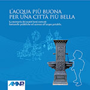

[{class="crop gray" align=right}](index.md)
Palermo, mappa delle fontane e fontanelle pubbliche di aqcua potabile vicono casa. Si potrà fare approvvigionamento di acqua potabile e frenare il consumo di plastica. Un piccolo gesto per la difesa dell'ambiente. **#PalermoPlasticFree**  

**Fonte dati:** [Comune di Palermo](https://opendata.comune.palermo.it/index.php) – [Ambiente](https://opendata.comune.palermo.it/opendata-archivio-dataset.php) – [Dataset della dislocazione delle fontanelle per acqua potabile (AMAP)](https://opendata.comune.palermo.it/opendata-dataset.php?dataset=1249).  
[Amap – Le Fontanelle di Palermo](https://www.amapspa.it/it/azienda/le-fontanelle-di-palermo/9) – [Brochure](https://www.amapspa.it/wp-content/uploads/2019/07/Libro_Fontane_AMAP.pdf) sulle Fontanelle realizzata da [AMAPSPA](https://www.amapspa.it/).<!-- more -->

**Licenza [CC BY-SA 4.0](https://creativecommons.org/licenses/by-sa/4.0/deed.it)** – Attribuzione – Condividi allo stesso modo 4.0 Internazionale (CC BY-SA 4.0).

## Geolocalizzazione semplice con umap
<iframe width="100%" height="600px" frameborder="0" allowfullscreen allow="geolocation" src="//umap.openstreetmap.fr/it/map/fontanelle-acqua-potabile-comune-di-palermo-2019_357965?scaleControl=false&miniMap=false&scrollWheelZoom=false&zoomControl=true&editMode=disabled&moreControl=true&searchControl=null&tilelayersControl=null&embedControl=null&datalayersControl=true&onLoadPanel=undefined&captionBar=false&captionMenus=true"></iframe>
<a href="//umap.openstreetmap.fr/it/map/fontanelle-acqua-potabile-comune-di-palermo-2019_357965?scaleControl=false&miniMap=false&scrollWheelZoom=true&zoomControl=true&editMode=disabled&moreControl=true&searchControl=null&tilelayersControl=null&embedControl=null&datalayersControl=true&onLoadPanel=undefined&captionBar=false&captionMenus=true">Visualizza a schermo intero</a>

**Mappa:** [#uMap](http://u.osmfr.org/m/357965/) [#PalermoHub](http://palermohub.opendatasicilia.it/fontanelle_pa.html) 

[{.off-glb align=left}](https://www.amapspa.it/wp-content/uploads/2019/07/Libro_Fontane_AMAP.pdf)    
[Amap – Le Fontanelle di Palermo](https://www.amapspa.it/it/azienda/le-fontanelle-di-palermo/9) [– ](https://www.amapspa.it/wp-content/uploads/2019/07/Libro_Fontane_AMAP.pdf)[Brochure](https://www.amapspa.it/wp-content/uploads/2019/07/Libro_Fontane_AMAP.pdf) [sulle Fontanelle realizzata da ](https://www.amapspa.it/wp-content/uploads/2019/07/Libro_Fontane_AMAP.pdf)[AMAPSPA](https://www.amapspa.it/)[.](https://www.amapspa.it/wp-content/uploads/2019/07/Libro_Fontane_AMAP.pdf)
  

 
# Il Progetto
## [Le fontanelle dell'acqua potabile! SONO VICINE, USALE](https://fontanelle.ondata.it/#team)

### Dati
Questo è un progetto che senza dati riutilizzabili sarebbe stato irrealizzabile. 
Li abbiamo semplicemente chiesti.  

[{.off-glb style="display: block; margin: 0 auto" }](http://fontanellepalermo.opendatasicilia.it/presentazione/#/0/3) 
**150** Fontanelle distribuite nelle **8** Circoscrizioni 
Per alcune bastano 5 minuti a piedi, se ti piace camminare, in 10 minuti sono ancora di più da tutta la città e almeno una in auto in 5 minuti

### Analisi
**"Le fontanelle sono lontane!".**
Abbiamo realizzata **[la mappa](https://fontanelle.ondata.it/mappa/)** delle aree da cui si raggiungono a piedi in **5 minuti** (no scuse).

<iframe width="100%" height="700px" frameborder="0" allowfullscreen allow="geolocation" src="https://fontanelle.ondata.it/mappa/#13/38.1375/13.3475"></iframe>

<a href="https://fontanelle.ondata.it/mappa/#13/38.1375/13.3475">Visualizza a schermo intero</a>

### L'impatto
Cambiare abitudini - ** "non bere più plastica" ** - è semplice. Farlo ha un impatto enorme che è possibile misurare.

{data-gallery="Gallery" class="resized33" }
{data-gallery="Gallery" class="resized33" }
{data-gallery="Gallery" class="resized33" }
{data-gallery="Gallery" class="resized33" }
{data-gallery="Gallery" class="resized33" }
{data-gallery="Gallery" class="resized33" }
{data-gallery="Gallery" class="resized33" }
{data-gallery="Gallery" class="resized33" }
{data-gallery="Gallery" class="resized33" }

**Disclaimer:** Le informazioni visibili e condivise non comportano la visualizzazione di dati sensibili. Data la natura esclusivamente informativa degli elaborati grafici e dei testi riportati, questi non costituiscono atti ufficiali. Per accedere agli atti ufficiali si rinvia agli elaborati definitivi allegati alle specifiche deliberazioni.