
[{class="crop gray"}](index.md) 

Non è la prima volta che OpenDataSicilia affronta il tema degli incendi boschivi, nel 2016 è stato affrontato da [Giuseppe Ragusa](https://twitter.com/giuragu) con “**_[Dati alle Fiamme](http://datiallefiamme.it/)_**“, l’anno successivo nel 2017 durante un’altra stagione calda per gli incendi, il tema è stato ripreso con gli amici di “**_Italia a Fuoco_**” e anche con l’ausilio dei dati [EFFIS – European Forest Fire Information System](http://effis.jrc.ec.europa.eu/applications/fire-news/) furono elaborate mappe e grafici (vedi [palermohub.opendatasicilia.it](https://palermohub.opendatasicilia.it/))
<!-- more -->
## Comuni inadempienti
Oggi lo riproponiamo perché pochi giorni fa la [Regione Siciliana](https://www.regione.sicilia.it/istituzioni/servizi-informativi/decreti-e-direttive/n-357serv-3-9082023) con **D. A. n.357/Sev. 3 del 09/08/2023** ha nominato i Commissari ad Acta per il catasto delle aree bruciate nei **147** Comuni _inadempienti_ (qui il **[nostro post](https://opendatasicilia.it/2023/08/10/catasto-delle-terre-bruciate/)**)
### La Normativa

A livello nazionale, il **catasto** **dei soprassuoli percorsi dal fuoco** è stato introdotto dalla [legge n. 353 del 2000](https://www.normattiva.it/uri-res/N2Ls?urn:nir:stato:legge:2000;353) definisce divieti, prescrizioni e sanzioni sulle zone boschive e sui pascoli i cui soprassuoli siano stati percorsi dal fuoco prevedendo la possibilità da parte dei comuni di apporre, a seconda dei casi, vincoli di diversa natura sulle zone interessate.

In particolare la legge stabilisce **vincoli temporali che regolano l’utilizzo dell’area interessata ad incendio**: un vincolo quindicennale, un vincolo decennale ed un ulteriore vincolo di cinque anni. Innanzitutto le zone boschive ed i pascoli i cui soprassuoli siano stati percorsi dal fuoco non possono avere una destinazione diversa da quella preesistente all’incendio per almeno quindici anni (vincolo quindicennale), è comunque consentita la costruzione di opere pubbliche necessarie alla salvaguardia della pubblica incolumità e dell’ambiente.

Inoltre, sulle zone boschive e sui pascoli i cui soprassuoli siano stati percorsi dal fuoco, è vietata per dieci anni la realizzazione di edifici nonché di strutture e infrastrutture finalizzate ad insediamenti civili ed attività produttive, fatti salvi i casi in cui per detta realizzazione sia stata già rilasciata, in data precedente l’incendio e sulla base degli strumenti urbanistici vigenti a tale data, la relativa autorizzazione o concessione.

Infine sono vietate per cinque anni, sui predetti soprassuoli, le attività di rimboschimento e di ingegneria ambientale sostenute con risorse finanziarie pubbliche, salvo specifica autorizzazione concessa dal Ministro dell’Ambiente e della Tutela del Territorio, per le aree naturali protette statali, o dalla regione competente, negli altri casi, per documentate situazioni di dissesto idrogeologico e nelle situazioni in cui sia urgente un intervento per la tutela di particolari valori ambientali e paesaggistici.

La procedura amministrativa delineata dalla Legge prevede che **una volta individuate le particelle catastali interessate dagli incendi**, venga prodotto un elenco delle stesse che verrà affisso all’Albo Pretorio del Comune per 30 giorni, durante tale periodo è prevista la possibilità, per i cittadini interessati, di presentare ricorso contro l’apposizione del vincolo. Trascorso tale periodo senza che non siano state sollevate obiezioni, il vincolo risulta attivo a tutti gli effetti.

Per **l’apposizione dei suddetti vincoli la legge stabilisce che i Comuni provvedano al censimento, tramite apposito catasto**, dei soprassuoli già percorsi dal fuoco potendosi avvalere dei rilievi effettuati dal **Comando del Corpo Forestale**.

Il censimento e l’aggiornamento del catasto sono compiti dei Comuni e le Regioni hanno potere sostitutivo nel caso in cui l’obbligo non venga rispettato.

**In Sicilia la materia è regolata dalla [legge regionale n. 13 del 2022](http://www.gurs.regione.sicilia.it/Gazzette/g22-24/g22-24.pdf), emanata dopo i gravi incendi del 2021, che prevede la nomina di commissari regionali in caso di inadempienza.**

## Sistema Informativo Forestale
Il [SIF (Sistema Informativo Forestale)](https://sif.regione.sicilia.it/ilportale/progetto-sif) della Regione Siciliana è un sistema costituito da una serie di banche dati del settore forestale (a volte importate e adattate da fonti primarie gestite da altri Enti), pensate per garantire l’accesso alle informazioni ambientali per un’amministrazione del territorio corretta e trasparente e per condividere tutte le informazioni, anche per l’analisi e la prevenzione delle emergenze.

Per eseguire i nostri _test_ e _analisi_ abbiamo utilizzato il **servizio** **di supporto alle istituzioni,** con gli strati informativi sul **catasto delle aree boscate percorse dal fuoco**, che offre i perimetri degli [incendi censiti dal 2010 al 2022](https://sifweb.regione.sicilia.it/portalsif/apps/webappviewer/index.html?id=5d6a5d41a8134a9092f20d9566bd07dd)  dal _Comando del Corpo Forestale_ e il relativo [Catasto](https://sifweb.regione.sicilia.it/portalsif/apps/webappviewer/index.html?id=02da7ecfecc84a0c9ea38fc2ac85e4d4) [AGEA](https://sifweb.regione.sicilia.it/portalsif/home/webmap/viewer.html?layers=64778578dad141d0900682436f6379b4)

## Lo stato dell’arte
Dopo la notizia sul Commissariamento di **147** Comuni [legge n. 353 del 2000](https://www.normattiva.it/uri-res/N2Ls?urn:nir:stato:legge:2000;353), ci siamo chiesti, qual’é la reale situazione in Sicilia?

I Comuni siciliani sono **391**, visto che **147** sono stati commissariati, gli altri **244** sono tutti ottemperanti?

Ci sono Comuni che non sono stati coinvolti in incendi?

Quante sono le aree percorse dal fuoco?

Quante sono le aree vincolate dalla [legge n. 353 del 2000](https://www.normattiva.it/uri-res/N2Ls?urn:nir:stato:legge:2000;353)?

Quante sono le aree ancora non vincolate?

Analizzando i dati del [SIF (Sistema Informativo Forestale)](https://sif.regione.sicilia.it/ilportale/progetto-sif) abbiamo ottenuto le risposte

Oltre ai famosi **147** comuni **inadempienti** ci sono **221** comuni ottemperanti e con grande sorpresa abbiamo costatato che fino al 2022, **23** comuni che miracolosamente non sono stati coinvolti in incendi.

Ed infine in **12** comuni si sono verificati incendi ogni anno dal 2010 al 2022

Seguire riportiamo in sintesi le aree percorse dal fuoco vincolate e non, dal 2010 al 2022

<iframe title="Aree percorse dal fuoco soggette alla legge n. 353 del 2000 nei Comuni siciliani  - Tabella" aria-label="Tabella" id="datawrapper-chart-9kzOL" src="https://datawrapper.dwcdn.net/9kzOL/4/" scrolling="no" frameborder="0" style="width: 0; min-width: 100% !important; border: none;" height="181" data-external="1"></iframe>
 

<iframe title="Sicilia 2022 | Comuni in regola con la Legge n. 353 del 2000" aria-label="Mappa" id="datawrapper-chart-2VGK7" src="https://datawrapper.dwcdn.net/2VGK7/9/" scrolling="no" frameborder="0" style="width: 0; min-width: 100% !important; border: none;" height="573" data-external="1"></iframe>

<iframe title="Aree percorse dal fuoco soggette alla legge n. 353 del 2000 nei Comuni siciliani " aria-label="Grafici a colonne impilate" id="datawrapper-chart-hFVOQ" src="https://datawrapper.dwcdn.net/hFVOQ/9/" scrolling="no" frameborder="0" style="width: 0; min-width: 100% !important; border: none;" height="600" data-external="1"></iframe>

## Analisi con QGIS
Utilizzando i dati descritti sopra, con **[QGIS ](https://www.qgis.org/it/site/)** è stato realizzato un atlante che genera 391 pagine, una per ogni Comune. Per ogni pagina è presente la mappa del comune in cui sono visibili: i limiti amministrativi, le aree percorse dal fuoco, i centri abitati ed altri dati; nella stessa pagina sono visibili dei dati statistici e l'istogramma delle aree bruciate nell'arco temporale che va dal 2010 al 2022.

Le immagini che seguono mostrano i Comuni con la percentuale più alta di terre bruciate nelle varie province, censite dal [SIF (Sistema Informativo Forestale)](https://sif.regione.sicilia.it/ilportale/progetto-sif) 2010 a 2022

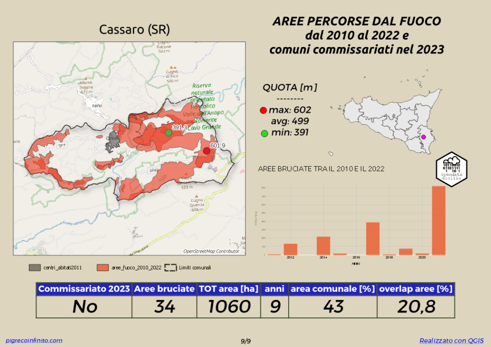{data-gallery="Gallery 01" data-description="Immagine realizzata con QGIS da Totò Fiandaca, base cartografica ISTAT e OpenstreetMap" class="resized33" }
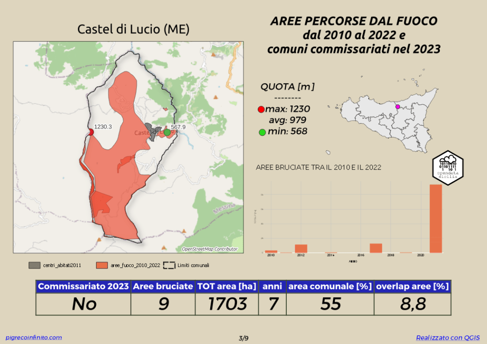{data-gallery="Gallery 01" data-description="Immagine realizzata con QGIS da Totò Fiandaca, base cartografica ISTAT e OpenstreetMap" class="resized33" }
{data-gallery="Gallery 01" data-description="Immagine realizzata con QGIS da Totò Fiandaca, base cartografica ISTAT e OpenstreetMap" class="resized33" }
{data-gallery="Gallery 01" data-description="Immagine realizzata con QGIS da Totò Fiandaca, base cartografica ISTAT e OpenstreetMap" class="resized33" }
{data-gallery="Gallery 01" data-description="Immagine realizzata con QGIS da Totò Fiandaca, base cartografica ISTAT e OpenstreetMap" class="resized33" }
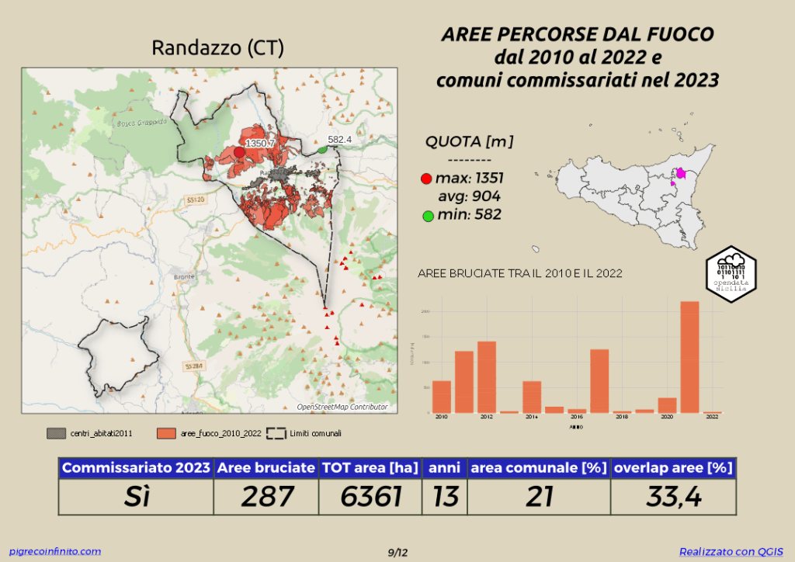{data-gallery="Gallery 01" data-description="Immagine realizzata con QGIS da Totò Fiandaca, base cartografica ISTAT e OpenstreetMap" class="resized33" }
{data-gallery="Gallery 01" data-description="Immagine realizzata con QGIS da Totò Fiandaca, base cartografica ISTAT e OpenstreetMap" class="resized33" }
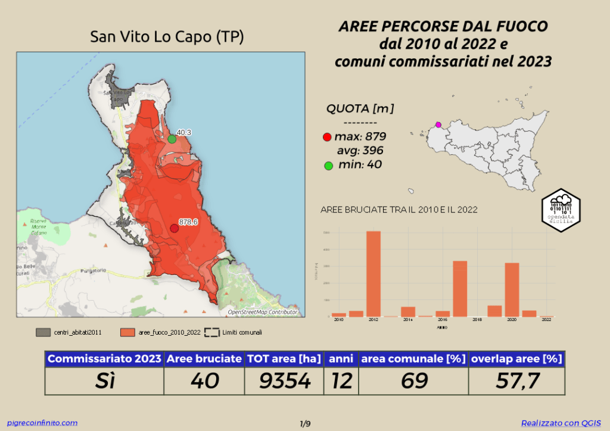{data-gallery="Gallery 01" data-description="Immagine realizzata con QGIS da Totò Fiandaca, base cartografica ISTAT e OpenstreetMap" class="resized33" }
{data-gallery="Gallery 01" data-description="Immagine realizzata con QGIS da Totò Fiandaca, base cartografica ISTAT e OpenstreetMap" class="resized33" }
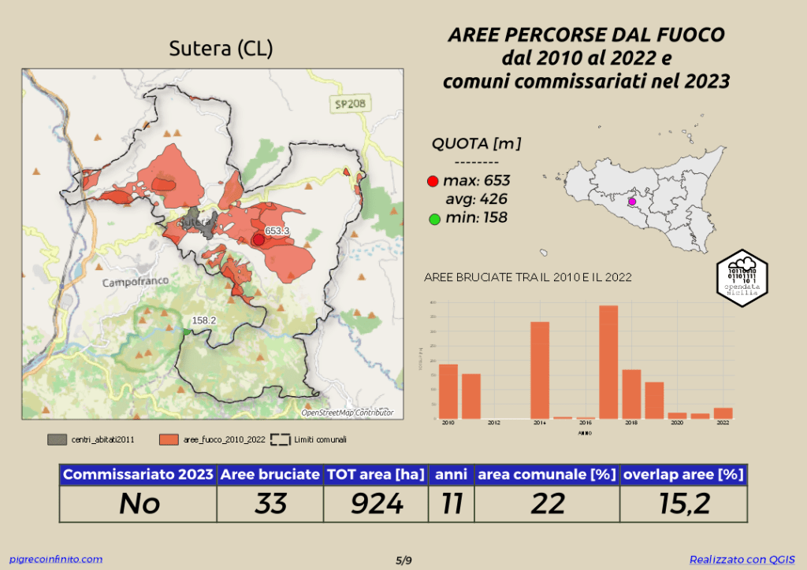{data-gallery="Gallery 01" data-description="Immagine realizzata con QGIS da Totò Fiandaca, base cartografica ISTAT e OpenstreetMap" class="resized33" }

dove:

- Commissariato 2023: indica se il comune corrente è stato commissariato nel 2023;

- Aree bruciate: indica il numero di aree bruciate dal 2010 al 2022;

- TOT area [ha]: indica la somma delle superfici bruciate dal 2010 al 2022;

- anni: indica il numero di anni in cui il comune corrente è stato percorso da incendi;

- area comunale [%]: indica la percentuale di superficie comunale (tolta l'area dei centri abitati) rispetto alla superficie delle aree bruciate nello stesso comune;

- overlap aree [%]: indica la percentuale di aree bruciate sovrapposte negli anni;

Altro esempio deducibile dall'atlante, i Comuni con massimo numero di incendi sia nel caso di Comune inadempiente che non:

* Monreale (PA) 412 aree bruciate in 13 anni dal 2010 al 2022
* Randazzo (CT) 287 aree bruciate in 13 anni dal 2010 al 2022 | Comune commissariato nel 2023

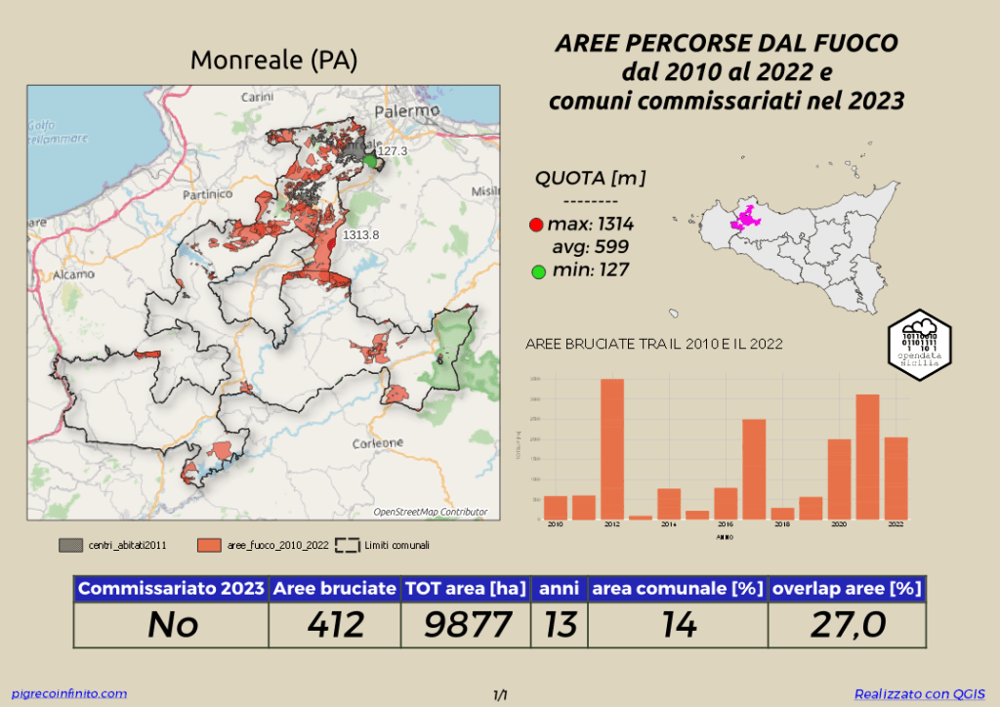{data-gallery="Gallery 04" data-description="Immagine realizzata con QGIS da Totò Fiandaca, base cartografica ISTAT e OpenstreetMap" class="resized50" }
{data-gallery="Gallery 04" data-description="Immagine realizzata con QGIS da Totò Fiandaca, base cartografica ISTAT e OpenstreetMap" class="resized50" }

Oppure, tutti i Comuni mai percorsi da incendi negli dal 2010 al 2022, sono 23:

{data-gallery="Gallery 03" data-description="Immagine realizzata con QGIS da Totò Fiandaca, base cartografica ISTAT e OpenstreetMap" class="resized33" }
{data-gallery="Gallery 03" data-description="Immagine realizzata con QGIS da Totò Fiandaca, base cartografica ISTAT e OpenstreetMap" class="resized33" }
{data-gallery="Gallery 03" data-description="Immagine realizzata con QGIS da Totò Fiandaca, base cartografica ISTAT e OpenstreetMap" class="resized33" }
{data-gallery="Gallery 03" data-description="Immagine realizzata con QGIS da Totò Fiandaca, base cartografica ISTAT e OpenstreetMap" class="resized33" }
{data-gallery="Gallery 03" data-description="Immagine realizzata con QGIS da Totò Fiandaca, base cartografica ISTAT e OpenstreetMap" class="resized33" }
{data-gallery="Gallery 03" data-description="Immagine realizzata con QGIS da Totò Fiandaca, base cartografica ISTAT e OpenstreetMap" class="resized33" }
{data-gallery="Gallery 03" data-description="Immagine realizzata con QGIS da Totò Fiandaca, base cartografica ISTAT e OpenstreetMap" class="resized33" }
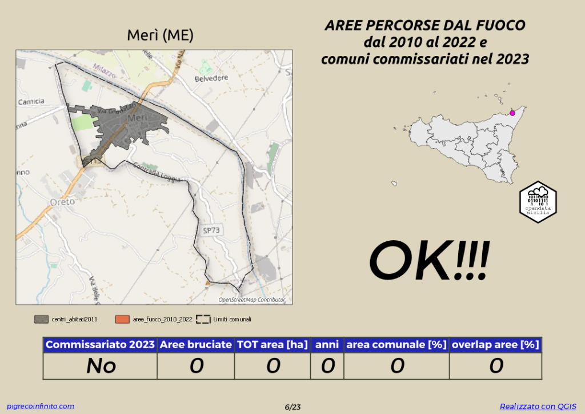{data-gallery="Gallery 03" data-description="Immagine realizzata con QGIS da Totò Fiandaca, base cartografica ISTAT e OpenstreetMap" class="resized33" }
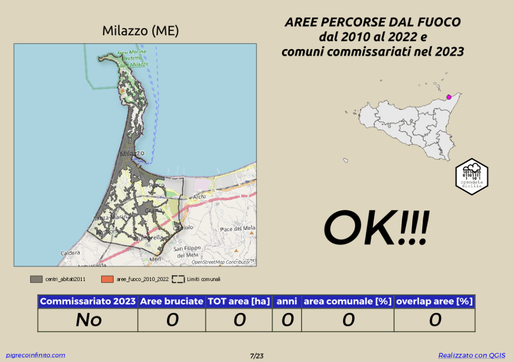{data-gallery="Gallery 03" data-description="Immagine realizzata con QGIS da Totò Fiandaca, base cartografica ISTAT e OpenstreetMap" class="resized33" }
{data-gallery="Gallery 03" data-description="Immagine realizzata con QGIS da Totò Fiandaca, base cartografica ISTAT e OpenstreetMap" class="resized33" }
{data-gallery="Gallery 03" data-description="Immagine realizzata con QGIS da Totò Fiandaca, base cartografica ISTAT e OpenstreetMap" class="resized33" }
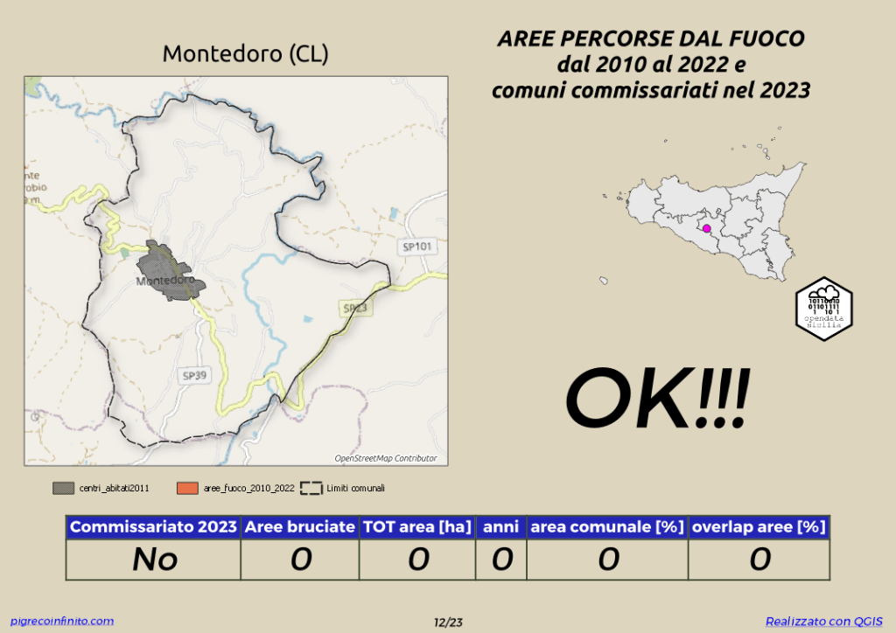{data-gallery="Gallery 03" data-description="Immagine realizzata con QGIS da Totò Fiandaca, base cartografica ISTAT e OpenstreetMap" class="resized33" }
{data-gallery="Gallery 03" data-description="Immagine realizzata con QGIS da Totò Fiandaca, base cartografica ISTAT e OpenstreetMap" class="resized33" }
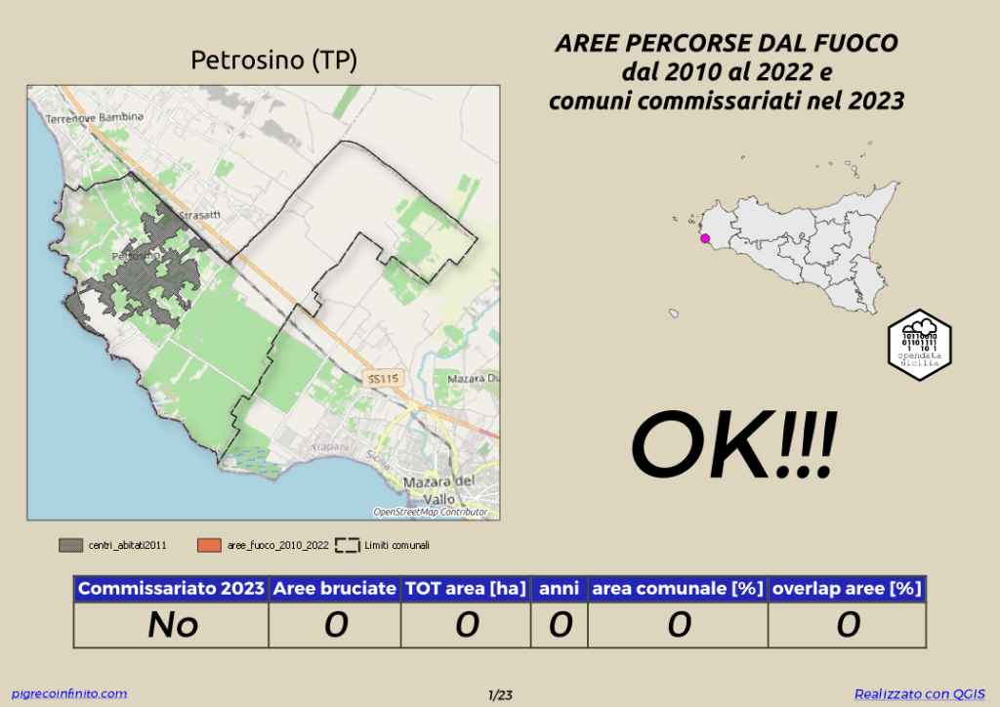{data-gallery="Gallery 03" data-description="Immagine realizzata con QGIS da Totò Fiandaca, base cartografica ISTAT e OpenstreetMap" class="resized33" }
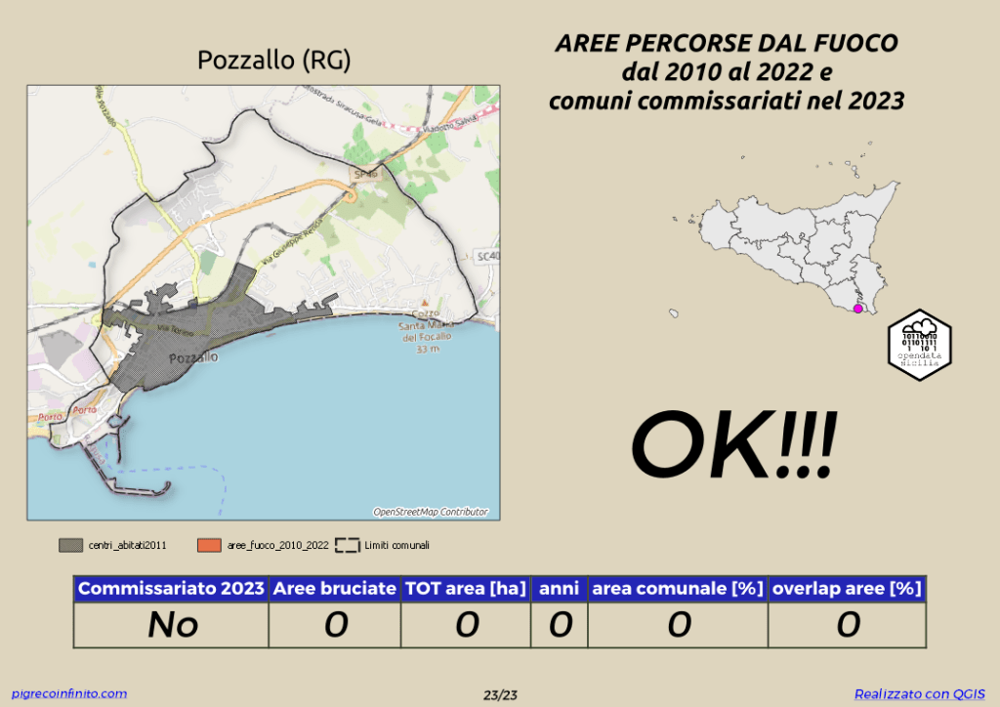{data-gallery="Gallery 03" data-description="Immagine realizzata con QGIS da Totò Fiandaca, base cartografica ISTAT e OpenstreetMap" class="resized33" }
{data-gallery="Gallery 03" data-description="Immagine realizzata con QGIS da Totò Fiandaca, base cartografica ISTAT e OpenstreetMap" class="resized33" }
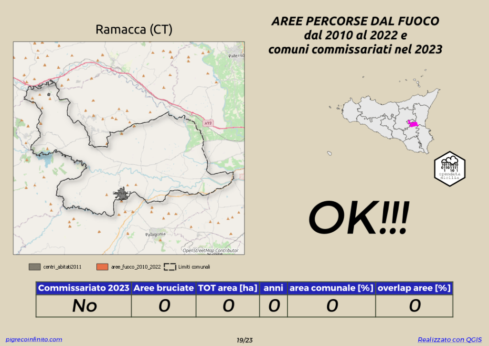{data-gallery="Gallery 03" data-description="Immagine realizzata con QGIS da Totò Fiandaca, base cartografica ISTAT e OpenstreetMap" class="resized33" }
{data-gallery="Gallery 03" data-description="Immagine realizzata con QGIS da Totò Fiandaca, base cartografica ISTAT e OpenstreetMap" class="resized33" }
{data-gallery="Gallery 03" data-description="Immagine realizzata con QGIS da Totò Fiandaca, base cartografica ISTAT e OpenstreetMap" class="resized33" }
{data-gallery="Gallery 03" data-description="Immagine realizzata con QGIS da Totò Fiandaca, base cartografica ISTAT e OpenstreetMap" class="resized33" }
{data-gallery="Gallery 03" data-description="Immagine realizzata con QGIS da Totò Fiandaca, base cartografica ISTAT e OpenstreetMap" class="resized33" }
{data-gallery="Gallery 03" data-description="Immagine realizzata con QGIS da Totò Fiandaca, base cartografica ISTAT e OpenstreetMap" class="resized50" }
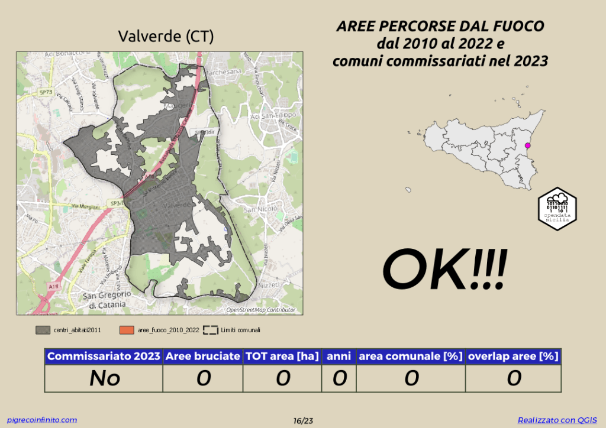{data-gallery="Gallery 03" data-description="Immagine realizzata con QGIS da Totò Fiandaca, base cartografica ISTAT e OpenstreetMap" class="resized50" }

Oppure i Comuni che hanno sempre subito incendi dal 2010 al 2022, sono 12:

{data-gallery="Gallery 02" data-description="Immagine realizzata con QGIS da Totò Fiandaca, base cartografica ISTAT e OpenstreetMap" class="resized33" }
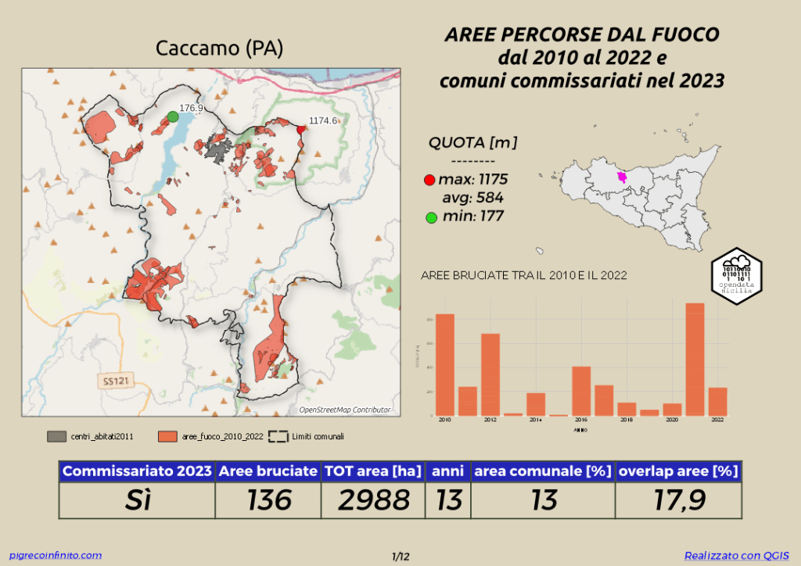{data-gallery="Gallery 02" data-description="Immagine realizzata con QGIS da Totò Fiandaca, base cartografica ISTAT e OpenstreetMap" class="resized33" }
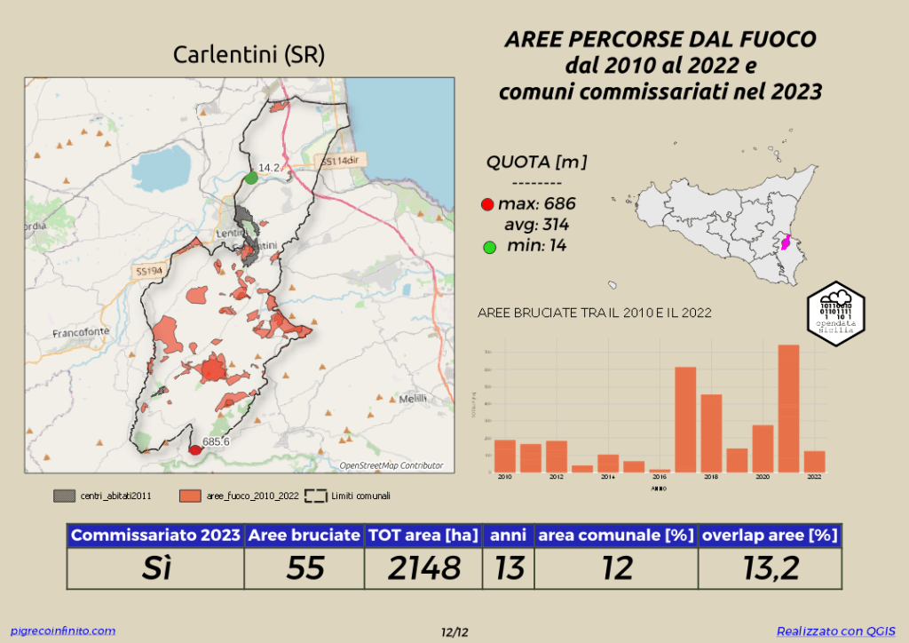{data-gallery="Gallery 02" data-description="Immagine realizzata con QGIS da Totò Fiandaca, base cartografica ISTAT e OpenstreetMap" class="resized33" }
{data-gallery="Gallery 02" data-description="Immagine realizzata con QGIS da Totò Fiandaca, base cartografica ISTAT e OpenstreetMap" class="resized33" }
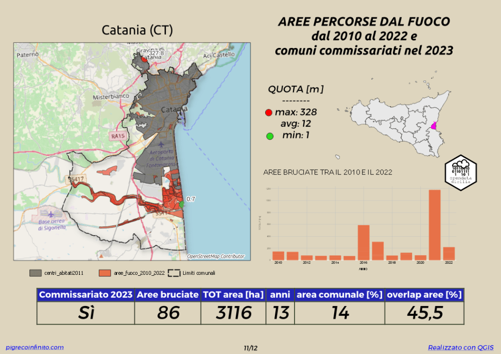{data-gallery="Gallery 02" data-description="Immagine realizzata con QGIS da Totò Fiandaca, base cartografica ISTAT e OpenstreetMap" class="resized33" }
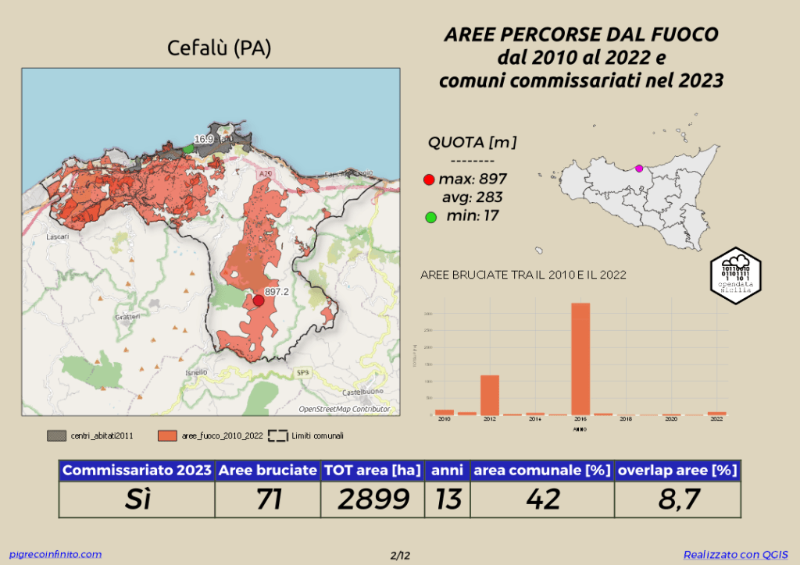{data-gallery="Gallery 02" data-description="Immagine realizzata con QGIS da Totò Fiandaca, base cartografica ISTAT e OpenstreetMap" class="resized33" }
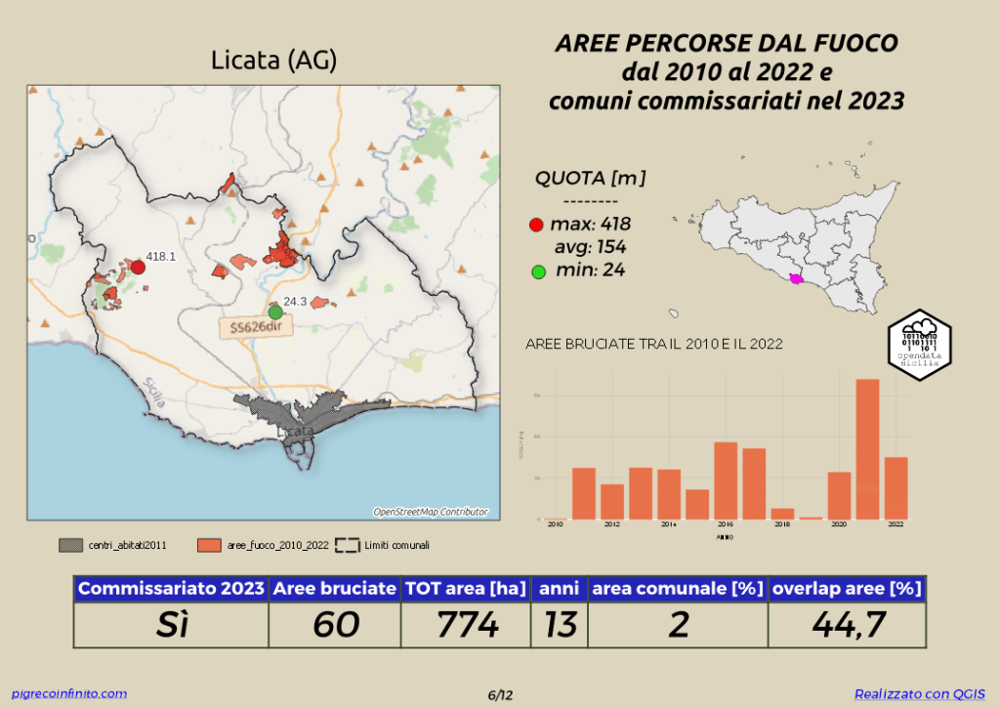{data-gallery="Gallery 02" data-description="Immagine realizzata con QGIS da Totò Fiandaca, base cartografica ISTAT e OpenstreetMap" class="resized33" }
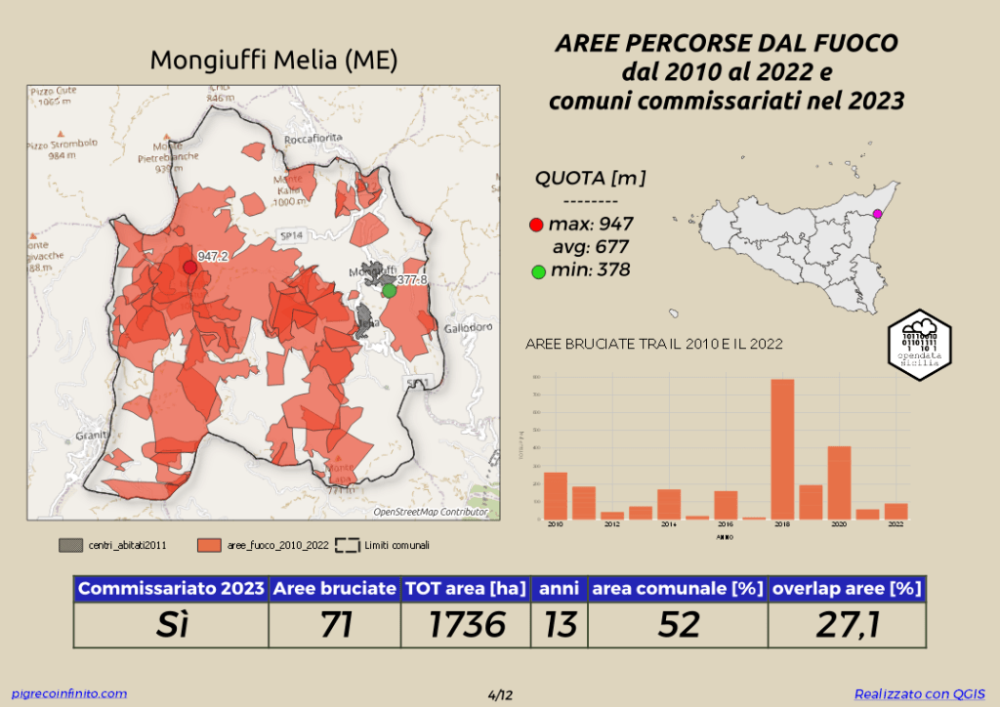{data-gallery="Gallery 02" data-description="Immagine realizzata con QGIS da Totò Fiandaca, base cartografica ISTAT e OpenstreetMap" class="resized33" }
{data-gallery="Gallery 02" data-description="Immagine realizzata con QGIS da Totò Fiandaca, base cartografica ISTAT e OpenstreetMap" class="resized33" }
{data-gallery="Gallery 02" data-description="Immagine realizzata con QGIS da Totò Fiandaca, base cartografica ISTAT e OpenstreetMap" class="resized33" }
{data-gallery="Gallery 02" data-description="Immagine realizzata con QGIS da Totò Fiandaca, base cartografica ISTAT e OpenstreetMap" class="resized33" }
{data-gallery="Gallery 02" data-description="Immagine realizzata con QGIS da Totò Fiandaca, base cartografica ISTAT e OpenstreetMap" class="resized33" }

Si potrebbero fare altre analisi, come per esempio quale è la fonte d'acqua più vicina per ogni area percorsa dal fuoco, sotto un rapido esempio:

dall'analisi si evince che l'area percorsa dall'incendio più distante da una fonte d'acqua dista 30 km e si trova nel Comune di Randazzo (CT), il comune commissariato nel 2023 con il numero massimo di aree incendiate.

L'analisi fatta con **[QGIS](https://www.qgis.org/it/site/)** da **[Totò Fiandaca](https://twitter.com/totofiandaca)** è disponibile su un repository **[github](https://github.com/pigreco/sicilia_brucia_2010_2022)**

Lo scopo principale di questo **[repository ](https://github.com/pigreco/sicilia_brucia_2010_2022)**è quello di dimostrare come è semplice realizzare delle analisi usando il compositore di stampe di QGIS, e in particolare il suo atlas (stampe in serie). Attraverso questo strumento è possibile creare un semplice layout di stampa e successivamente visualizzara/stampare 391 pagine una per ogni comune. I vari oggetti presenti nel template (mappa, panoramica, testo, grafico, tabella, ecc...) sono dinamici, ovvero, cambiano sfogliando l'atlante.

## Analisi visiva dei Comuni inadempienti con Tableau
Per provare a capire e quantificare quanta superfice percorsa dal fuoco dal 2010 al 2022 non è ancora soggetta alla [legge n. 353 del 2000](https://www.normattiva.it/uri-res/N2Ls?urn:nir:stato:legge:2000;353) e il lavoro che dovranno svolgere i Commissari, abbiamo realizzato una dashboard che mette in relazione gli incendi i comuni e gli stessi Commissari.

Utilizzando la banca dati sui censimenti degli incendi dal 2010 al 2022 gestita da [SIF (Sistema Informativo Forestale)](https://sif.regione.sicilia.it/ilportale/progetto-sif) abbiamo estratto solo le aree percorse dal fuoco all'interno dei confini amministrativi dei Comuni inadempienti.

La superficie percorsa dal fuoco in TUTTI i Comuni censiti fino al 2022 è circa 322.000 ha, e 41% circa ricade nei Comuni inadempienti, il ché significa che 132.627 ha di aree percorse dal fuoco non è soggetta a normativa specifica.

Le superficie percorsa dal fuoco nei Comuni inadempienti è stata calcolata prendendo in considerazione SOLO la superficie dell'incendio che ricade all'interno del limite amministrativo del Comune

Come si legge chiaramente dalle tavole in QGIS e dalla dashboard in molti Comuni nel corso degli anni gli incendi si sono verificati all'incirca nelle stesse aree.

Tra i comuni inadempienti, **Randazzo** in provincia di Catania è il comune dove si sono verificati più incendi nel corso degli anni (287) e **San Vito Lo Capo** in provincia di Trapani è il primo per superficie percorsa dal fuoco (93.352 ha)

<iframe title="Commissari Terre Bruciate" aria-label="Tabella" id="datawrapper-chart-kajzZ" src="https://datawrapper.dwcdn.net/kajzZ/2/" scrolling="no" frameborder="0" style="width: 0; min-width: 100% !important; border: none;" height="502" data-external="1"></iframe>

**Fonte dati**: [SIF (Sistema Informativo Forestale)](https://sif.regione.sicilia.it/ilportale/progetto-sif) - [Elenco dei 147 Comuni commissariati](https://www.regione.sicilia.it/istituzioni/servizi-informativi/decreti-e-direttive/n-357serv-3-9082023) è pubblicato sul sito istituzionale della Regione Siciliana ed è raggiungibile **[a questo link](https://www.regione.sicilia.it/istituzioni/servizi-informativi/decreti-e-direttive/n-357serv-3-9082023)**

## Catasto delle terre percorse dal fuoco
Il [SIF (Sistema Informativo Forestale)](https://sif.regione.sicilia.it/ilportale/progetto-sif) espone il catasto delle percorse dal fuoco sul portale [webgis](https://sifweb.regione.sicilia.it/portalsif/apps/webappviewer/index.html?id=02da7ecfecc84a0c9ea38fc2ac85e4d4) regionale.

L'individuazione delle particelle catastali interessate dagli incendi viene effettuata attraverso la sovrapposizione dello strato vettoriale "Rilevamento Aree Percorse da incendio" con i corrispondenti fogli catastali vettoriali.

[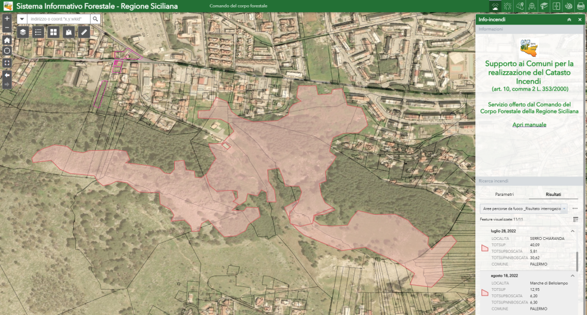](https://sifweb.regione.sicilia.it/portalsif/apps/webappviewer/index.html?id=02da7ecfecc84a0c9ea38fc2ac85e4d4)

Con la sovrapposizione dei due strati informativi non si ottiene reale estensione e localizzazione dell'area interessata dall'incendio nella particella X, ma si indica generalmente tutta la particella.

La [legge n. 353 del 2000](https://www.normattiva.it/uri-res/N2Ls?urn:nir:stato:legge:2000;353) **definisce divieti, prescrizioni e sanzioni sulle zone boschive e sui pascoli i cui soprassuoli siano stati percorsi dal fuoco**, e non su tutta la particella.

**Non è più corretto individuare in ogni particella solo l'effettiva area interessata all'incendio?**

Visto [SIF (Sistema Informativo Forestale)](https://sif.regione.sicilia.it/ilportale/progetto-sif) espone i dati sul censimento degli incendi (2010 - 2022) e il catasto AGEA in formato vettoriale, abbiamo fatto un semplice test con i dati del 2022 di Palermo utilizzando [QGIS](https://www.qgis.org/it/site/), nella [Umap](http://u.osmfr.org/m/950590/) riportata in basso i risultati.

L'intera particella e rappresentata dai poligoni con il perimetro rosso, le aree percorse dal fuoco all'interno della particella sono rappresentate con poligoni color giallo e perimetro color nero e linea tratteggiata

<iframe width="100%" height="600px" frameborder="0" allowfullscreen allow="geolocation" src="//umap.openstreetmap.fr/it/map/demo-palermo-catasto-dei-soprassuoli-percorsi-dal-_950590?scaleControl=false&miniMap=false&scrollWheelZoom=false&zoomControl=true&allowEdit=false&moreControl=true&searchControl=null&tilelayersControl=null&embedControl=null&datalayersControl=true&onLoadPanel=caption&captionBar=false&captionMenus=true"></iframe>
<a href="//umap.openstreetmap.fr/it/map/demo-palermo-catasto-dei-soprassuoli-percorsi-dal-_950590?scaleControl=false&miniMap=false&scrollWheelZoom=true&zoomControl=true&allowEdit=false&moreControl=true&searchControl=null&tilelayersControl=null&embedControl=null&datalayersControl=true&onLoadPanel=caption&captionBar=false&captionMenus=true">Visualizza a schermo intero</a>

A cura di _[Totò Fiandaca](https://twitter.com/totofiandaca)_ e _[Giovan Battista Vitrano](https://twitter.com/gbvitrano)_

Tutto questo è stato possibile grazie alla banca dati del [SIF (Sistema Informativo Forestale)](https://sif.regione.sicilia.it/ilportale/progetto-sif) GRAZIE!

Piccola richiesta al SIF, è possibile aggiungere il codice ISTAT dei Comuni (PRO\_COM\_T) ai vari db sugli incendi?

_L'immagine di copertina è di Raffaele Franco, Monte Pellegrino_ | [Incendio del 15/08/2023](https://www.palermotoday.it/cronaca/incendio-monte-pellegrino-razzo.html)

**Disclaimer:** Le informazioni visibili e condivise non comportano la visualizzazione di dati sensibili. Data la natura esclusivamente informativa degli elaborati grafici e dei testi riportati, questi non costituiscono atti ufficiali. Per accedere agli atti ufficiali si rinvia agli elaborati definitivi allegati alle specifiche deliberazioni.