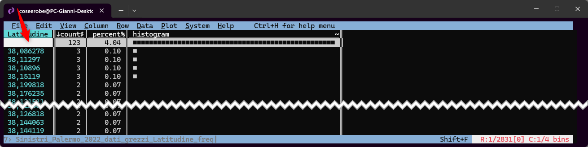
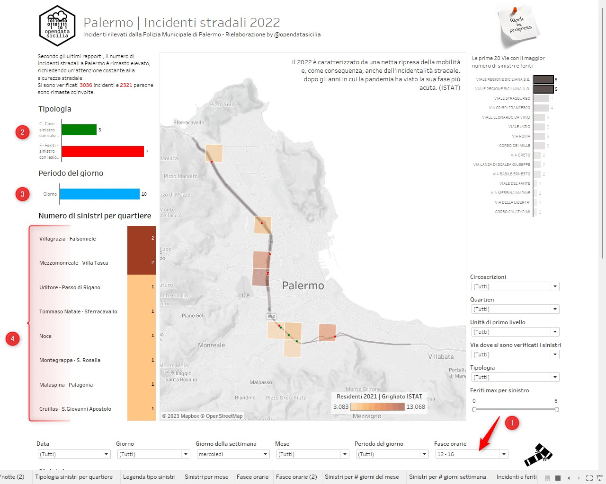
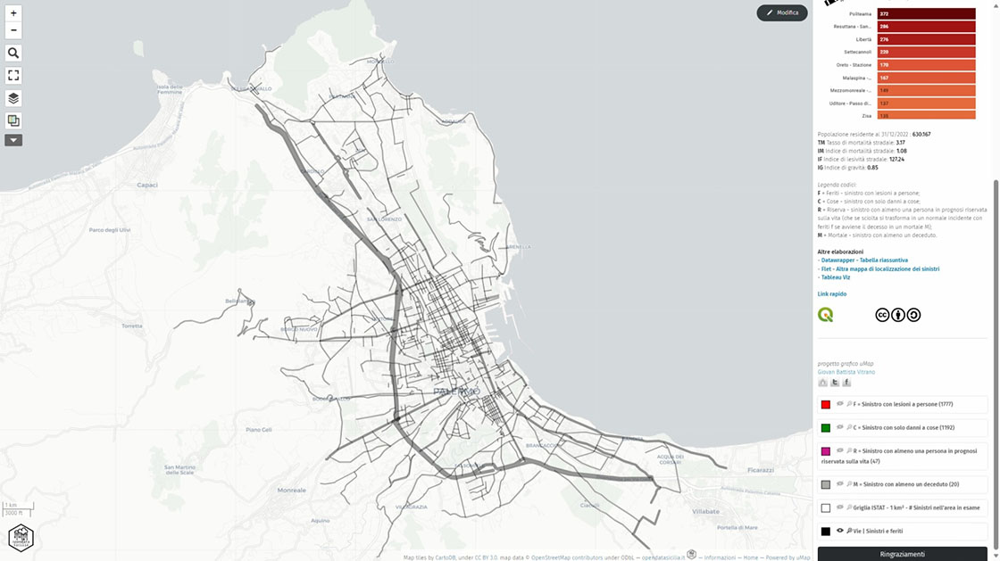
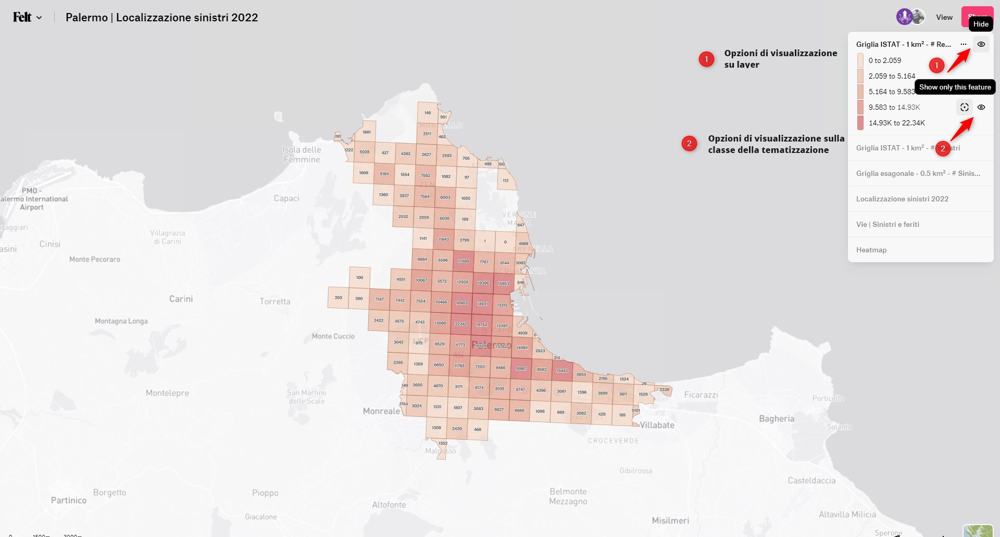
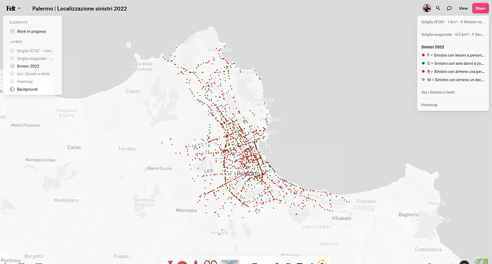
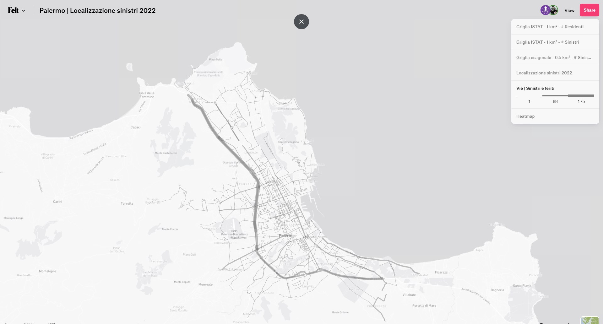
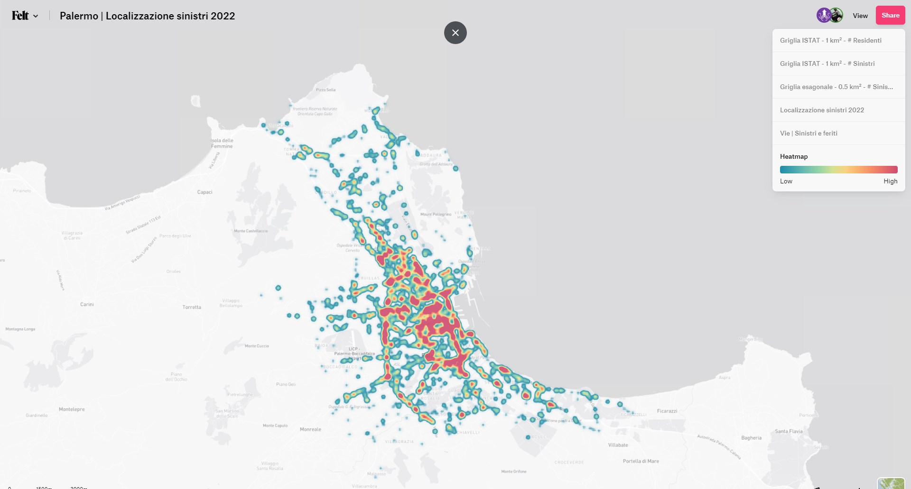

<style>
.md-typeset code { background-color: #fff0;}  
.md-typeset pre>code { background-color: #fff0;} 
.dszQmPq90Hj9i-pDPesOa {    display: none!important;} 
</style>
[{class="crop gray" align=right}](index.md)
<!--- [{class="crop gray" align=right}](index.md) -->

Il 2022 è caratterizzato da una netta ripresa della mobilità e, come conseguenza, anche dell’incidentalità stradale, dopo gli anni in cui la pandemia ha visto la sua fase più acuta. (ISTAT) e Palermo non fa eccezione. <br> Secondo gli ultimi rapporti, il numero di incidenti stradali a Palermo è rimasto elevato, richiedendo un'attenzione costante alla sicurezza stradale.<!-- more -->

## Dati ISTAT

<script id="infogram_0_12bb744e-ba3b-4ca4-b7dd-149e4214bbd5" title="Palermo Incidenti serie storica" src="https://e.infogram.com/js/dist/embed.js?8hY" type="text/javascript"></script>

<hr>

## Il dataset
Il dataset dei Sinistri 2022 è disponibile sul [portale opendata del Comune Palermo](https://opendata.comune.palermo.it/opendata-dataset.php?dataset=1713), distribuito con Licenza  [CC BY 4.0 - Attribuzione 4.0 Internazionale](https://creativecommons.org/licenses/by/4.0/deed.it).<br>
Ad una prima lettura con [Visidata](https://www.visidata.org/) ci siamo resi conto che non sono specificati il numero di morti per incidente, non è presente la relativa colonna dati.


Rapidamenmte abbiamo verificato il numeto di sinitri per tipologia.


Sinistri per tipologia:

-    C =  **1.196**
-    F =  **1.799**
-    R =  **47**
-    M =  **20**

In assenza di altri dati abbiamo aggiunto la colonna **morti** supponendo che per ogni sinistro di tipo **M** ci sia stato almeno un decesso.



Per **123** incidenti (4.04%) mancano le coordinate (lat. long), per mapparle è stato usato il *geocoding*, usando i pochi dati della colonna **Luogo**, le coordinate ottenute potrebbero avere un margine di errore.

<hr>

## Quanti?
Si sono verificati **3.036** incidenti e **2.321** persone sono rimaste coinvolte.<br>
Mediamete si verificano **8,3** incidenti strdali al giorno che procano la morte di **0,05** persone e il ferimento di altre **5,5**

In valore assoluto si registrano **1.777** incidenti con lesioni a persone, (F = Feriti ), **47** incidenti con almeno una con almeno una persona in prognosi riservata sulla vita (R = Riserva), **20** incidenti con almeno una persona deceduta (M = Mortale) ed infine **1.192** incidenti con solo danni a cose (C = Cose).

## Quando?
Il **79,1%** (2.427) degli incidenti sono avvenuti durante il giorno ed hanno causato lesioni all'**80,4%** (1.867) persone coinvolte, 
il restante **19,1%** (609) sono avvenuti di notte ed hanno causato lesioni al **19,5%** (454) persone. (1)
{ .annotate }

1. Periodo convenzionalmente definito notturno tra le ore 22,01 e le 6,00.

Il maggior numero di incidenti e feriti si è verificato a **Dicembre** (281 sinistri con 216 feriti), mese con la media giornaliera di 9 incidenti e 7 feriti, seguito da **Ottobre** (280 sinistri con 243 feriti) con la media giornaliera poco più alta, 9 incidenti e 7,8 feriti.
Gennaio è il mese con il numero più basso di incidenti (215) con la media giornaliera poco più alta, 6.9 incidenti e 4,8 feriti.

**Venerdì** e **Mercoledì** sono i giorni ”neri” per numero di incidenti **483** e **351** feriti il Venerdì e **469** incidenti e **313** feriti il mercoledì. <br>
Di Venerdì di verificano **15.9%** di incidenti con il **13,48%** di feriti, di Mercoledì **15,44** con il **13,48%** di feriti.

Il picco più elevato di incidentalità durante l’arco della giornata si registra nella fascia oraria 12-16 con 709 incidenti e 587 feriti. Sempre nella stessa fascia nell'ora 13 (1) riscontriamo il picco massimo **196** incicenti e **167** feriti
{ .annotate }

1. (13:00 - 13:59)

## Dove?
La strada con il nummero più alto di incidenti è Viale Regione Siciliana (E90) che lungo i suoi **41.05** km si sono verificati **324** incidenti **239** feriti e **2** morti, cosi divisi:

-    Viale Regione Siciliana N.O. **199** incidenti e **154** feriti;
-    Viale Regione Siciliana S.E. **125** incidenti e **85** feriti.

Seguono:

-    Via Messina Marine (SS113) **75** incidenti e **78** feriti;
-    Via Roma (viabilità terziaria) **62** incidenti e **58** feriti;
-    Corso Calatafimi (viabilità secondaria) (ss186) **59** incidenti e **52** feriti;
-    Corso dei Mille (viabilità secondaria) **51** incidenti e **20** feriti.

Per maggiori dettagli vi consigliano di visualizzare il Viz realizzato con [Tableau](#analisi-visiva-con-tableau) ed usare i relativi filtri.

[Esempio](#analisi-visiva-con-tableau): Visualizzare gli incidenti avvenuti in Viale Regione siciliana, in base al giorno della settimna, fascia di orari, periodo del giorno, tipo di sinistri e numero di feriti, ecc..

{data-gallery="tableau" data-description="Tableau | Mappa e analisi visiva incidendi 2022) by @OpendataSicilia" class="resized33" }
{data-gallery="tableau" data-description="Tableau | Mappa e analisi visiva incidendi 2022) by @OpendataSicilia" class="resized33" }
{data-gallery="tableau" data-description="Tableau | Mappa e analisi visiva incidendi 2022) by @OpendataSicilia" class="resized33" }

<hr>
	
## Localizzaione con Umap

La [mappa](https://umap.openstreetmap.fr/it/map/palermo-localizzazione-sinistri-2022_971650#13/38.1435/13.3728) è composta da 8 layers:

 -    [Griglia ISTAT - 1 km² - # Sinistri nell'area in esame;](https://umap.openstreetmap.fr/it/map/palermo-localizzazione-sinistri-2022_971650#13/38.1435/13.3728) *(layer spento di deault)*
-    [Griglia ISTAT - 1 km² - # Residenti;](https://umap.openstreetmap.fr/it/map/palermo-localizzazione-sinistri-2022_971650#13/38.1435/13.3728) 
 -    [Localizzazione sinistri 2022;](https://umap.openstreetmap.fr/it/map/palermo-localizzazione-sinistri-2022_971650#13/38.1435/13.3728) suddivisi in 4 layer separati:
      -    F = Sinistro con lesioni a persone (1777)
	  -    C = Sinistro con solo danni a cose (1192)
	  -    R = Sinistro con almeno una persona in prognosi riservata sulla vita (47)
	  -    M = Sinistro con almeno un deceduto (20)
 -    [Vie | Sinistri e feriti;](https://umap.openstreetmap.fr/it/map/palermo-localizzazione-sinistri-2022_971650#13/38.1435/13.3728) 
 -    [Heatmap](https://umap.openstreetmap.fr/it/map/palermo-localizzazione-sinistri-2022_971650#13/38.1435/13.3728) *(layer spento di deault)*
 
{data-gallery="umap" data-description="Palermo | Mappa e analisi incidendi 2022) by @OpendataSicilia" class="resized25" }
{data-gallery="umap" data-description="Palermo | Mappa e analisi incidendi 2022) by @OpendataSicilia" class="resized25" }
{data-gallery="umap" data-description="Palermo | Mappa e analisi incidendi 2022) by @OpendataSicilia" class="resized25" }
{data-gallery="umap" data-description="Palermo | Mappa e analisi incidendi 2022) by @OpendataSicilia" class="resized25" }

<iframe width="100%" height="600px" frameborder="0" allowfullscreen allow="geolocation" src="//umap.openstreetmap.fr/it/map/palermo-localizzazione-sinistri-2022_971650?scaleControl=false&miniMap=false&scrollWheelZoom=false&zoomControl=true&editMode=disabled&moreControl=true&searchControl=null&tilelayersControl=null&embedControl=null&datalayersControl=true&onLoadPanel=caption&captionBar=false&captionMenus=true"></iframe><p><a href="//umap.openstreetmap.fr/it/map/palermo-localizzazione-sinistri-2022_971650?scaleControl=false&miniMap=false&scrollWheelZoom=true&zoomControl=true&editMode=disabled&moreControl=true&searchControl=null&tilelayersControl=null&embedControl=null&datalayersControl=true&onLoadPanel=caption&captionBar=false&captionMenus=true">Visualizza a schermo intero</a></p>

👉 Se vuoi includere questa mappa sul tuo sito, copia il codice sottostante inserendolo su una pagina o articolo

```
<iframe width="100%" height="600px" frameborder="0" allowfullscreen allow="geolocation" src="//umap.openstreetmap.fr/it/map/palermo-localizzazione-sinistri-2022_971650?scaleControl=false&miniMap=false&scrollWheelZoom=false&zoomControl=true&editMode=disabled&moreControl=true&searchControl=null&tilelayersControl=null&embedControl=null&datalayersControl=true&onLoadPanel=caption&captionBar=false&captionMenus=true"></iframe><p><a href="//umap.openstreetmap.fr/it/map/palermo-localizzazione-sinistri-2022_971650?scaleControl=false&miniMap=false&scrollWheelZoom=true&zoomControl=true&editMode=disabled&moreControl=true&searchControl=null&tilelayersControl=null&embedControl=null&datalayersControl=true&onLoadPanel=caption&captionBar=false&captionMenus=true">Visualizza a schermo intero</a></p>
```

<hr>

## Localizzaione con Felt
La [mappa](https://felt.com/map/Palermo-Localizzazione-sinistri-2022-9AKlAYNeUTM9B6Ls19A9Bk9CMRB?loc=38.13829,13.35017,12.45z&share=1) è composta da 5 layers:

 -    [Griglia ISTAT - 1 km² - # Sinistri;](https://felt.com/map/Palermo-Localizzazione-sinistri-2022-9AKlAYNeUTM9B6Ls19A9Bk9CMRB?loc=38.13829,13.35017,12.45z&share=1) *(layer spento di deault)*
 -    [Griglia ISTAT - 1 km² - # Residenti;](https://felt.com/map/Palermo-Localizzazione-sinistri-2022-9AKlAYNeUTM9B6Ls19A9Bk9CMRB?loc=38.13829,13.35017,12.45z&share=1)
 -    [Localizzazione sinistri 2022;](https://felt.com/map/Palermo-Localizzazione-sinistri-2022-9AKlAYNeUTM9B6Ls19A9Bk9CMRB?loc=38.13829,13.35017,12.45z&share=1)
 -    [Vie | Sinistri e feriti;](https://felt.com/map/Palermo-Localizzazione-sinistri-2022-9AKlAYNeUTM9B6Ls19A9Bk9CMRB?loc=38.13829,13.35017,12.45z&share=1) 
 -    [Heatmap](https://felt.com/map/Palermo-Localizzazione-sinistri-2022-9AKlAYNeUTM9B6Ls19A9Bk9CMRB?loc=38.13829,13.35017,12.45z&share=1) *(layer spento di deault)*
 
{data-gallery="Flet" data-description="Palermo | Mappa e analisi incidendi 2022) by @OpendataSicilia" class="resized25" }
{data-gallery="Flet" data-description="Palermo | Mappa e analisi incidendi 2022) by @OpendataSicilia" class="resized25" }
{data-gallery="Flet" data-description="Palermo | Mappa e analisi incidendi 2022) by @OpendataSicilia" class="resized25" }
{data-gallery="Flet" data-description="Palermo | Mappa e analisi incidendi 2022) by @OpendataSicilia" class="resized25" }

<iframe width="100%" height="600" frameborder="0" title="Felt Map" src="https://felt.com/embed/map/Palermo-Localizzazione-sinistri-2022-9AKlAYNeUTM9B6Ls19A9Bk9CMRB?loc=38.13991,13.37951,11.93z"></iframe> 

👉 Se vuoi includere questa mappa sul tuo sito, copia il codice sottostante inserendolo su una pagina o articolo

```
<iframe width="100%" height="600" frameborder="0" title="Felt Map" src="https://felt.com/embed/map/Palermo-Localizzazione-sinistri-2022-9AKlAYNeUTM9B6Ls19A9Bk9CMRB?loc=38.13991,13.37951,11.93z"></iframe> 
```

<hr>

## Animazione con Flourish studio

<div class="flourish-embed" data-src="story/2056513"><script src="https://public.flourish.studio/resources/embed.js"></script></div>

👉 Se vuoi includere questa mappa sul tuo sito, copia il codice sottostante inserendolo su una pagina o articolo

```
<div class="flourish-embed" data-src="story/2056513"><script src="https://public.flourish.studio/resources/embed.js"></script></div>
```

<hr>

## Dtawrapper

<iframe title="Palermo numero di sinistri per quartiere" aria-label="Tabella" id="datawrapper-chart-BwJaC" src="https://datawrapper.dwcdn.net/BwJaC/14/" scrolling="no" frameborder="0" style="width: 0; min-width: 100% !important; border: none;" height="1179" data-external="1"></iframe><script type="text/javascript">!function(){"use strict";window.addEventListener("message",(function(a){if(void 0!==a.data["datawrapper-height"]){var e=document.querySelectorAll("iframe");for(var t in a.data["datawrapper-height"])for(var r=0;r<e.length;r++)if(e[r].contentWindow===a.source){var i=a.data["datawrapper-height"][t]+"px";e[r].style.height=i}}}))}();
</script>

👉 Se vuoi includere questa mappa sul tuo sito, copia il codice sottostante inserendolo su una pagina o articolo

```
<iframe title="Palermo numero di sinistri per quartiere" aria-label="Tabella" id="datawrapper-chart-BwJaC" src="https://datawrapper.dwcdn.net/BwJaC/14/" scrolling="no" frameborder="0" style="width: 0; min-width: 100% !important; border: none;" height="1179" data-external="1"></iframe><script type="text/javascript">!function(){"use strict";window.addEventListener("message",(function(a){if(void 0!==a.data["datawrapper-height"]){var e=document.querySelectorAll("iframe");for(var t in a.data["datawrapper-height"])for(var r=0;r<e.length;r++)if(e[r].contentWindow===a.source){var i=a.data["datawrapper-height"][t]+"px";e[r].style.height=i}}}))}();
</script>
```

<hr>

## Analisi visiva con Tableau
<div class='tableauPlaceholder' id='viz1698057307294' style='position: relative'><noscript><a href='#'></a></noscript><object class='tableauViz'  style='display:none;'><param name='host_url' value='https%3A%2F%2Fpublic.tableau.com%2F' /> <param name='embed_code_version' value='3' /> <param name='site_root' value='' /><param name='name' value='PalermoSinistri2022&#47;Sinistri_2022' /><param name='tabs' value='no' /><param name='toolbar' value='yes' /><param name='static_image' value='https:&#47;&#47;public.tableau.com&#47;static&#47;images&#47;Pa&#47;PalermoSinistri2022&#47;Sinistri_2022&#47;1.png' /> <param name='animate_transition' value='yes' /><param name='display_static_image' value='yes' /><param name='display_spinner' value='yes' /><param name='display_overlay' value='yes' /><param name='display_count' value='yes' /><param name='language' value='it-IT' /><param name='filter' value='publish=yes' /></object></div>                <script type='text/javascript'>                    var divElement = document.getElementById('viz1698057307294');                    var vizElement = divElement.getElementsByTagName('object')[0];                    if ( divElement.offsetWidth > 800 ) { vizElement.style.width='1120px';vizElement.style.height='1827px';} else if ( divElement.offsetWidth > 500 ) { vizElement.style.width='1120px';vizElement.style.height='1827px';} else { vizElement.style.width='100%';vizElement.style.height='3777px';}                     var scriptElement = document.createElement('script');                    scriptElement.src = 'https://public.tableau.com/javascripts/api/viz_v1.js';                    vizElement.parentNode.insertBefore(scriptElement, vizElement);                </script>

👉 Se vuoi includere questa mappa sul tuo sito, copia il codice sottostante inserendolo su una pagina o articolo

```
<div class='tableauPlaceholder' id='viz1698057307294' style='position: relative'><noscript><a href='#'></a></noscript><object class='tableauViz'  style='display:none;'><param name='host_url' value='https%3A%2F%2Fpublic.tableau.com%2F' /> <param name='embed_code_version' value='3' /> <param name='site_root' value='' /><param name='name' value='PalermoSinistri2022&#47;Sinistri_2022' /><param name='tabs' value='no' /><param name='toolbar' value='yes' /><param name='static_image' value='https:&#47;&#47;public.tableau.com&#47;static&#47;images&#47;Pa&#47;PalermoSinistri2022&#47;Sinistri_2022&#47;1.png' /> <param name='animate_transition' value='yes' /><param name='display_static_image' value='yes' /><param name='display_spinner' value='yes' /><param name='display_overlay' value='yes' /><param name='display_count' value='yes' /><param name='language' value='it-IT' /><param name='filter' value='publish=yes' /></object></div>                <script type='text/javascript'>                    var divElement = document.getElementById('viz1698057307294');                    var vizElement = divElement.getElementsByTagName('object')[0];                    if ( divElement.offsetWidth > 800 ) { vizElement.style.width='1120px';vizElement.style.height='1827px';} else if ( divElement.offsetWidth > 500 ) { vizElement.style.width='1120px';vizElement.style.height='1827px';} else { vizElement.style.width='100%';vizElement.style.height='3777px';}                     var scriptElement = document.createElement('script');                    scriptElement.src = 'https://public.tableau.com/javascripts/api/viz_v1.js';                    vizElement.parentNode.insertBefore(scriptElement, vizElement);                </script>
```
## Strumenti usati

**Analisi dati:**

-    [QGIS](https://www.qgis.org/it/site/)
-    [Visidata](https://www.visidata.org/)
-    [Google Sheets](https://www.google.it/intl/it/sheets/about/)

**Geolocalizzazione:**

-    [Umap](https://umap.openstreetmap.fr/)
-    [Felt](https://felt.com/)

**Viz:**

-    [Tableau](https://public.tableau.com/app/discover)
-    [Datawrapper](https://www.datawrapper.de/)
-    [Infogram](https://infogram.com/)
-    [Flourish](https://app.flourish.studio/)

## Ringraziamenti

[Andrea Borruso](https://twitter.com/aborruso)<br>
[Salvatore Fiandaca](https://twitter.com/totofiandaca)

<hr>
**Disclaimer:** Le informazioni visibili e condivise non comportano la visualizzazione di dati sensibili. Data la natura esclusivamente informativa degli elaborati grafici e dei testi riportati, questi non costituiscono atti ufficiali. Per accedere agli atti ufficiali si rinvia agli elaborati definitivi allegati alle specifiche deliberazioni.