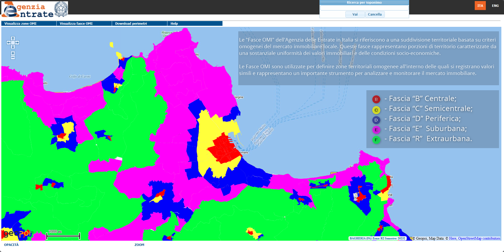
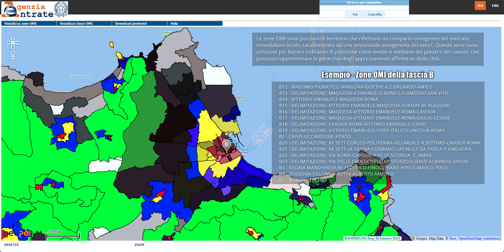

[{class="crop gray" align=right}](index.md)

L'**[Osservatorio del Mercato Immobiliare (OMI)](https://www.agenziaentrate.gov.it/portale/web/guest/schede/fabbricatiterreni/omi/banche-dati/quotazioni-immobiliari "Osservatorio del Mercato Immobiliare (OMI)")** è un servizio gestito dall'**[Agenzia delle Entrate"](https://www.agenziaentrate.gov.it/portale/  "Agenzia delle Entrate)** in Italia che si occupa della rilevazione e dell'elaborazione di informazioni tecniche ed economiche relative ai valori immobiliari. Questo strumento fornisce una banca dati che consente di consultare le quotazioni dei valori degli immobili e delle locazioni su tutto il territorio italiano. L'OMI è stato creato per garantire maggiore trasparenza ai contribuenti e per condurre studi approfonditi sul mercato immobiliare.  <!-- more -->

## Le Fasce
Le "**[Fasce OMI](https://www1.agenziaentrate.gov.it/servizi/geopoi_omi/index.php)** dell'**[Agenzia delle Entrate ](https://www.agenziaentrate.gov.it/portale/ "Agenzia delle Entrate")**  in Italia si riferiscono a una suddivisione territoriale basata su criteri omogenei del mercato immobiliare locale. Queste fasce rappresentano porzioni di territorio caratterizzate da una sostanziale uniformità dei valori immobiliari e delle condizioni socio-economiche. Le Fasce OMI sono utilizzate per definire zone territoriali omogenee all'interno delle quali si registrano valori simili e rappresentano un importante strumento per analizzare e monitorare il mercato immobiliare.

## Le Zone
Le "**[Zone OMI](https://www1.agenziaentrate.gov.it/servizi/geopoi_omi/index.php)**" sono porzioni di territorio che riflettono un comparto omogeneo del mercato immobiliare locale, caratterizzato da una sostanziale omogeneità dei valori. Queste zone sono utilizzate per fornire indicatori di posizione come medie o mediane dei prezzi o dei canoni, che possono rappresentare la gerarchia degli apprezzamenti all'interno della città.

### Esempio - Zone OMI della fascia B

-    B12 - MASSIMO-PIGNATELLI ARAGONA-GOETHE-V.E.ORLANDO-AMICO
-    B13 - DELIMITAZIONE: MAQUEDA-V.EMANUELE-BONELLO-AMEDEO-SAN VITO
-    B14 - VITTORIO EMANUELE-MAQUEDA-ROMA
-    B15 - DELIMITAZIONE: VITTORIO EMANUELE-MAQUEDA-TUKORY-RE RUGGERO
-    B16 - DELIMITAZIONE: MAQUEDA-VITTORIO EMANUELE-ROMA-CAVOUR
-    B17 - DELIMITAZIONE: MAQUEDA-VITTORIO EMANUELE-ROMA-GIULIO CESARE
-    B18 - DELIMITAZIONE: CAVOUR-ROMA-VITTORIO EMANUELE-CRISPI
-    B19 - DELIMITAZIONE: VITTORIO EMANUELE-FORO ITALICO-LINCOLN-ROMA
-    B2 - CRISPI-UCCIARDONE-PORTO
-    B20 - DELIMITAZIONE: XX SETT-CORLEO-POLITEAMA-VILLAREALE-R.SETTIMO-CAVOUR-ROMA
-    B21 - DELIMITAZIONE: XX SETT-LA FARINA-CUSMANO-LATINI-S.F.DA PAOLA-P.UNGHERIA
-    B22 - DELIMITAZIONE: VIA ROMA-CAVOUR- P.PE DI SCORDIA- E. AMARI
-    B23 - DELIMITAZIONE: VIA DELLE CROCI-CORLEO-P.STURZO-U.BASSI ALBANESE-ORSINI
-    B3 - REGINA MARGHERITA-RE FEDERICO-FINOCCHIARO APRILE-MARCO POLO
-    B4 - DOSSUNA-COLONNA ROTTA-ALBERTO AMEDEO
-    B7 - BORGO VECCHIO

	
!!! note "Fonte dati"

    **Agenzia delle Entrate - Quotazioni immobiliari** [link alla pagina](https://www.agenziaentrate.gov.it/portale/web/guest/schede/fabbricatiterreni/omi/banche-dati/quotazioni-immobiliari) 

## WORK IN PROGRESS...

**Disclaimer:** Le informazioni visibili e condivise non comportano la visualizzazione di dati sensibili. Data la natura esclusivamente informativa degli elaborati grafici e dei testi riportati, questi non costituiscono atti ufficiali. Per accedere agli atti ufficiali si rinvia agli elaborati definitivi allegati alle specifiche deliberazioni.