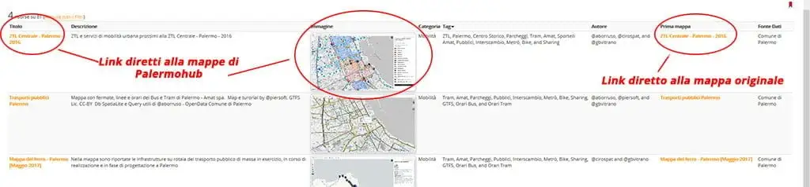
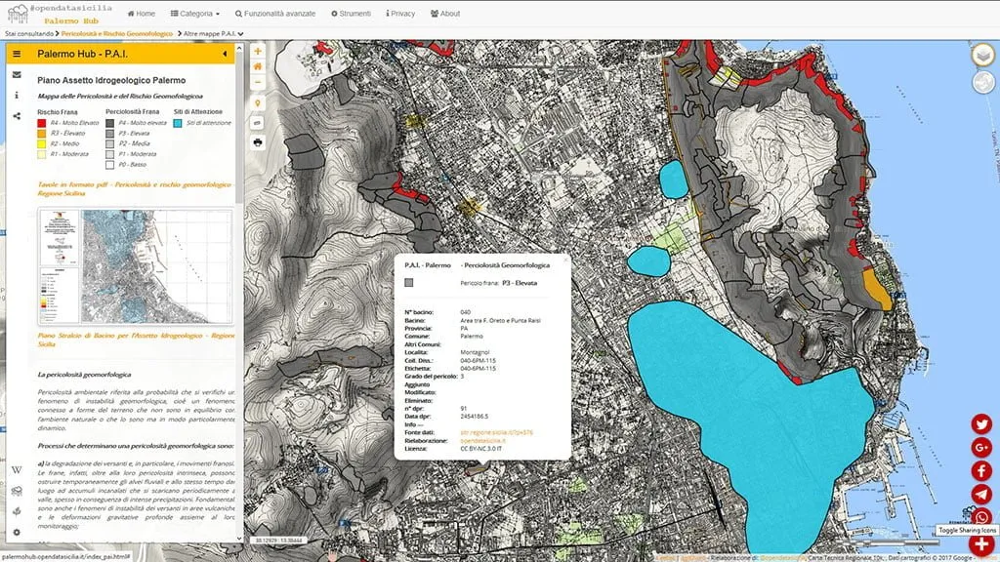

---
title: PalermoHub di opendatasicilia.it
description:  PalermoHub di opendatasicilia.it
draft: false
date: 2018-08-06
authors:
  - gbvitrano
categories:
  - Mappe
tags:
  - Mappe
  - Cartografia
  - Palermo
  - Sicilia
social_image: assets/img/social/palermohub.jpg
--- 

[{class="crop gray" align=left}](index.md)

## L’idea
Da qualche anno ho attivato questo [sito web](https://coseerobe.gbvitrano.it/) amatoriale dove carico tutte le mie rielaborazioni opendata (prevalentemente sono mappe su Palermo), un [repository GitHub](https://github.com/gbvitrano/Maps) ed un clone anche su [SicilaHub](https://github.com/SiciliaHub/mappe), nonostante questo, spesso amici e colleghi mi contattano per avere i link delle mie mappe.
L’[Atlante delle Carte Tecniche storiche di Palermo](http://palermohub.opendatasicilia.it/index_atlante.html#14/38.1114/13.3534), la [Variante Generale vigente](http://palermohub.opendatasicilia.it/index_prg.html#14/38.1185/13.3595) di Palermo, la [Cartografia e Ortofoto di base](http://palermohub.opendatasicilia.it/cartografia.html#14/38.1185/13.3595) <!-- more -->e [Piano Stralcio di Bacino per l’Assetto Idrogeologico (P.A.I.) Regione Sicilia](http://palermohub.opendatasicilia.it/index_pai.html#14/38.1185/13.3595), sempre Palermo, sono tra le mappe più richieste. 
Da qui l’**idea** di [PalermoHub](http://palermohub.opendatasicilia.it/), perché non mettere tutte le mappe in uno stesso contenitore, cosi da rendere più facile la loro fruizione?

Confrontandomi con _[@aborruso](https://twitter.com/aborruso)_ e _[@cirospat](https://twitter.com/cirospat)_  di _[opendatasicilia](http://opendatasicilia.it/)_, la mia idea si è evoluta, perché limitarci alle mie mappe quando per esempio anche il buon [Ciro](https://twitter.com/cirospat) ha una vastissima produzione di mappe su [Umap](http://umap.openstreetmap.fr/it/user/cirospat/)?
A questo punto ci sembrato normale estendere l’idea a tutte quelle persone che pubblicano mappe opendata su Palermo.

## Cosa è
**PalermoHub **di [opendatasicilia.it](http://opendatasicilia.it/) è un contenitore di mappe realizzate/rielaborate da liberi cittadini o da civic hackers prevalentemente sul territorio comunale di Palermo,  non ha alcun intento commerciale, l’unica finalità è mostrare le possibilità di rielaborazione e comunicazione offerte dagli [open data](https://it.wikipedia.org/wiki/Dati_aperti) o [dati pubblici](https://medium.com/open-data-stories/non-open-data-ma-dati-pubblici-la-metafora-dellacqua-b09ff1c24fe3) comunali, regionali, nazionali. Tutti possono contribuire alla crescita e alla divulgazione.

Il cuore di [PalermoHub](http://palermohub.opendatasicilia.it/) è il catalogo di ricerca [Simile exhibit](http://www.simile-widgets.org/exhibit3/) rielaborato in sitle [Petrusino](http://petrusino.opendatasicilia.it/) di [opendatasicilia.it](http://opendatasicilia.it/), un **catalogo** multitematico di **siti web**, **applicazioni** per dispositivi mobili, **mappe online**, **servizi web** e **infografiche**, con un’attenzione particolare alla **Sicilia**. Realizzato per permetterne una **più facile individuazione** ai più diversi tipi di utenza.
Viene spontaneo chiedersi…”_ma se già c’è un catalogo come [Petrusino](http://petrusino.opendatasicilia.it/), perchè duplicarlo…_?”

> _In buona sostanza_ [PalermoHub](http://palermohub.opendatasicilia.it/) è un [Petrusino](http://petrusino.opendatasicilia.it/) specifico, oltre ad essere un catalogo monotematico su Palermo, è anche il contenitore delle mappe, un unico _luogo fisico_ con funzionalità avanzate di ricerca e filtraggio per rendere facile ed intuitiva la ricerca delle mappe sul terriritorio Palermitano agli utenti.

Navigare tra le mappe di [PalermoHub](http://palermohub.opendatasicilia.it/) è semplicissimo, si può usare il menù  posizionato sull’header  di tutte le pagine, oppure utilizzando le [funzionalità avanzate](http://palermohub.opendatasicilia.it/wiki.html) di ricerca disponibili direttamente nella homepage.

Tramite il pulsante “**Categoria”** del menù,  **si accede alla lista delle mappe suddivise per categorie/tematismi. Basta selezionare e cliccare la categoria e il relativo tema per visualizzare la mappa.**

{ .off-glb style="display: block; margin: 0 auto"}

Invece tramite le [funzionalità avanzate](http://palermohub.opendatasicilia.it/wiki.html) di ricerca e filtraggio situate direttamente nella [homepage](http://palermohub.opendatasicilia.it/)  si può affinare la ricerca usando i Tag, l’Autore, la data o la fonte dei dati.
Possono essere utilizzati simultaneamente più filtri per una ricerca avanzata.

{ .off-glb style="display: block; margin: 0 auto"}

Anche il testo nella colonna “**Titolo**“o la clip nella colonna “**Immagine**” riportati in tabella nella home page, portano agevolmente alla mappa

{ .off-glb style="display: block; margin: 0 auto"}

## Contribuire
Far parte di [PalermoHub](http://palermohub.opendatasicilia.it/) è semplicissimo ed è gratis, basta inviare una richiesta di **Pull Requests** al repositoty [Github](https://github.com/SiciliaHub/palermohub) includendo e documentando tutti i file necessari oppure inviando una richiesta alla [mailing list OpenDataSicilia.it](https://groups.google.com/d/forum/opendatasicilia)  allegando i **link o file** della Vostra mappa, sarà nostra cura attivare le nuove pagine html per includere la nuova mappa.

Si può contribuire anche condividendo sui vari social il progetto [PalermoHub](http://palermohub.opendatasicilia.it/) e inserendo gli hastag: **#PalermoHub @opendatasicilia**

{ .off-glb style="display: block; margin: 0 auto"}

 
(ATTENZIONE! se hai attivo un ad blocker, i tasti di condivisione non verranno visualizzati) 

 
 Attualmente sono disponibili più di 80 risorse con diversi tematismi, oltre alle mappe realizzate dai menbri di [opendatasicilia.it](http://opendatasicilia.it/) è presente la mappa dei [monumenti abbandonati e dimenticati](http://palermohub.opendatasicilia.it/monumenti_abbandonati.html) di Palermo, a cura di [Giuseppe Mazzola](https://www.facebook.com/mazzolagiu) per l’associazione [Palermo Indignata](https://www.facebook.com/palermoindignata/), la [mappa monumentale di Palermo e dell’Agro Palermitano](http://palermohub.opendatasicilia.it/mappa_monumentale.html), a cura di Marcello Petrucci e le meravigliose mappe di [Guenter Richter](https://twitter.com/grichter) realizzate con **[iXMaps](http://ixmaps.com/examples/)**

[PalermoHub](http://palermohub.opendatasicilia.it/) è fruibile sia da desktop che da mobile, si adatta facilmete a quasi tutti dispositivi mobile di ultima generazione, anche se il modello di riferimento nel segmento mobile è stato il vecchio Samsung Galaxy S3, con una rioluzione di 360 x 640.
Per una lettura ottimale delle mappe in mobile si consiglia l’uso di tablet di dimesioni minime 7 pollici ed una risoluzione di 960 x  600 px

Tutto il materiale rielaborato per Palermo Hub di OpenDataSicilia.it è distribuito con licenza [Creative Commons Attribuzione – Condividi allo stesso modo 4.0 Internazionale (CC BY-SA 4.0)](https://creativecommons.org/licenses/by-sa/4.0/deed.it) tranne diversa indicazione. 

**Disclaimer:** Le informazioni visibili e condivise non comportano la visualizzazione di dati sensibili. Data la natura esclusivamente informativa degli elaborati grafici e dei testi riportati, questi non costituiscono atti ufficiali. Per accedere agli atti ufficiali si rinvia agli elaborati definitivi allegati alle specifiche deliberazioni.