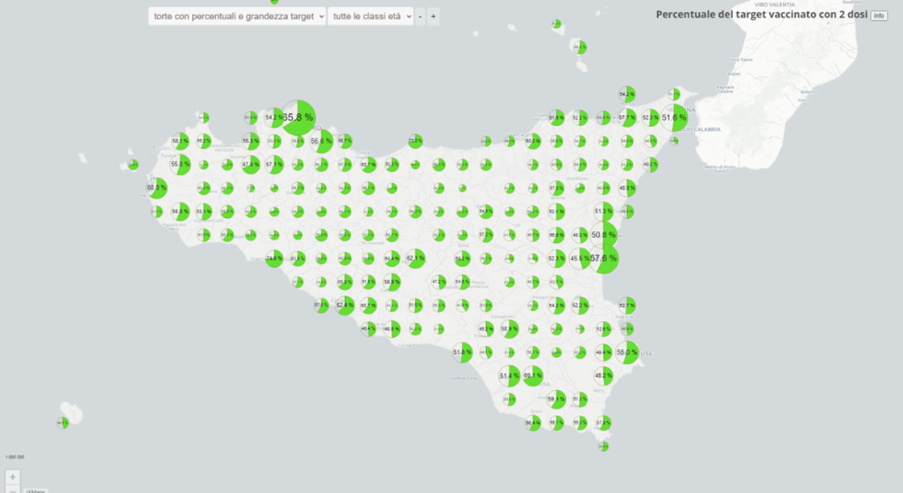
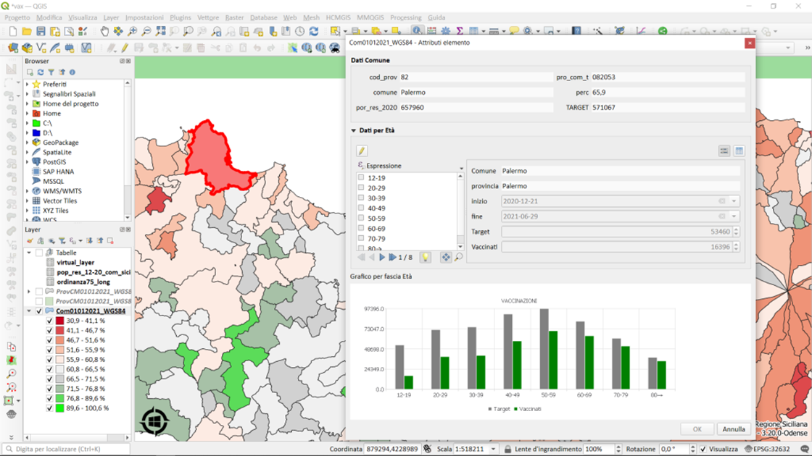
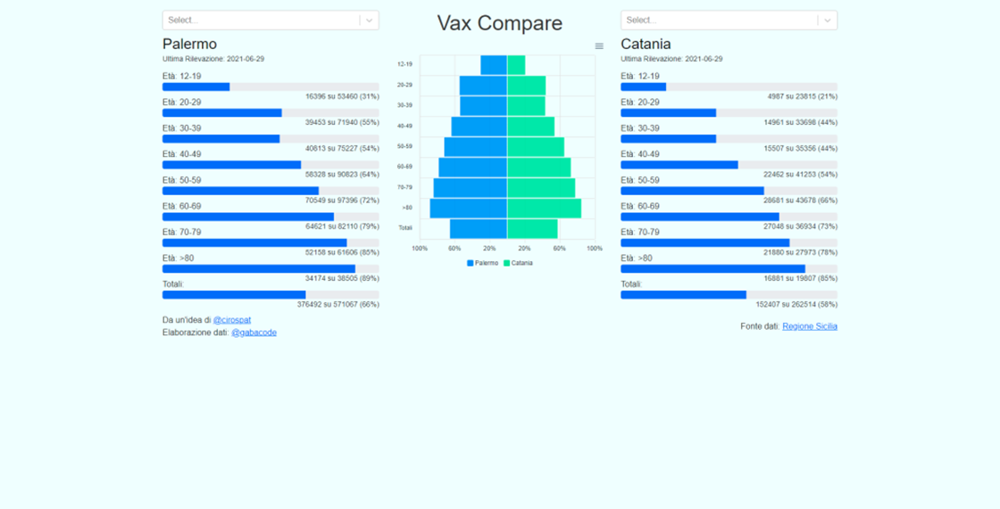

[{class="crop gray off" align=right }](index.md)

La [Regione Sicilia](https://www.regione.sicilia.it/) ha pubblicato in opendata il [dataset](https://dati.regione.sicilia.it/dataset/covid-19-vaccini-sicilia-target-e-vaccinati-per-comune-e-fasce-di-eta)  “ **[target e vaccinati per comune e fasce di età.](https://dati.regione.sicilia.it/dataset/covid-19-vaccini-sicilia-target-e-vaccinati-per-comune-e-fasce-di-eta)“**

**Fonte:** [COVID-19 vaccini Sicilia: target e vaccinati per comune e fasce di età – Dataset – Portale open data della Regione Siciliana](https://dati.regione.sicilia.it/dataset/covid-19-vaccini-sicilia-target-e-vaccinati-per-comune-e-fasce-di-eta), [Ordinanza n. 75 del 7 luglio 2021 | Regione Siciliana](https://www.regione.sicilia.it/istituzioni/servizi-informativi/decreti-e-direttive/ordinanza-n-75-7-luglio-2021) <!-- more -->

Ecco un [rappresentazione grafica](https://public.tableau.com/views/SiciliaVaccinicovid19/SiciliaTarget-Vaccini?:language=it-IT&publish=yes&:display_count=n&:origin=viz_share_link) dei dati realizzata con [Tableau Public](https://public.tableau.com/),  ogni elemento dei grafici è cliccabile e può essere usato anche come filtro.

 

<noscript></noscript><object class='tableauViz'  style='display:none;'><param name='host_url' value='https%3A%2F%2Fpublic.tableau.com%2F' /> <param name='embed_code_version' value='3' /> <param name='site_root' value='' /><param name='name' value='SiciliaVaccinicovid19&#47;SiciliaTarget-Vaccini' /><param name='tabs' value='no' /><param name='toolbar' value='yes' /><param name='static_image' value='https:&#47;&#47;public.tableau.com&#47;static&#47;images&#47;Si&#47;SiciliaVaccinicovid19&#47;SiciliaTarget-Vaccini&#47;1.png' /> <param name='animate_transition' value='yes' /><param name='display_static_image' value='yes' /><param name='display_spinner' value='yes' /><param name='display_overlay' value='yes' /><param name='display_count' value='yes' /><param name='language' value='it-IT' /></object>
                

 
[{ .off-glb }](https://gjrichter.github.io/viz/COVID-19/projects/COVID-19-Vaccini_Sicilia/ixmaps_Vaccini_Sicilia.html?fbclid=IwAR2t7P0QeU-POABsgyqm7n-hoaSV9dbX2JkYp9VHujt-VO7UWMnSJWCvD38)

* [Dashboard realizzata da: Guenter Richter](https://gjrichter.github.io/viz/COVID-19/projects/COVID-19-Vaccini_Sicilia/ixmaps_Vaccini_Sicilia.html?fbclid=IwAR2t7P0QeU-POABsgyqm7n-hoaSV9dbX2JkYp9VHujt-VO7UWMnSJWCvD38)

[{ .off-glb }](https://pigrecoinfinito.com/2021/07/15/dati-sulla-vaccinazione-in-sicilia/)

* [Dashboard realizzata da: Salvatore Fiandaca](https://pigrecoinfinito.com/2021/07/15/dati-sulla-vaccinazione-in-sicilia/)

[{ .off-glb }](https://datastudio.google.com/u/0/reporting/4b172c3d-1dd6-4844-9aaf-c0ba774ad099/page/qI9UC?s=lsvUNotAUkQ)

* [Dashboard realizzata da: Dennis Angemi](https://datastudio.google.com/u/0/reporting/4b172c3d-1dd6-4844-9aaf-c0ba774ad099/page/qI9UC?s=lsvUNotAUkQ)

[{ .off-glb }](https://vaxcompare.vercel.app/?fbclid=IwAR0kWaMKIVbwtBpua1e3MnC1R5Qy3TCgessnJevHwsmifXD1sB_3kzSUJRU)

* [Dashboard realizzata da: Gabriele Scalici](https://vaxcompare.vercel.app/?fbclid=IwAR0kWaMKIVbwtBpua1e3MnC1R5Qy3TCgessnJevHwsmifXD1sB_3kzSUJRU)

**Disclaimer:** Le informazioni visibili e condivise non comportano la visualizzazione di dati sensibili. Data la natura esclusivamente informativa degli elaborati grafici e dei testi riportati, questi non costituiscono atti ufficiali. Per accedere agli atti ufficiali si rinvia agli elaborati definitivi allegati alle specifiche deliberazioni.