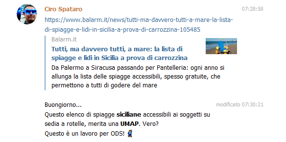
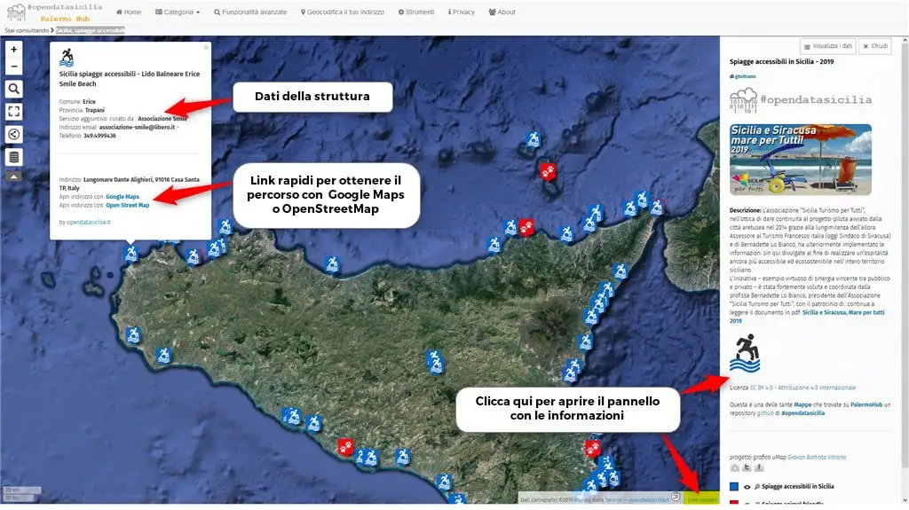

<style>
.md-typeset code { background-color: #fff0;}  
.md-typeset pre>code { background-color: #fff0;}  
</style>
[{class="crop gray" align=left}](index.md)


Qualche settimana fa il buon [Ciro](https://twitter.com/cirospat), da sempre attento al tema dell’accessibilità, legge un articolo su [balarm.it](https://www.balarm.it/news/tutti-ma-davvero-tutti-a-mare-la-lista-di-spiagge-e-lidi-in-sicilia-a-prova-di-carrozzina-105485) dove vengono elencate le spiagge e lidi accessibili a prova di carrozzina, e propone in un gruppo telegram di mappare le spiagge 🙂 <br>
**Mappa:** [#uMap](http://u.osmfr.org/m/339960/) [#PalermoHub](http://palermohub.opendatasicilia.it/sicilia_spiagge_accessibili.html)
<!-- more -->

{.off-glb style="display: block; margin: 0 auto" }

E’ una proposta che non si può rifiutare… cosi [ODS](http://opendatasicilia.it/) si mette in moto e qualche giorno dopo la [mappa](http://palermohub.opendatasicilia.it/sicilia_spiagge_accessibili.html) era fatta, prima di pubblicarla [Andrea](https://twitter.com/aborruso) suggerisce di contattare l’Associazione [Sicilia Turismo per Tutti](https://www.facebook.com/siciliaturismopertutti/) per verificare i dati.

Contatto la Prof.ssa [Bernadette Lo Bianco](https://www.facebook.com/profile.php?id=100004027914269), dell’Associazione [Sicilia Turismo per Tutti](https://www.facebook.com/siciliaturismopertutti/), le presento il lavoro fatto e il desiderio di collaborare con loro per realizzare un servizio utile alla collettività, noto con piacere che è interessata e piacevolmente sorpresa della nostra [mappa.](http://palermohub.opendatasicilia.it/sicilia_spiagge_accessibili.html) Mi informa che i dati caricati erano incompleti e che l’[Associazione](https://www.facebook.com/siciliaturismopertutti/) stava lavorando per aggiornare i dati al 2019, visto l’enorme lavoro che era in corso e il loro impegno, rimango a disposizione per aggiornare la [mappa](http://palermohub.opendatasicilia.it/sicilia_spiagge_accessibili.html) con i nuovi dati, che sono arrivati puntualmente dopo qualche settimana.

## Cosa c’è nella mappa
Nella [mappa](http://palermohub.opendatasicilia.it/sicilia_spiagge_accessibili.html) sono geolocalizzate tutte strutture balneari che tra percorsi dedicati e servizi necessari per le persone con disabilità motoria (anche temporanea) costituiscono in Sicilia una costellazione di spiagge accessibili in cui il mare è accessibile: da Palermo ad Agrigento, da Trapani a Catania, Siracusa e Pantelleria, il mare di Sicilia è un’esperienza godibile da tutti. (cit)

Per ogni spiaggia o lido vengono riportate le informazioni principali, Comune, Provincia, indirizzo e contatti, dove sono stati indicati. Nel popup informativo di tutti geo markers sono presenti i link rapidi  per ottenere le indicazioni stradali/percorso con [Google Masp](https://www.google.it/maps) o [OpenStreetMap](https://www.openstreetmap.org/), comodi per essere utilizzati anche in mobile.

{.off-glb style="display: block; margin: 0 auto"}
<br>
<hr>
## Umap
<iframe width="100%" height="600px" frameborder="0" allowfullscreen allow="geolocation" src="//umap.openstreetmap.fr/it/map/spiagge-accessibili-in-sicilia-2019_339960?scaleControl=false&miniMap=false&scrollWheelZoom=false&zoomControl=true&editMode=disabled&moreControl=true&searchControl=null&tilelayersControl=null&embedControl=null&datalayersControl=true&onLoadPanel=undefined&captionBar=false&captionMenus=true"></iframe><p><a href="https://palermohub.opendatasicilia.it/sicilia_spiagge_accessibili.html">Visualizza a schermo intero</a></p>

👉 Se vuoi includere questa mappa sul tuo sito, copia il codice sottostante inserendolo su una pagina o articolo

```
<iframe width="100%" height="600px" frameborder="0" allowfullscreen allow="geolocation" src="//umap.openstreetmap.fr/it/map/spiagge-accessibili-in-sicilia-2019_339960?scaleControl=false&miniMap=false&scrollWheelZoom=false&zoomControl=true&editMode=disabled&moreControl=true&searchControl=null&tilelayersControl=null&embedControl=null&datalayersControl=true&onLoadPanel=undefined&captionBar=false&captionMenus=true"></iframe><p><a href="https://palermohub.opendatasicilia.it/sicilia_spiagge_accessibili.html">Visualizza a schermo intero</a></p>
```

[Gent.ma](http://Gent.ma) Prof.ssa [Bernadette Lo Bianco](https://www.facebook.com/profile.php?id=100004027914269) grazie per la fiducia, [ODS](http://opendatasicilia.it/) è fiera ed orgogliosa di aver dato un piccolo contribuito al progetto **[Sicilia e Siracusa, Mare per tutti 2019](https://github.com/SiciliaHub/palermohub/raw/gh-pages/legend/Spiagge_per_tutti_accessibili_2019.pdf)**  con la [mappa](http://palermohub.opendatasicilia.it/sicilia_spiagge_accessibili.html),  ci auguriamo che possa essere utile a molte persone.


<hr>
**Disclaimer:** Le informazioni visibili e condivise non comportano la visualizzazione di dati sensibili. Data la natura esclusivamente informativa degli elaborati grafici e dei testi riportati, questi non costituiscono atti ufficiali. Per accedere agli atti ufficiali si rinvia agli elaborati definitivi allegati alle specifiche deliberazioni.