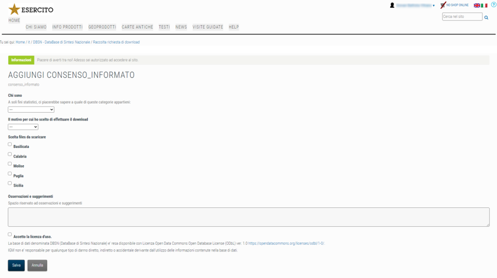

---
title: IGM | DBSN – DATABASE DI SINTESI NAZIONALE
description: IGM | DBSN – DATABASE DI SINTESI NAZIONALE
draft: false
date: 2022-09-24
authors:
  - gbvitrano
categories:
  - News
tags:
  - IGM
  - Italia
  - Sicilia
  - Geospatial
  - OSM
  - Opendata
--- 

[{class="crop gray"}](index.md) 

Il **DBSN** (DataBase di Sintesi Nazionale) è una banca dati geografica contenente le informazioni territoriali più significative per effettuare analisi tematiche e rappresentazioni in ambito nazionale. Per realizzare il DBSN, con l’obiettivo di elaborare dati sempre più completi ed aggiornati, si è fatto riferimento principalmente ai dati geotopografici regionali come fonte primaria di informazione. Nella fase iniziale del progetto sono stati raccolti i dati nella versione più aggiornata e si è operato una trasformazione di struttura per renderla omogenea a livello nazionale, mantenendo il livello di dettaglio originario. <!-- more -->  Successivamente si è provveduto all’integrazione con dati di Enti pubblici nazionali, ad esempio le mappe catastali dell’Agenzia delle Entrate, i dati dell’Istat, dati di altri Ministeri, considerando anche altre informazioni disponibili su web come i dati di Open Street Map (OSM).

Laddove l’informazione derivata non era sufficiente si è provveduto ad acquisire i dati direttamente da ortoimmagini. In particolare nella rielaborazione dei contenuti, la viabilità viene aggiornata almeno per i collegamenti principali; i limiti amministrativi vengono derivati da quelli catastali e si provvede a rendere congruenti le aree comunali tra loro e con il confine di Stato; l’edificato viene classificato per le categorie d’uso principali.

## Specifiche
La struttura del Data Base è basata su specifiche tecniche allineate a quelle previste dalla normativa nazionale (Decreto 10 novembre 2011). Il termine “sintesi” si riferisce alla selezione delle informazioni e alla semplificazione della struttura del database: le specifiche di contenuto del DBSN sono un sotto insieme del “Catalogo dei Dati Territoriali – Specifiche di Contenuto per i database geotopografici” che ha portato alla riduzione da 159 a 91 classi distribuite in 9 strati (di cui ne sono cedibili 74 in quanto le rimanenti non sono state verificate).

* [Specifiche PDF](https://www.igmi.org/boaga_caloger_api4242_rosbind/dbsn/dbsn_specs.pdf)
* [Specifiche HTML complete](https://www.igmi.org/boaga_caloger_api4242_rosbind/dbsn/dbsn_specs_all.html)
* [Specifiche HTML sintetiche](https://www.igmi.org/boaga_caloger_api4242_rosbind/dbsn/dbsn_specs_redux.html)

Si tratta di un archivio diviso per regioni e province (al momento sono presenti i dati di Basilicata, Calabria, Molise,  Puglia e Sicilia) che presentano 9 [tematismi](https://www.igmi.org/boaga_caloger_api4242_rosbind/dbsn/dbsn_specs_redux.html):

* Viabilità, mobilità e trasporti
* Immobili ed antropizzazioni
* Idrografia
* Orografia
* Vegetazione
* Reti di sottoservizi
* Località significative e scritte cartografiche
* Ambiti amministrativi
* Aree di pertinenza

Dal contenuto del DBSN, in formato vettoriale, si deriva la cartografia alla scala 1:25.000 mediante procedure automatiche di generalizzazione cartografica ed applicazione della simbologia definita. ([Documentazione)](https://www.igmi.org/boaga_caloger_api4242_rosbind/dbsn/dbsn_specs_all.html)

## Licenza d’uso
Il database DBSN (DataBase di Sintesi Nazionale) dell’Istituto Geografico Militare è reso disponibile sotto la [Licenza Open Data Commons Open Database License (ODbL) ver. 1.0](https://opendatacommons.org/licenses/odbl/1-0/)

## Metadato

* [Scheda Metadato](https://www.igmi.org/boaga_caloger_api4242_rosbind/dbsn/scheda.xml)
## Normativa

* “Catalogo dei Dati Territoriali – Specifiche di Contenuto per i database geotopografici”, allegato al D.M. 10 novembre 2011 “Regole tecniche per la definizione delle specifiche di contenuto dei database geotopografici” (Gazzetta Ufficiale n. 48 del 27/02/2012 – Supplemento ordinario n. 37).
* Decreto Legislativo 24 gennaio 2006, n. 36 e s.m.i. relativo all’apertura dei dati e al riutilizzo dell’informazione del settore pubblico.
### **[Download dei dati](https://www.igmi.org/acl_users/credentials_cookie_auth/require_login?came_from=https%3A//www.igmi.org/it/dbsn-database-di-sintesi-nazionale/raccolta-richiesta-di-download/%2B%2Badd%2B%2Bplanetek.igm_types.consenso_informato)**
Dal 20 settembre 2022 è possibile scaricare in open data una prima versione del [DBSN – DataBase di Sintesi Nazionale,](https://www.igmi.org/it/dbsn-database-di-sintesi-nazionale) dopo la **[registrazione](https://www.igmi.org/acl_users/credentials_cookie_auth/require_login?came_from=https%3A//www.igmi.org/it/dbsn-database-di-sintesi-nazionale/raccolta-richiesta-di-download/%2B%2Badd%2B%2Bplanetek.igm_types.consenso_informato)** al portale.

“I dati sono rilasciati in un formato _non propriamente aperto_ (.gdb = ESRI File Geodatabase) anche se supportato dalla [libreria GDAL](https://gdal.org/drivers/vector/openfilegdb.html) e di conseguenza da [QGIS](https://www.qgis.org/it/site/) ed altri software che si appoggiano ad essa.”

Post Consigliato [OpenStreetMap conquista anche l’Istituto Geografico Militare ← de.straba.us](https://de.straba.us/openstreetmap-conquista-anche-listituto-geografico-militare/) di [@napo](https://twitter.com/napo)

**Disclaimer:** Le informazioni visibili e condivise non comportano la visualizzazione di dati sensibili. Data la natura esclusivamente informativa degli elaborati grafici e dei testi riportati, questi non costituiscono atti ufficiali. Per accedere agli atti ufficiali si rinvia agli elaborati definitivi allegati alle specifiche deliberazioni.