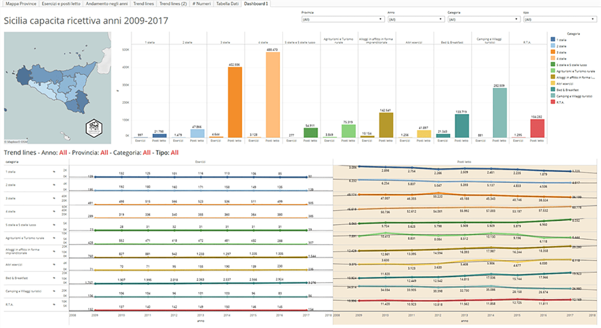
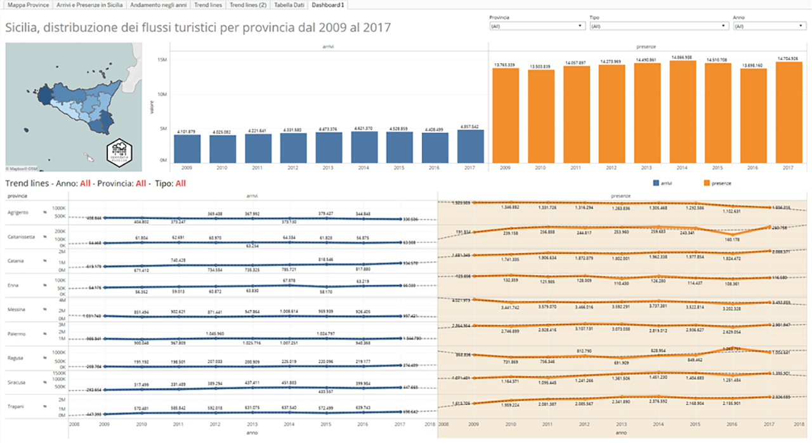

---
title: Sicilia, capacità ricettiva e flussi turistici dal 2009 al 2017
description: Sicilia, capacità ricettiva e flussi turistici dal 2009 al 2017
draft: false
date: 2019-03-26
authors:
  - gbvitrano
categories:
  - News
tags:
  - Italia
  - Capacità ricettiva
  - Fussi turistici
  - Sicilia
social_image: assets/img/social/capacità_ricettiva.jpg  
--- 

[{class="crop gray off" align=right}](index.md)

Sul [portale opendata](https://dati.regione.sicilia.it/organization/regione-sicilia) della **Regione Siciliana** sono stati pubblicati recentemente quattro interessanti dataset sulla [capacità ricettiva](https://dati.regione.sicilia.it/dataset/distribuzione-dei-flussi-turistici-per-provincia), [flussi turistici](https://dati.regione.sicilia.it/dataset/distribuzione-dei-flussi-turistici-per-provincia), [regione](https://dati.regione.sicilia.it/dataset/fe6fd91e-1815-4b75-9e1b-dfc0569d287e) e [nazione](https://dati.regione.sicilia.it/dataset/5d7fc299-0f05-407d-beb1-91a109464fa9) di provenienza in Sicilia dal 2009 al 2017, i dati sono disponibili per il download in formato **.csv** e **.json**.
I dataset sono distribuiti con licenza [Creative Commons Attribution License (cc-by)](http://opendefinition.org/licenses/cc-by/)<!-- more -->

#### Capacità ricettiva, anni 2009 – 2017
Dati sulla capacità ricettiva, per provincia e categoria di esercizio, con i dati sul numero di esercizi e posti letto

**Fonte dati:** [Regione Siciliana](https://dati.regione.sicilia.it/dataset/capacita-ricettiva-anni-2009-2017) Portale Opendata  
**Viz**: [Tableau Public](https://public.tableau.com/views/Sicilia-Capacitricettivaanni2009-2017/Dashboard1?:embed=y&:display_count=yes)

{ .off-glb }

#### Distribuzione dei flussi turistici per provincia
Flussi turistici in Sicilia, per provincia, dall’anno 2009 al 2017, suddivisi per arrivi e presenze.

**Fonte dati:** [Regione Siciliana](https://dati.regione.sicilia.it/dataset/31f42581-2636-4193-ba46-997365ea4fac) Portale Opendata 
**Viz**: [Tableau Public](https://public.tableau.com/views/Distribuzionedeiflussituristiciperprovincia2009-2017/Dashboard1?:embed=y&:display_count=yes)

{ .off-glb }

**Disclaimer:** Le informazioni visibili e condivise non comportano la visualizzazione di dati sensibili. Data la natura esclusivamente informativa degli elaborati grafici e dei testi riportati, questi non costituiscono atti ufficiali. Per accedere agli atti ufficiali si rinvia agli elaborati definitivi allegati alle specifiche deliberazioni.