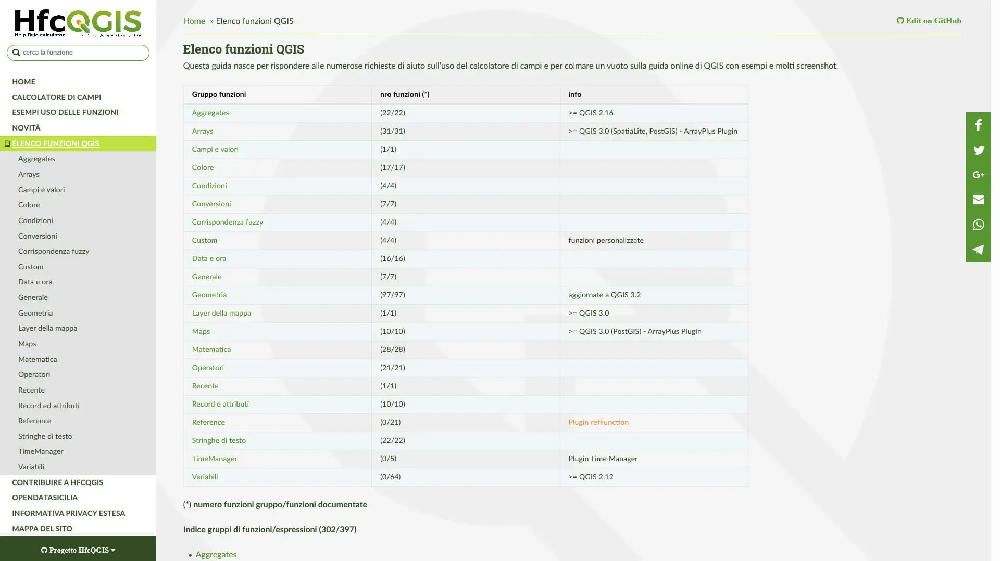
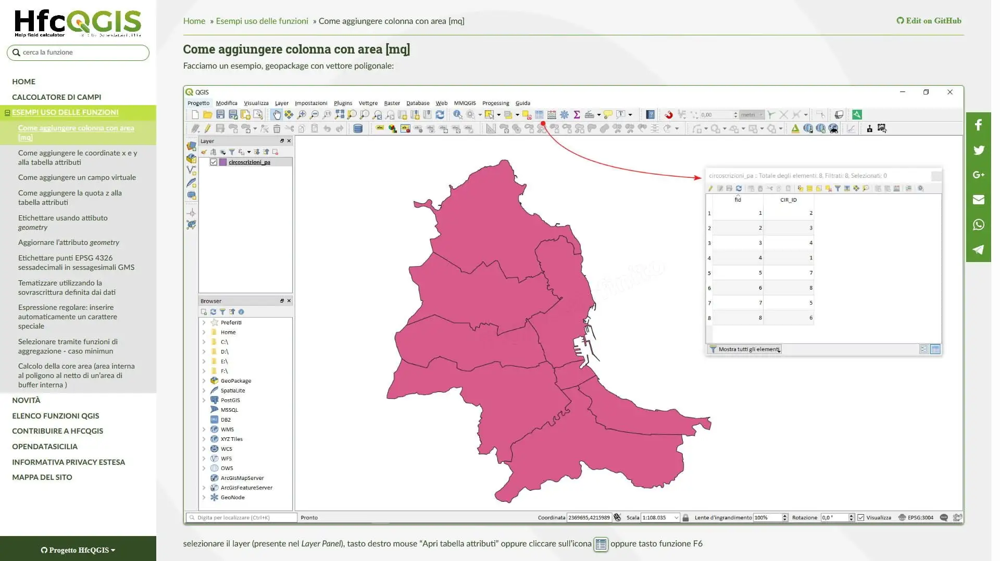
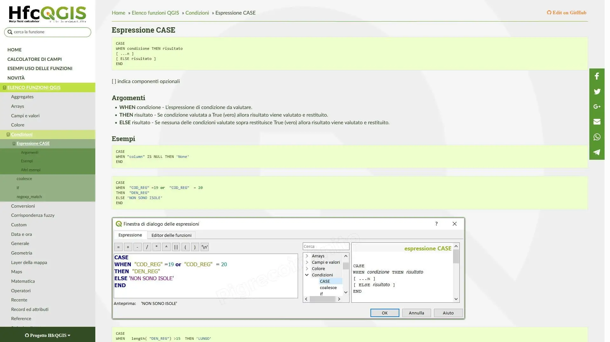
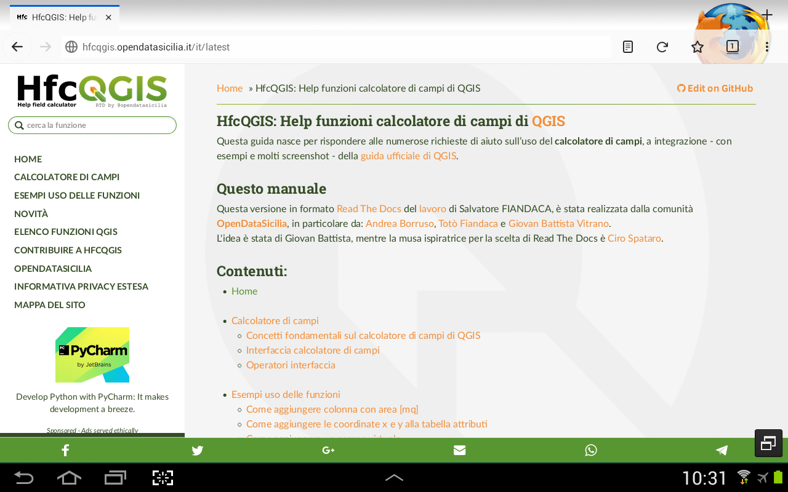
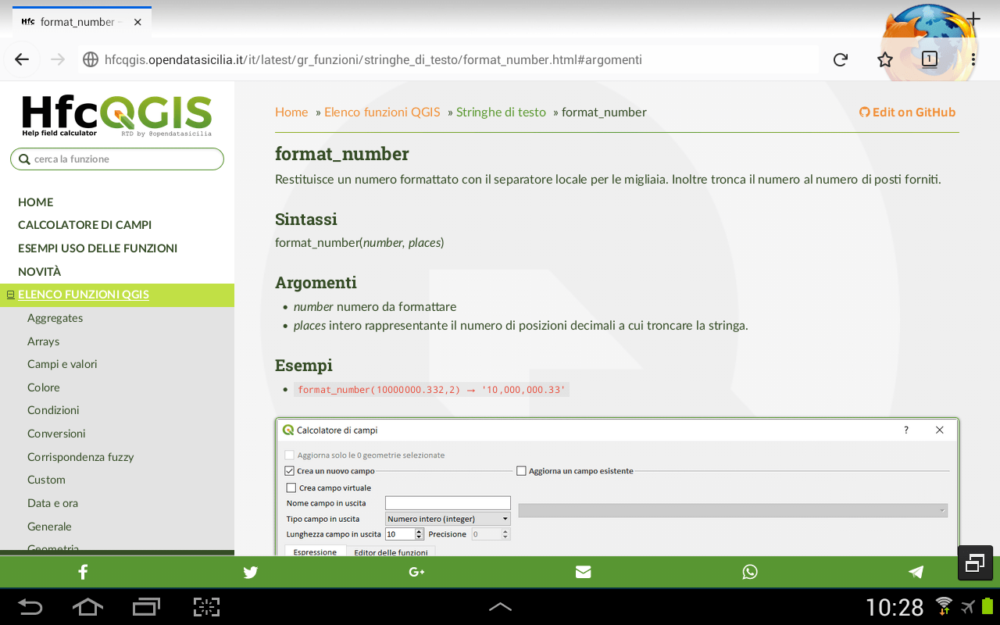
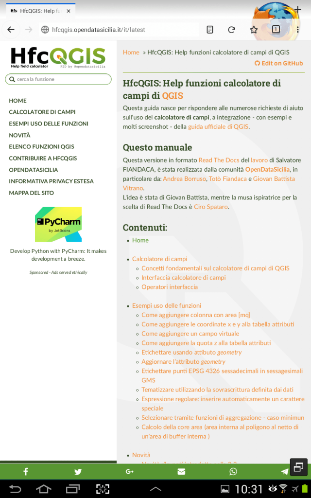
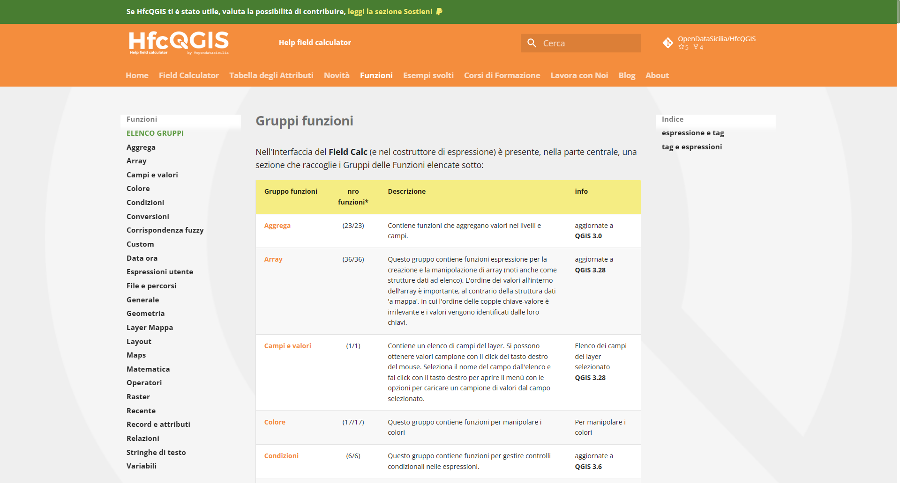
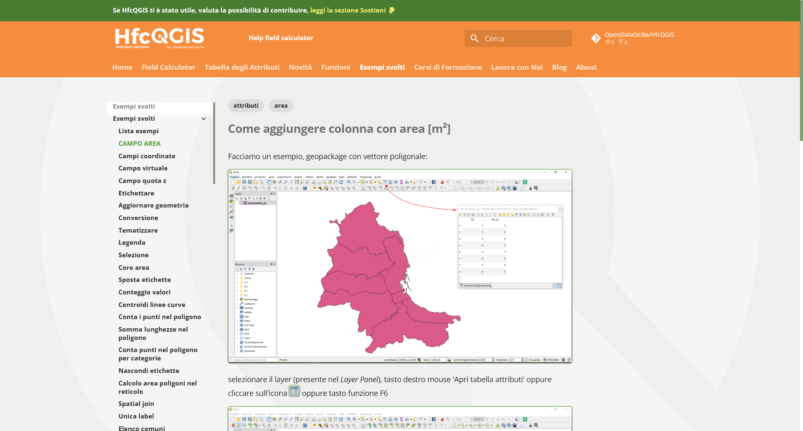
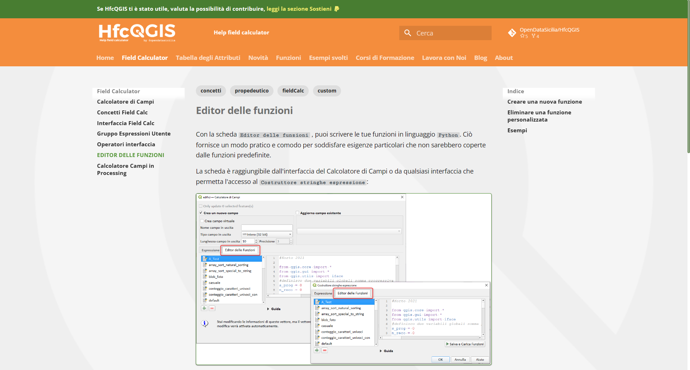
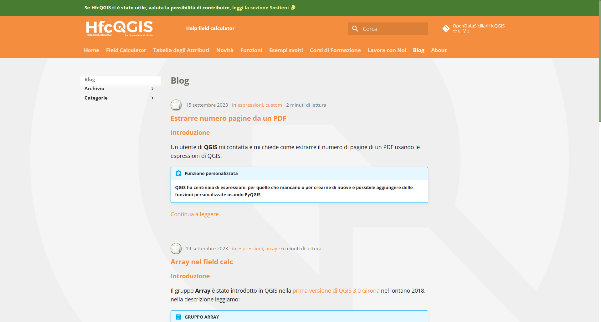

---
title: HfcQGIS - Help funzioni calcolatore di campi di QGIS
description: HfcQGIS - Help funzioni calcolatore di campi di QGIS
draft: false
date: 2018-07-23
authors:
  - gbvitrano
categories:
  - News 
tags:
  - QGIS
  - Calcolatore di campi
social_image: assets/img/social/hfc_social.png
---  

[{class="crop gray" align=right}](index.md) 

## Cos'è HfcQGIS?
**[HfcQGIS](http://hfcqgis.opendatasicilia.it/it/latest/index.html)** è una guida/manuale che spiega come usare il **[calcolatore di campi](http://hfcqgis.opendatasicilia.it/it/latest/calcolatore_campi/index.html)** e le relative funzioni/espressioni di **#QGIS**, realizzato da **[Salvatore Fiandaca](https://pigrecoinfinito.wordpress.com/)** (aka _pigreco_, per gli amici _Totò_). Totò è un componente attivo della comunità **#QGIS** e nella sua infinita bontà, pazienza è sempre disponibile a spiegare, aiutare e risolvere tutti problemi che noi utenti neofiti incontriamo nell’uso di [QGIS.](https://qgis.org/it/site/)<!-- more -->

Come spesso accade quando chiediamo aiuto/suggerimenti nei vari social/forum/blog, siamo molto pigri e non usiamo mai il tasto **CERCA** (o se lo usiamo lo usiamo male), _pretendiamo_ che ci venga data subito la soluzione al nostro _urgente problema,_ non pensando che la soluzione è già in quelle pagine o post, perchè già la stessa é stata data ad un’altro utente!

Il mauale**[HfcQGIS](http://hfcqgis.opendatasicilia.it/it/latest/index.html)** nasce proprio per rispondere alle numerose richieste di aiuto sull’uso del **[calcolatore di campi](http://hfcqgis.opendatasicilia.it/it/latest/calcolatore_campi/index.html)** e per colmare un vuoto sulla [guida online di QGIS](https://qgis.org/it/docs/index.html), che giustamente non tratta, non può approfondire tutte le infinite possibilità date dallo strumento.

La primissima versione di **[HfcQGIS](http://hfcqgis.opendatasicilia.it/it/latest/index.html)** è stata organizzata da**[Salvatore Fiandaca](https://pigrecoinfinito.wordpress.com/)** su [Github](https://github.com/pigreco/HfcQGIS/blob/master/README.md) qui il [link al blog pigrecoinfinito](https://pigrecoinfinito.wordpress.com/2018/05/21/hfcqgis/) dove Totò spiega il suo incredibile e meraviglioso lavoro reso a tutti noi utilizzatori di QGIS.

## HfcQGIS in Read the Docs (RTD) by @OpendataSicilia
**[HfcQGIS](http://hfcqgis.opendatasicilia.it/it/latest/index.html)** in [Read the Docs](https://docs.readthedocs.io/en/latest/index.html#) nasce dalla collabborazione di un gruppetto di persone della comunità [@OpendataSicilia](http://opendatasicilia.it/) , in particolare da [Andrea Borruso](https://twitter.com/aborruso), [Totò Fiandaca](https://twitter.com/totofiandaca) e [Giovan Battista Vitrano.](https://twitter.com/gbvitrano)

Conoscendo il **[mega lavoro](https://github.com/pigreco/HfcQGIS)** fatto su [Github](https://github.com/pigreco/HfcQGIS) da Totò e bombardato dall’inarrestabile [Ciro Spataro](https://twitter.com/cirospat) sulla bontà di [Read the Docs](https://docs.readthedocs.io/en/latest/index.html#) chiedo consiglio ad [Andrea Borruso](https://twitter.com/aborruso)  se era possibile dare un’interfaccia più amichevole al [repository HfcQGIS](https://github.com/pigreco/HfcQGIS)

Ispirati dalla [guida](http://googledocs.readthedocs.io/it/latest/) scritta da [Ciro Spataro](https://twitter.com/cirospat) sulla conversione di [Google Doc direttamente a Read the Docs](http://googledocs.readthedocs.io/it/latest/) abbiamo iniziato la conversione…alla fine ci siamo fatti prendere la mano!

**[HfcQGIS](http://hfcqgis.opendatasicilia.it/it/latest/index.html)** è fruibile sia da desktop che da mobile, si adatta facilmete a quasi tutti dispositivi mobile di ultima generazione, anche se il modello di riferimento nel segmento mobile è stato il vecchio Samsung Galaxy S3, con una rioluzione di 360 x 640.

{data-gallery="Gallery 01" data-description="HfcQGIS in Read the Docs (RTD) by @OpendataSicilia" class="resized33" }
{data-gallery="Gallery 01" data-description="HfcQGIS in Read the Docs (RTD) by @OpendataSicilia" class="resized33" }
{data-gallery="Gallery 01" data-description="HfcQGIS in Read the Docs (RTD) by @OpendataSicilia" class="resized33" }
{data-gallery="Gallery 01" data-description="HfcQGIS in Read the Docs (RTD) by @OpendataSicilia" class="resized33" }
{data-gallery="Gallery 01" data-description="HfcQGIS in Read the Docs (RTD) by @OpendataSicilia" class="resized33" }
{data-gallery="Gallery 01" data-description="HfcQGIS in Read the Docs (RTD) by @OpendataSicilia" class="resized33" }
{data-gallery="Gallery 01" data-description="HfcQGIS in Read the Docs (RTD) by @OpendataSicilia" class="resized33" }
{data-gallery="Gallery 01" data-description="HfcQGIS in Read the Docs (RTD) by @OpendataSicilia" class="resized33" }
{data-gallery="Gallery 01" data-description="HfcQGIS in Read the Docs (RTD) by @OpendataSicilia" class="resized33" }

## Video realizzati da Totò Fiandaca per spiegare il nuovo layout RTD

<iframe width="560" height="315" src="https://www.youtube-nocookie.com/embed/V0bCA0Vg_Yc?si=T_R6c29UwtEnc3P-" title="YouTube video player" frameborder="0" allow="accelerometer; autoplay; clipboard-write; encrypted-media; gyroscope; picture-in-picture; web-share" allowfullscreen></iframe>

<iframe width="560" height="315" src="https://www.youtube-nocookie.com/embed/q4HL_JPx-nY?si=5yG1b641XCEvWRnY" title="YouTube video player" frameborder="0" allow="accelerometer; autoplay; clipboard-write; encrypted-media; gyroscope; picture-in-picture; web-share" allowfullscreen></iframe>

## HfcQGIS in Material for MkDocs by @OpendataSicilia
A settenbre del 2021 è stata realizzata la nuova release usando la piattaforma [MkDocs](https://www.mkdocs.org/) e tema [Material for MkDocs](https://squidfunk.github.io/mkdocs-material/) che rende ancor più semplice la navigazione nella guida al Calcolatore dei campi. E' stata aperta un nuovo spazio **[Blog](https://hfcqgis.opendatasicilia.it/blog)** nel quale condividere, tutorial e risorse utili per utilizzare al meglio il calcolatore di campi di QGIS.

{data-gallery="Gallery 02" data-description="HfcQGIS in Material for MkDocs by @OpendataSicilia" class="resized33" }
{data-gallery="Gallery 02" data-description="HfcQGIS in Material for MkDocs by @OpendataSicilia" class="resized33" }
{data-gallery="Gallery 02" data-description="HfcQGIS in Material for MkDocs by @OpendataSicilia" class="resized33" }
{data-gallery="Gallery 02" data-description="HfcQGIS in Material for MkDocs by @OpendataSicilia" class="resized33" }
{data-gallery="Gallery 02" data-description="HfcQGIS in Material for MkDocs by @OpendataSicilia" class="resized33" }
{data-gallery="Gallery 02" data-description="HfcQGIS in Material for MkDocs by @OpendataSicilia" class="resized33" }
{data-gallery="Gallery 02" data-description="HfcQGIS in Material for MkDocs by @OpendataSicilia" class="resized33" }
{data-gallery="Gallery 02" data-description="HfcQGIS in Material for MkDocs by @OpendataSicilia" class="resized33" }
{data-gallery="Gallery 02" data-description="HfcQGIS in Material for MkDocs by @OpendataSicilia" class="resized33" }
## Come puoi contribuire
**[HfcQGIS](http://hfcqgis.opendatasicilia.it/it/latest/index.html)** è un progetto open e tutti possono contribuire, magari anche con una [donazione PayPal](https://www.paypal.me/pigrecoinfinito) a Totò visto che per realizzare la guida ha impiegato del tempo e messo a disposizione tutta la sua passione e conoscenza sullo strumento.

Si può contribuire anche usando i tasti di condivisione social inserendo alcuni hastag: **#hfcqgis #qgis @opendatasicilia** (se hai attivo un _ad blocker_, i tasti di condivisione non verranno visualizzati).

Segnala eventuali malfunzionamenti, così da migliorare la guida, suggerisci miglioramenti, e se vuoi che la [sezione esempi](http://hfcqgis.opendatasicilia.it/it/latest/esempi/index.html) cresca, suggerisci degli esempi che vorresti vedere.

Si può contribure utilizzando Github e Pull Requests. Includere screenshot e GIF animate nella richiesta di pull, quando possibile. Documenta bene Terminare tutti i file con una nuova riga Evita il codice dipendente dalla piattaforma.

In ogni singola pagina **[HfcQGIS](http://hfcqgis.opendatasicilia.it/it/latest/index.html)** c’è il link **Edit on GitHub** per facilitare il compito Pull Requests.

**[Qui trovate l’articolo](https://pigrecoinfinito.wordpress.com/2018/07/23/hfcqgis-in-rtd-by-opendatasicilia/)** di Totò dove spiega anche con video come funziona **[HfcQGIS](http://hfcqgis.opendatasicilia.it/it/latest/index.html), [qui il canale youtube di Totò](https://www.youtube.com/user/vediamo13/videos?view_as=subscriber)**

[Qui l’articolo su @OpendataSicilia](http://opendatasicilia.it/2018/07/23/hfcqgis-rtd-opendatasicilia/)

Contribuire, nel mio piccolo, a realizzare la versione di **[HfcQGIS](http://hfcqgis.opendatasicilia.it/it/latest/index.html)** in Read the Docs (RTD) by [@OpendataSicilia](http://opendatasicilia.it/) mi da l’opportunità per ringrazziare di cuore Totò, Andrea e tutta la comunità [@OpendataSicilia](http://opendatasicilia.it/) per tutto quello che mi hanno insegnato in questi anni. GRAZIE!
