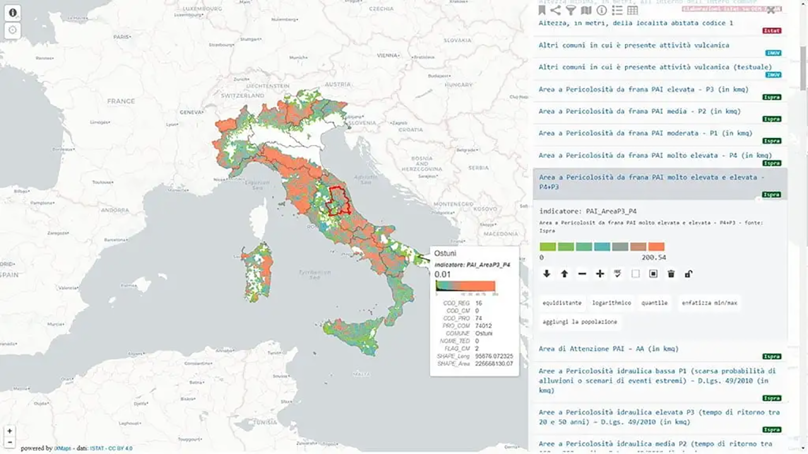

---
title: ISTAT – Mappa dei rischi dei comuni italiani
description: ISTAT – Mappa dei rischi dei comuni italiani
draft: false
date: 2017-08-15
authors:
  - gbvitrano
categories:
  - News
tags:
  - ISTAT
  - OpenData
  - Portale
  - WRLD
  - Dataset

social_image: assets/img/social/mappa_rischio.jpg 
--- 

[{class="crop gray" align=right}](index.md)

L’**Istituto Nazionale di Statistica** e **Casa Italia**, struttura di missione della Presidenza del Consiglio, rendono disponibile un quadro informativo integrato sui rischi naturali in Italia.

L’obiettivo è fornire variabili e indicatori di qualità, a livello comunale, che permettono una visione di insieme sui rischi di esposizione a **terremoti**, **eruzioni vulcaniche**, **frane** e **alluvioni**, attraverso l’integrazione di dati provenienti da varie fonti istituzionali, quali **Istat**, **INGV**, **ISPRA**,<!-- more --> Ministero dei beni e delle attività culturali e del turismo.

Per ciascun Comune i dati sul rischio **sismico**, **idrogeologico** e **vulcanico** sono corredati da informazioni demografiche, abitative, territoriali e geografiche.

**[Cartografia](http://gisportal.istat.it/mapparischi/index.html?extent=)** – Atlante con **mappe interattive** e tabelle associate

**[Dataset](http://www.istat.it/it/mappa-rischi/indicatori)** –  Comune,  Provincia o Regione da scaricare

[Qui un articolo](https://medium.com/tantotanto/la-mappa-dei-rischi-dei-comuni-italiani-85d71be49e8b) di [Andrea Borruso](https://medium.com/@aborruso?source=post_header_lockup)  su come consultare, interrogare e scaricare la mappa dei rischi dei comuni italiani tramite **API REST**

## [Rielaborazione](https://goo.gl/yPMj9m) del database ISTAT di [Guenter Richter](https://twitter.com/grichter)

[{ .off-glb }](https://goo.gl/yPMj9m)

**Disclaimer:** Le informazioni visibili e condivise non comportano la visualizzazione di dati sensibili. Data la natura esclusivamente informativa degli elaborati grafici e dei testi riportati, questi non costituiscono atti ufficiali. Per accedere agli atti ufficiali si rinvia agli elaborati definitivi allegati alle specifiche deliberazioni.