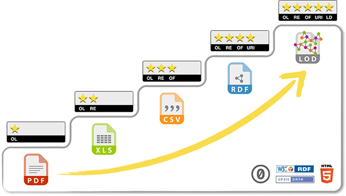

---
title: Cosa sono gli opendata?
description:  Cosa sono gli opendata?
draft: false
date: 2016-11-05
authors:
  - gbvitrano
categories:
  - Opendata  
tags:
  - Opendata 
social_image: assets/img/social/opendata_def_pa.jpg 
---  

[{class="crop gray" align=left}](index.md)

I **[dati aperti](https://it.wikipedia.org/wiki/Dati_aperti)**, comunemente chiamati con il termine [inglese](https://it.wikipedia.org/wiki/Lingua_inglese) **open data** anche nel contesto italiano, sono dati liberamente accessibili a tutti le cui eventuali restrizioni sono l’obbligo di citare la fonte o di mantenere la banca dati sempre aperta.

Il progetto Open Definition di [Open Knowledge Foundation](https://it.wikipedia.org/wiki/Open_Knowledge_Foundation) utilizza la seguente frase per definire dati (e contenuti) aperti: «un contenuto o un dato si definisce aperto se chiunque è in grado di utilizzarlo, <!-- more -->ri-utilizzarlo e ridistribuirlo, soggetto, al massimo, alla richiesta di attribuzione e condivisione allo stesso modo».

La definizione, molto sintetica, viene poi meglio esplicata attraverso il documento “[Conoscenza Aperta](http://opendefinition.org/okd/italiano/)”  i cui contenuti sono molto simili a quelli della [OSI definition](http://www.opensource.org/osd.html). Si tratta di 11 punti che mettono chiarezza sulle modalità di distribuzione e di accesso a tale informazioni. Fra questi ricordiamo: la possibilità di utilizzare a qualsiasi scopo i dati (quindi eliminando clausole quali la possibilità di lucro) e l’assenza di restrizioni tecnologiche (formati aperti ma anche il servizio d’accesso).

Il Legislatore italiano con la Legge **[17 dicembre 2012, n. 221](http://www.gazzettaufficiale.it/eli/id/2012/12/18/012G0244/sg)** ha formalizzato una definizione di dati aperti (formalmente “dati di tipo aperto”) inserendola all’interno dell’**[art. 68](http://www.agid.gov.it/cad/art-68-analisi-comparativa-soluzioni)** del **[Codice dell’Amministrazione Digitale](http://www.agid.gov.it/cad/codice-amministrazione-digitale)**. (CAD)

Secondo tale definizione, sono dati di tipo aperto, i dati che presentano le seguenti tre caratteristiche:

* a) sono disponibili secondo i termini di una [licenza](https://it.wikipedia.org/wiki/Italian_Open_Data_License) che ne permetta l’utilizzo da parte di chiunque, anche per finalità commerciali, in formato disaggregato;
* b) sono accessibili attraverso le tecnologie dell’informazione e della comunicazione, ivi comprese le reti telematiche pubbliche e private, in formati aperti ai sensi della lettera a), sono adatti all’utilizzo automatico da parte di programmi per elaboratori e sono provvisti dei relativi metadati;
* c) sono resi disponibili gratuitamente attraverso le tecnologie dell’informazione e della comunicazione, ivi comprese le reti telematiche pubbliche e private, oppure sono resi disponibili ai costi marginali sostenuti per la loro riproduzione e divulgazione.

Tale definizione, in coordinamento con quanto disposto dall’**[articolo** 52](http://www.agid.gov.it/cad/art-52-accesso-telematico-riutilizzo-dati-pubbliche-amministrazioni)** dello stesso [codice](http://www.agid.gov.it/cad/codice-amministrazione-digitale)**, rappresenta la base per il cosiddetto **_principio open by default_** ora presente nell’ordinamento italiano. (fonte [wikipedia.org](https://it.wikipedia.org/wiki/Dati_aperti))

**[Articolo 52](http://www.agid.gov.it/cad/art-52-accesso-telematico-riutilizzo-dati-pubbliche-amministrazioni) comma 2 del [Codice dell’Amministrazione Digitale](http://www.agid.gov.it/cad/codice-amministrazione-digitale). (CAD)**

* I dati e i documenti che le amministrazioni titolari pubblicano, con qualsiasi modalità, senza l’espressa adozione di una licenza di cui all’articolo 2, comma 1, lettera h), del decreto legislativo 24 gennaio 2006, n. 36, si intendono rilasciati come dati di tipo aperto ai sensi all’articolo 68, comma 3, del presente Codice, ad eccezione dei casi in cui la pubblicazione riguardi dati personali del presente Codice. L’eventuale adozione di una licenza di cui al citato articolo 2, comma 1, lettera h), è motivata ai sensi delle linee guida nazionali di cui al comma 7.

Per tutti i siti web delle PA senza lincenza esplicita vige la licenza [Commons Creative](https://it.wikipedia.org/wiki/Licenze_Creative_Commons) [Attribuzione](https://creativecommons.org/licenses/by/3.0/it/deed.it), ovvero il principio l’OpenbyDefault (post [consigliato](http://www.mysolutionpost.it/archivio/fisco-e-societ%C3%A0/2014/04/banche-dati-pa-e-accesso-civico.aspx) di [Morena Ragone](https://twitter.com/morenaragone))

{class="resized10 nobox" .off-glb } Le licenze Creative Commons, dal blog “open data formazione”

## Le 5 stelle dei dati aperti
Dati aperti collegati ad altri insiemi di dati aperti (_[Linked data](https://it.wikipedia.org/wiki/Linked_data)_).[Tim Berners-Lee](https://it.wikipedia.org/wiki/Tim_Berners-Lee), il fondatore del [World Wide Web](https://it.wikipedia.org/wiki/World_wide_web), ha ordinato il formato dei dati su una scala a cinque stelle: una stella corrisponde al minimo di apertura, cinque stelle il massimo: 
\* Dato non strutturato e codificato in formato proprietario (esempi: un file [pdf](https://it.wikipedia.org/wiki/Portable_Document_Format); un’immagine [jpeg](https://it.wikipedia.org/wiki/Jpeg)); 
\*\* Dato strutturato ma codificato in formato proprietario (quindi abbastanza facile da poter essere elaborato da un’[applicazione informatica](https://it.wikipedia.org/wiki/Applicazione_%28informatica%29)); 
\*\*\* Dato strutturato in un formato non proprietario (per esempio, il formato [CSV](https://it.wikipedia.org/wiki/Comma-separated_values), che può essere aperto da qualsiasi software); 
\*\*\*\* Dati strutturati e codificati in formato non proprietario e dotati di un [identificativo unico di risorsa](https://it.wikipedia.org/wiki/Uniform_Resource_Identifier) (URI). Un esempio è lo standard [RDF](https://it.wikipedia.org/wiki/Resource_Description_Framework): applica al dato un significato condiviso (“quel dato ha lo stesso significato in qualsiasi lingua, per qualsiasi Paese”); 
\*\*\*\*\* Dati aperti collegati ad altri insiemi di dati aperti (_[Linked data](https://it.wikipedia.org/wiki/Linked_data)_).

(fonte [wikipedia.org](https://it.wikipedia.org/wiki/Dati_aperti))

[{class=" resized50c nobox" .off-glb }](http://5stardata.info/en/)

_I **[dati aperti](https://it.wikipedia.org/wiki/Dati_aperti)** sono dati che possono essere liberamente utilizzati, riutilizzati e ridistribuiti da chiunque, soggetti eventualmente alla necessità di citarne la fonte e di condividerli con lo stesso tipo di [licenza](https://it.wikipedia.org/wiki/Italian_Open_Data_License) con cui sono stati originariamente rilasciati._

_Per maggiori informazioni sul fenomeno degli OpenData consiglio di leggere il [manuale degli Open Data](http://opendatahandbook.org/it/) e il_ blog _[open data formazione](https://sites.google.com/view/opendataformazione/home?authuser=0)_

[Linee guida Opendata 2017 – Comune di Palermo](https://www.google.com/url?q=https://www.comune.palermo.it/js/server/normative/_11052017130800.pdf&sa=U&ved=0ahUKEwjijZS7sZ3UAhXkDcAKHVdqCmIQFggHMAE&client=internal-uds-cse&usg=AFQjCNGNmMbGJYRI_u9MD6fbNaPS5_N3qA)

A seguire un elenco di alcuni siti di riferimento che invitano le Amministrazioni alla pubblicazione ed all’uso da parte di terzi degli opendata:

[https://www.agendadigitale.eu/](https://www.agendadigitale.eu/)

[http://www.agid.gov.it/](http://www.agid.gov.it/)

[http://www.dati.gov.it/](http://www.dati.gov.it/)

[http://www.datiopen.it/](http://www.datiopen.it/)

## Webinar 9 Ottobre 2018 organizzato da FormezPA
Open data: valorizzare il patrimonio informativo pubblico attraverso i dati aperti

<iframe width="560" height="315" src="https://www.youtube-nocookie.com/embed/tS08Zg7npks?si=S_yQI62rEtBg_DHM" title="YouTube video player" frameborder="0" allow="accelerometer; autoplay; clipboard-write; encrypted-media; gyroscope; picture-in-picture; web-share" allowfullscreen></iframe></iframe>

Il seminario online si inserisce all’interno del ciclo di webinar dedicati all’**[Innovazione digitale](http://eventipa.formez.it/progetto-formez-dettaglio-ms/17436)** organizzato da Formez PA nell’ambito della convenzione con AgID _ItaliaLogin – servizi digitali_.

(Base foto in alto, vista panoramica della [Cattedrale di Palermo](https://commons.wikimedia.org/wiki/Cattedrale_di_Palermo) pubblicata sul [it.wikipedia.org](https://it.wikipedia.org/wiki/Palermo#/media/File:Panoramica_Cattedrale_di_Palermo.jpg) – Author: [Kiban](https://commons.wikimedia.org/wiki/User:Kiban) – lic. [CC BY-SA 3.0](http://creativecommons.org/licenses/by-sa/3.0))
