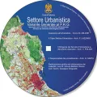

---
title: Il primo passo verso gli opendata, strumenti urbanistici di Palermo
description:  Il primo passo verso gli opendata, strumenti urbanistici di Palermo
draft: false
date: 2016-11-05
authors:
  - gbvitrano
categories:
  - Opendata  
tags:
  - Palermo
  - Opendata
  - Variante Generale
  - PRG
  - Piano Regolatore
social_image: assets/img/social/strumenti_urbanistici_01.jpg  
--- 
[{class="crop gray off" align=right}](index.md)

{align=left class="resized10 nobox" .off-glb }Nel dicembre del 1999, lavoravo presso la “_Ripartizione Urbanistica_” nel gruppo informatico, che si occupava di aggiornare e stampare la Variante Generale al P.R.G.
Vista la richiesta, sempre crescente, di stampe e allegati del PRG, di mia iniziativa, progettai e realizzai, un cd multimediale e multipiattaforma win/mac, dove mettere a disposizione dei cittadini gli elaborati della Variante Generale in formato[.pdf](https://acrobat.adobe.com/it/it/why-adobe/about-adobe-pdf.html). Il cd fu presentato alla stampa locale dall’allora Vice Sindaco E. Arcuri.   <!-- more -->
Nello stesso periodo i colleghi del “_Ufficio Centro Storico_”, _A. Scianna_, _B. Bonamini_, _S. Cannistraro_, presentavano un lavoro simile sul Piano Particolareggiato Esecutivo (PPE), del Centro Storico della Città. 
Anche se gli strumenti informatici non erano efficaci come oggi, fu possibile divulgare i programmi e i progetti relativi al territorio, l’Amministrazione Comunale offrì agli operatori del settore e alla collettività utili strumenti ed un prezioso servizio.
Ripensandoci oggi, con entrambi i lavori fu fatto il primo timido passo verso gli opendata.
{align=right class="resized10 nobox" .off-glb }Nel 2004 dopo che la Variante Generale al P.R.G. fu approvata con D. Dir. 558 e 124/DRU/02 dell’Assessorato Territorio ed Ambiente della Regione, di mia iniziativa, progettai e realizzai un nuovo cd per i nuovi elaborati. Contemporaneamente al cd furono elaborate delle pagine html (mini sito) da poter inserire all’interno del portale del [Comune di Palermo](https://www.comune.palermo.it/territorio.php) sia della Variante al P.R.G. che del Piano Particolareggiato Esecutivo, del Centro Storico, pagine nate con l’intento di favorire la massima divulgazione, fruizione e comprensione della Variante e del PPE e di consentire anche ai non addetti ai lavori la consultazione degli stessi.
Anche in questo caso, con i dati non strutturati e codificati in un formato proprietario come i file pdf, html, jpg e dwf, un altro piccolo passo verso gli opendata era stato compiuto…

## Download tavole in formato pdf
**In basso sono riportati i link alle tavole in formato [.pdf](https://acrobat.adobe.com/it/it/why-adobe/about-adobe-pdf.html)** **della Variante Generale al P.R.G. e del P.P.E. Piano Particolareggiato Esecutivo del centro storico della Città di Palermo**.
Tutti i link delle tavole presenti in questa sezione rinviano al sito ufficiale del [Comune di Palermo](https://www.comune.palermo.it/) – [Amministrazione Trasparente](https://www.comune.palermo.it/amministrazione_trasparente.php?apt=6) – [Pianificazione e Governo del Territorio.](https://www.comune.palermo.it/amministrazione_trasparente.php?sel=19)

!!! Danger " Visualizazione mobile"

	Per una corretta visualizzazione in modalità mobile si consiglia l’uso di tablet o
	smartphone con una risoluzione minima di 640 x 360 px (es. Samsung Galaxy S3, Nexus 4 
	o iPhone 6) e ruotando lo schermo del terminale in modalità landscape (orizzontale).

<iframe src="https://palermohub.opendatasicilia.it/legend/stru_urb_online.html" width="100%" height="600px" frameborder="0"></iframe>

## Progetto PRG Palermo
La mappa qui riportata è una versione beta test 2.0 (non verificata) degli strumenti urbanistici di attuazione vigenti al 2016. Variante Generale al PRG e PPE del centro storico di Palermo. Realizzata per studiare l'applicativo [Qgis](http://qgis.org/it/site/forusers/download.html) e modalità webgis offerta dai plugin [Leaflet](http://leafletjs.com/) e [QTiles](https://github.com/nextgis/QTiles)
La visualizzazione del PPE è automatica dallo zoom 16

[{ .off-glb }](http://palermohub.opendatasicilia.it/index_prg.html#14/38.1185/13.3595)

**WebMap** elaborata con #Qgis e il plugin #qtiles con gli [Opendata del Comune di Palermo](https://opendata.comune.palermo.it/opendata-dataset.php?dataset=320)

**Fonte dati:** [#Comune di Palermo](https://www.comune.palermo.it/) , [#Opendata](https://www.comune.palermo.it/opendata.php) , [#Urbanistica](https://opendata.comune.palermo.it/opendata-dataset.php?dataset=320) [#Perimetrazione Zonizzazione P.R.G. vigente](https://opendata.comune.palermo.it/opendata-dataset.php?dataset=321) [#Vincoli vigenti della Variante al P.R.G.](https://www.comune.palermo.it/amministrazione-trasparente.php?grp=3&lev=3&id=171) [#Elaborati PPE Centro Storico](https://www.comune.palermo.it/amministrazione-trasparente.php?grp=3)

**Disclaimer:** Le informazioni visibili e condivise non comportano la visualizzazione di dati sensibili. Data la natura esclusivamente informativa degli elaborati grafici e dei testi riportati, questi non costituiscono atti ufficiali. Per accedere agli atti ufficiali si rinvia agli elaborati definitivi allegati alle specifiche deliberazioni.