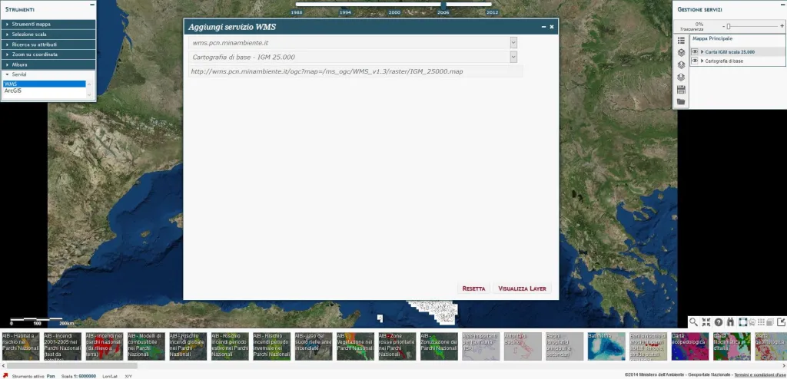
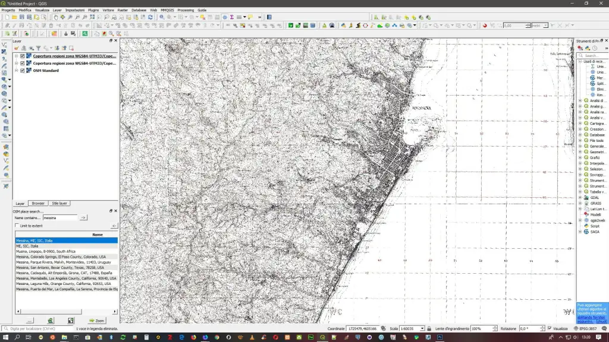

---
title: Carte IGM di tutta l’Italia on line
description:  Carte IGM di tutta l’Italia on line
draft: false
date: 2016-11-20
authors:
  - gbvitrano
categories:
  - Tutorial
tags:
  - IGM
  - Italia
  - Sicilia
social_image: assets/img/social/gpn_igm_palermo_01.jpg
--- 

[{class="crop gray" align=left}](index.md) 

Il Ministero dell’Ambiente ha messo a disposizione, gratuitamente, per tutti, tutta la cartografia ufficiale IGM al 25000, 100000 e 250000 e molte altre carte. Tutto questo sul **[Geoportale Nazionale](http://www.pcn.minambiente.it/)**, che contiene anche altri servizi interessanti, quali la trasformazione di coordinate.

Le carte sono sovrapponibili in trasparenza alle viste da satellite e sono navigabili con vari strumenti messi a disposizione.

E’ possibile anche riprendere **[misure di lunghezze ed aree](http://www.pcn.minambiente.it/viewer/)**.<!-- more --> 

**Complessivamente, su tutto il territorio nazionale, sono disponibili le seguenti carte:**

– [Servizi di rete](http://www.pcn.minambiente.it/mattm/servizi-ogc/) – **[Manuali d’uso dei servizi](http://www.pcn.minambiente.it/mattm/servizi-manuali/)**

– [Carta IGM scala 1:25000 – Regioni zona WGS84-UTM33 – Metadati risorsa on-line – WMS 1.3.0 – Formato Tiff](http://wms.pcn.minambiente.it/ogc?map=/ms_ogc/WMS_v1.3/raster/IGM_25000.map) – [Viewer](http://www.pcn.minambiente.it/viewer/index.php?services=IGM_25000)

– [Carta IGM scala 100.000 – Regioni zona WGS84-UTM33 – Metadati risorsa on-line – WMS 1.3.0 – Formato Tiff](http://wms.pcn.minambiente.it/ogc?map=/ms_ogc/WMS_v1.3/raster/IGM_25000.map) – [Viewer](http://www.pcn.minambiente.it/viewer/index.php?services=IGM_100000)

– [Carta IGM scala 1:250000 – WMS – Metadati risorsa on-line – WMS 1.3.0 – Formato Tiff](http://wms.pcn.minambiente.it/ogc?map=/ms_ogc/WMS_v1.3/raster/IGM_250000.map)

– Atlante De Agostini

– Aree studio per l’analisi di dissesto

– [Habitat a rischio – Servizio WFS](http://wms.pcn.minambiente.it/ogc?map=/ms_ogc/wfs/Progetto_Antincendi_Boschivi.map&Service=WFS)

– [Incendi 2001-2005](http://www.pcn.minambiente.it/mattm/progetto-incendi/) – [Servizio WFS](http://wms.pcn.minambiente.it/ogc?map=/ms_ogc/wfs/Progetto_Antincendi_Boschivi.map&Service=WFS)

– Modelli di sombustibile

– [Rischio Incendi](http://www.pcn.minambiente.it/mattm/progetto-incendi/)

– [Desertificazione](http://wms.pcn.minambiente.it/ogc?map=/ms_ogc/WFS/Atlante_desertificazione.map)

– [Catalogo Frane](http://wms.pcn.minambiente.it/ogc?map=/ms_ogc/wfs/Catalogo_Frane.map)

– [Progetto coste](http://www.pcn.minambiente.it/mattm/progetto-coste/)

– [Catalogo WMS](http://www.pcn.minambiente.it/mattm/servizio-wms/)

– [Catalogo CSW](http://www.pcn.minambiente.it/mattm/servizio-csw/)

– [Catalogo WFS](http://www.pcn.minambiente.it/mattm/servizio-di-scaricamento-wfs/)

– [Prodotti LiDAR – Regione Sicilia](http://www.pcn.minambiente.it/geoportal/catalog/search/resource/details.page?uuid=%7B28A9720B-3440-4EC0-A42A-42C9301EFFE1%7D)

Tutti questi elementi rappresentano dei lucidi che possono essere attivati o disattivati e ne può essere controllata la percentuale di trasparenza.

La cartografia è dotata anche di una funzione di ricerca, per individuare rapidamente una zona tramite i [toponimi](http://wms.pcn.minambiente.it/ogc?map=/ms_ogc/wfs/Toponimi_2011.map).

Il **[Geoportale Nazionale](http://www.pcn.minambiente.it/)** consente a chiunque disponga di un collegamento Internet – studiosi, ricercatori, amministratori, privati cittadini – di visualizzare ed utilizzare senza alcun onere la cartografia di proprio interesse, selezionandola proprio come se si trovasse sugli scaffali di una biblioteca.

Possono essere individuate due tipologie di utenti finali del GN. Alla prima appartengono tutti coloro interessati ad una semplice visualizzazione della cartografia disponibile, che può essere consultata esattamente come si sfoglia un libro. Alla seconda appartengono coloro che, per professione o per studio, hanno necessità di elaborare i dati territoriali e ambientali presenti sul Portale e lo possono fare grazie ai servizi **[WMS](http://www.pcn.minambiente.it/mattm/servizio-wms/)**, **[WFS](http://www.pcn.minambiente.it/mattm/servizio-di-scaricamento-wfs/)** e **[WCS](http://www.pcn.minambiente.it/mattm/servizio-di-scaricamento-wcs/)** messi a disposizione e che consentono l’interoperabilità dei dati.

**[Manuali d’uso dei servizi](http://www.pcn.minambiente.it/mattm/servizi-manuali/)**

Fonte notizia: [news.interstudio.net](http://news.interstudio.net/2013/04/25/carte-igm-di-tutta-litalia-on-line/)

## Procedura per poter utilizzare la **Cartografia di base – IGM 25.000** **(WGS84-UTM33)** con QGIS
Dal  [Viewer](http://www.pcn.minambiente.it/viewer/index.php?services=IGM_25000)  del Geoportale Nazionale [Carta IGM scala 1:25000 – Regioni zona WGS84-UTM33](http://wms.pcn.minambiente.it/ogc?map=/ms_ogc/WMS_v1.3/raster/IGM_25000.map) –  Clicca sulla voce **Servizi** sul menù di sinistra, scegli il servizio WMS, si aprirà un popup,

{ .off-glb }

selezionare l’ente e il servizio, ente: **[wms.pcn.minambiente.it](http://wms.pcn.minambiente.it/)** servizio: **Cartografia di base – IGM 25.000**.

Si ottiene l’URL del servizio **WMS** [http://wms.pcn.minambiente.it/ogc?map=/ms\_ogc/WMS\_v1.3/raster/IGM\_25000.map](http://wms.pcn.minambiente.it/ogc?map=/ms_ogc/WMS_v1.3/raster/IGM_25000.map) (WGS84-UTM33)

In alternativa puoi aprire il [Catalogo del servizio WMS](http://www.pcn.minambiente.it/mattm/servizio-wms/) e copiare url del servizio desiderato…

{ .off-glb }

Ottenuto l’url del servizio **[Cartografia di base – IGM 25.000](http://wms.pcn.minambiente.it/ogc?map=/ms_ogc/WMS_v1.3/raster/IGM_25000.map)** basta usare [QGIS](https://www.qgis.org/it/site/) o altri software di Gis per aggiungere una [nuova sorgente dati WMS](https://coseerobe.gbvitrano.it/_with_ogc/ogc_client_support.html#id9) e lavorare con la Cartografia di base – IGM 25.000 (WGS84-UTM33)

{ .off-glb }

"){ .off-glb }

attendere qualche minuto…il tempo necessario per far caricare l’immagine… ed il gioco è fatto, occhio al [Sistema di Riferimento delle Coordinate](https://3dmetrica.it/i-codici-epsg/)…

{ .off-glb }

Se si desidera scaricare tutta la mappa sul pc in formato Tiff vi consiglio il post di [@aborruso](https://twitter.com/aborruso) **[Dati da un server WMS:](https://medium.com/tantotanto/dati-da-un-server-wms-scaricarli-riproiettarli-comprimerli-e-tassellarli-da-riga-di-comando-a34cb6fe13e0)**: scaricarli, riproiettarli, comprimerli, tassellarli e piramidarli da riga di comando, ([GDAL](https://www.gdal.org/))

## Condizioni d’uso e distribuzione dei dati cartografici del [Geoportale Nazionale](http://www.pcn.minambiente.it/mattm/) – [Note legali](http://www.pcn.minambiente.it/mattm/note-legali/)
I dati geografici distribuiti gratuitamente dal Geoportale Nazionale vengono realizzati ai soli fini dei loro utilizzi istituzionali, secondo processi di produzione e criteri di validazione interni che ne determinano i livelli di attendibilità ed esaustività. Il MATTM non è responsabile per eventuali danni indiretti, incidentali o derivati connessi con l’uso dei dati da essa distribuiti.

I vincoli e le licenze d’uso dei diversi prodotti resi disponibili (servizi di visualizzazione di mappe, servizi di download di dati, applicazioni o altre risorse) sono riportate nella sezione corrispondente del metadato.

**I dati scaricabili tramite il servizio di Download del [Geoportale](http://www.pcn.minambiente.it/mattm/) sono messi a disposizione con [Attribuzione – Non commerciale – Condividi allo stesso modo 3.0 Italia (CC BY-NC-SA 3.0 IT)](https://creativecommons.org/licenses/by-nc-sa/3.0/it/legalcode)**

**Disclaimer:** Le informazioni visibili e condivise non comportano la visualizzazione di dati sensibili. Data la natura esclusivamente informativa degli elaborati grafici e dei testi riportati, questi non costituiscono atti ufficiali. Per accedere agli atti ufficiali si rinvia agli elaborati definitivi allegati alle specifiche deliberazioni.