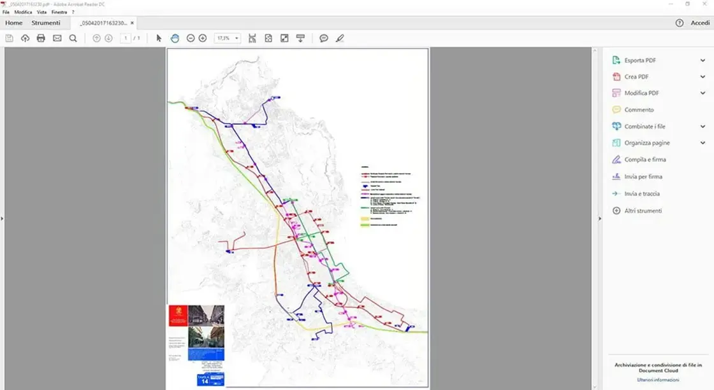
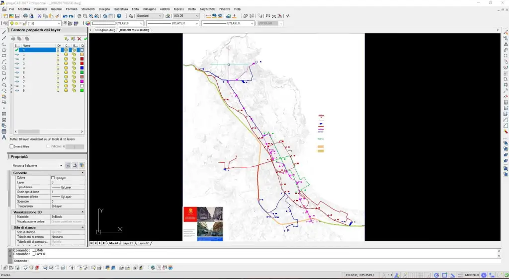
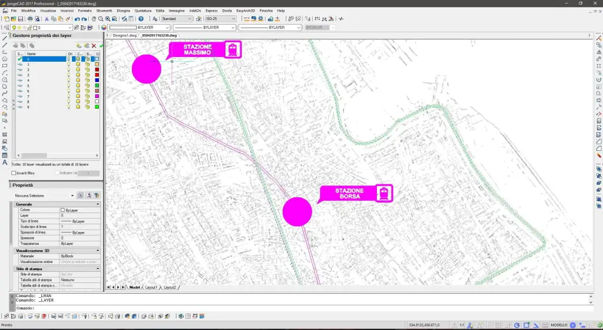
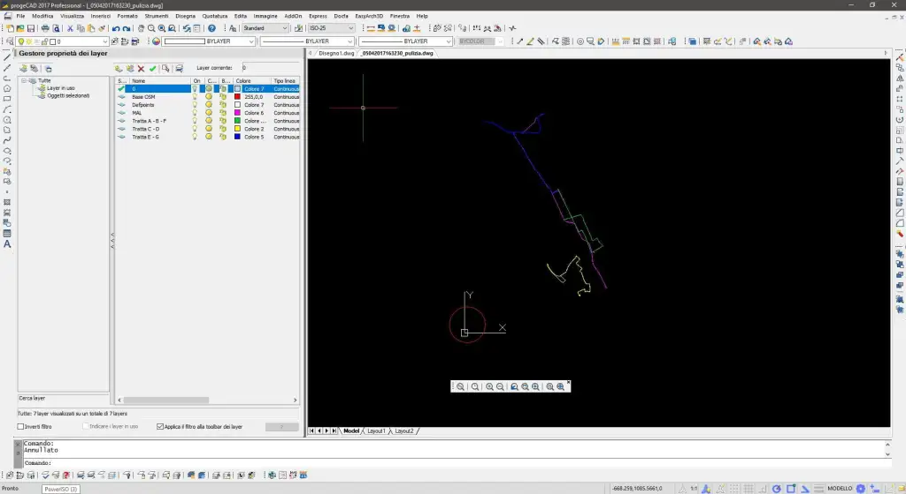
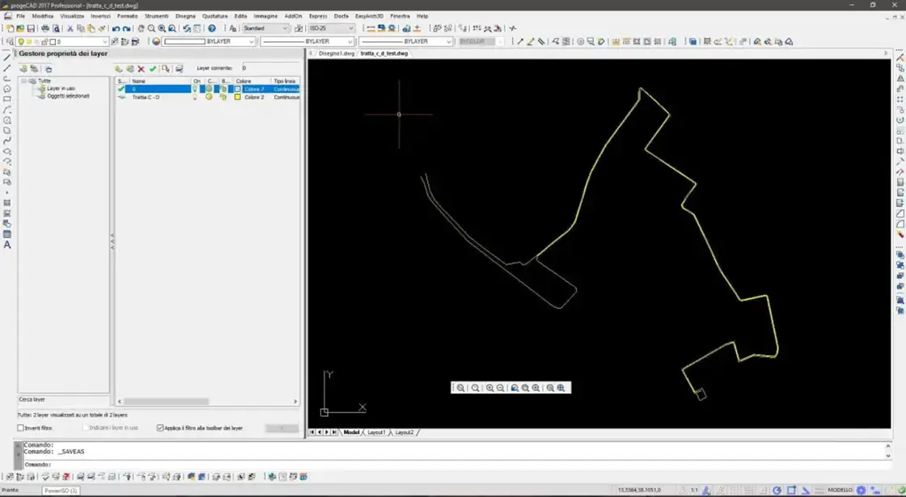
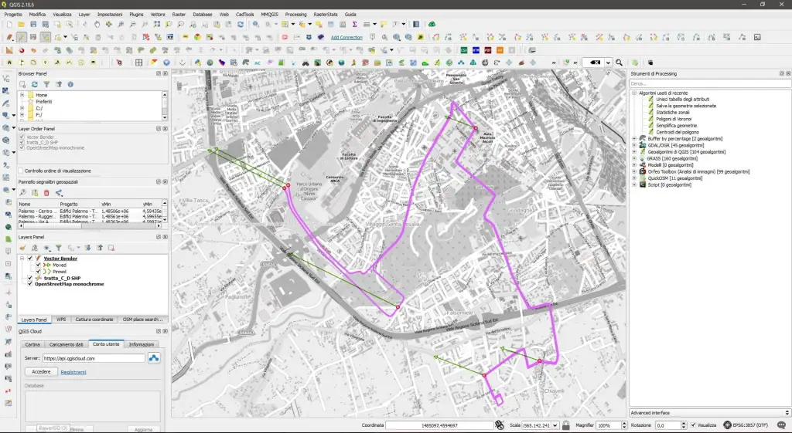
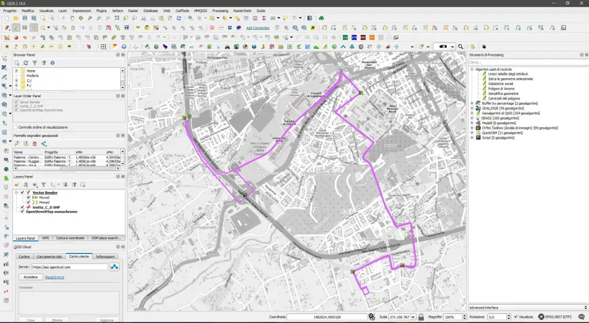
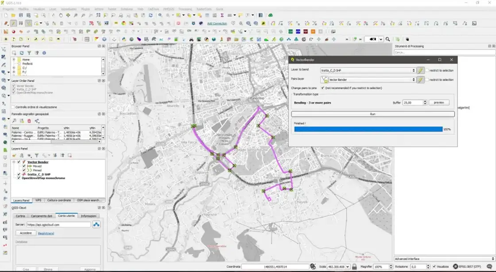
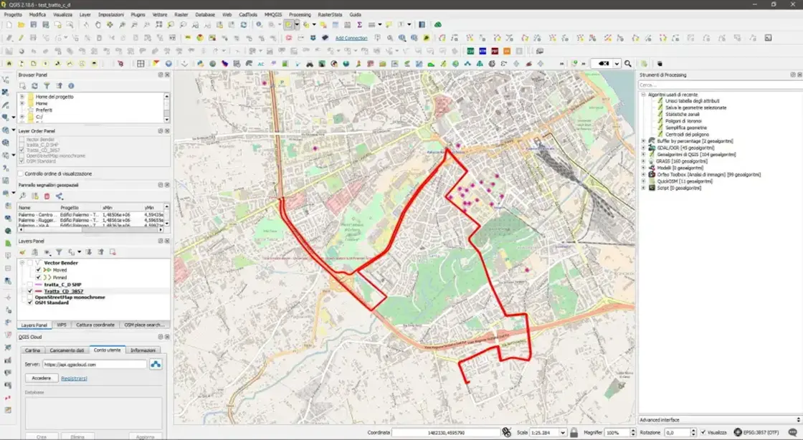

---
title: Tutorial da file pdf a shapefile
description:  Tutorial da file pdf a shapefile
draft: false
date: 2017-05-08
authors:
  - gbvitrano
categories:
  - Tutorial
tags:
  - Shapefile
  - pdf
  - shp
  - Palermo
social_image: assets/img/social/pdf.jpg
--- 

[{class="crop gray off" align=right}](index.md) 
Dopo il comunicato stampa sul sito del Comune di Palermo   [Tram – Entra nel vivo la fase di progettazione per le nuove linee verso ZEN-Mondello, Bonagia e lungo la costa](https://www.comune.palermo.it/noticext.php?cat=1&id=13959) con [Ciro Spataro](https://twitter.com/cirospat) abbiamo pensato di fare una delle nostre mappe…ovvero la [mappa del ferro](http://u.osmfr.org/m/143534/) come l’ha chiamata Ciro. 
Per realizzare la mappa c’è quasi tutto, occorrono solo le nuove linee del tram in formato vettoriale.  
Gran parte dei vettori, (linee tram esistenti, passante ferroviario, etc etc) sono reperibili su [OpenStreetMap](https://www.openstreetmap.org/#map=12/38.1373/13.3834), facili da estrarre con [overpass-turbo.eu](http://overpass-turbo.eu/), [qui](https://geomappando.com/2016/04/20/estrarre-dati-openstreetmap-overpass-turbo/)<!-- more --> un articolo molto utile su [geomappando](https://geomappando.com/)  o un interessante [video](https://www.youtube.com/watch?v=I1PkPCbdtDI) di [GISTIPSTER](https://www.youtube.com/channel/UCEkiQYFsotUmbPTufps3TdA).  
In alternativa si può scaricare l’intera cartografia di Palermo, o qualsiasi altra città, da [Estratti OpenStreetMap](http://osm-estratti.wmflabs.org/estratti/Sicilia/Palermo/Palermo),
Per ricavare i vettoriali delle nuove linee del tram abbiamo pensato di usare il file pdf allegato al comunicato stampa [Tavola 14 – planimetria riassuntiva](https://www.comune.palermo.it/js/server/uploads/_05042017163230.pdf) scala 25.000 dell’intero sistema di trasporti su rotaia. 
La stessa e tutte le altre tavole del progetto si trovano sul sito del Comune di Palermo, ([qui](https://www.comune.palermo.it/grandi_opere_tram.php) l’intero progetto in file pdf del trasporto pubblico di massa) 

{ .off-glb }

Screenshot del file pdf [Tavola 14 – planimetria riassuntiva](https://www.comune.palermo.it/js/server/uploads/_05042017163230.pdf) scala 25.000

L’idea è semplice…

1. Convertire il file pdf in dxf
2. Georeferenziare il nuovo file ottenuto con Qgis
3. Verificare il risultato della georeferenziazione e correggere manualmente eventuali imperfezioni.
4. Esportare i nuovi file in versione geojson per umap
### **Conversione da PDF in DXF**
Per la conversione da pdf a dwg/dxf in rete si trovano tanti programmi, open source e non.

Dopo qualche ricerca e qualche test, abbiamo scelto di usare [progeCAD 2017 Professional](http://www.progesoft.com/it/download/) in versione di prova gratuita completa per 30 giorni. Gli stessi risultati si possono ottenere con [DraftSight](https://www.3ds.com/it/prodotti-e-servizi/draftsight/free-download/) o con il più semplice [PDF to DWG Converter](http://anydwg.com/pdf-to-dwg.html).

[Qui](https://youtu.be/eumK91dCrxs?list=PL35E4D721B24623DF) trovate un breve video che spiega come caricare un file pdf in [progeCAD](http://www.progesoft.com/it/download/)

[Qui](https://www.graebert.com/pdfimport/) un video che spiega come caricare un file pdf in [DraftSigh](https://www.3ds.com/it/prodotti-e-servizi/draftsight/free-download/)

{ .off-glb }

Seguendo il [video](https://youtu.be/eumK91dCrxs?list=PL35E4D721B24623DF) dimostrativo di [progeCAD 2017 Professional](http://www.progesoft.com/it/download/) si intuisce facilmente come caricare un file pdf

{ .off-glb }

Dopo qualche minuto di elaborazione il pdf è stato convertito in dwg.

{ .off-glb }

L’importazione è riuscita, adesso non resta che pulire il file e lasciare solo quello che ci interessa.
Come si può notare dalle immagini ad ogni colore presente nel file pdf corrisponde un layer nel dwg.

{ .off-glb }

A questo punto disattiviamo/eliminiamo tutto ciò che non ci interessa e facciamo un po di ordine.

{ .off-glb }

Rinominiamo i layer, così li riconosciamo subito.

{ .off-glb }

Con il comando **elimina**, presente nel menù **File → Utilità → Elimina**

Eliminiamo tutto il superfluo, questa utility, ci consente di tenere il file sempre pulito e leggero.

Una volta ripulito il file, è necessario posizionare le linee sulle coordinate di Palermo, in modo da non complicarci troppo il lavoro con Qgis.

Per far ciò, abbiamo inserito come riferimento esterno, un file georeferenziato e convertito in dxf della base cartografica scaricata da [OpenStreetMap](https://www.openstreetmap.org/#map=12/38.1373/13.3834).

{ .off-glb }

Dal menù **Inserisci → riferimenti esterni,** carichiamo una parte della cartografia OSM, (dallo screenshot si nota poco, ma è quel puntino all’interno del cerchio rosso)

Come si può notare le linee importate dal file pdf, sono fuori scala e posizionate a caso.

Utilizzando il comando **Allinea** e con un po di pazienza riusciamo, traslare le nuove linee del tram sulle coordinate di Palermo.

{ .off-glb }

Adesso le linee, grossolanamente, sono sulle coordinate di Palermo, affineremo la georeferenziazione con Qgis.

Per ottenere un buon risultato finale, è opportuno georeferenziare separatamente le 4 linee che ci interessano.

Di conseguenza salviamo/esportiamo ogni linee in un nuovo file dfx.

{ .off-glb }

Ecco un file dwg con la singola tratta c – d, grossolanamente posizionato sulle coordinate di Palermo.

## La georeferenziazione
Per questa seconda fase è necessario un software gis, nel nostro esempio usiamo [Qgis](https://www.qgis.org/it/site/) e il plugin Plugin Vector Bender spiegato in questo [video](https://www.youtube.com/watch?v=QxWgezMnUUU) da [Salvatore Fiandaca](https://pigrecoinfinito.wordpress.com/)

Per prima cosa importiamo il file dxf in qgis, per farlo abbiamo diversi metodi, usare i plugin  **dxf2shp o dxf import/convert**, o nel caso di file dfx con molte più informazioni si può usare **Spatialite**, tutto spiegato sempre da [Salvatore Fiandaca](https://pigrecoinfinito.wordpress.com/) nel suo blog [pigrecoinfinito](https://pigrecoinfinito.wordpress.com/)

Dove aver caricato il file dxf, salviamo lo stesso in formato shp, perchè sul formato dfx non possiamo fare modifiche.

{ .off-glb }

Attiviamo il plugin Vector Bender ed iniziamo ad inserire punti per la georeferenziazione.

{ .off-glb }

Questo è il risultato di un primo test, più punti inseriamo e più precisi siamo, migliore sarà il risultato finale.

{ .off-glb }

…e dopo qualche  tentativo e dopo alcune correzioni manuali la linea “**sembra**” essere al suo posto. Salviamo il lavoro appena fatto in un nuovo file shp.

{ .off-glb }

Sicuramente non è precisa come l’originale, ma rende l’idea.

Per completare il lavoro, basta ripetere la stessa procedura per le altre 3 linee rimanenti

**Qualcuno si starà chiedendo… Ma non era più semplice ridisegnare le linee…?
Forse si, ma il tempo e la pazienza non mi mancano e soprattutto mi piace sperimentare, magari si può usare questo metodo con file pdf molto più complessi, ed in quel caso si risparmia un bel po di tempo…**

**Disclaimer:** Le informazioni visibili e condivise non comportano la visualizzazione di dati sensibili. Data la natura esclusivamente informativa degli elaborati grafici e dei testi riportati, questi non costituiscono atti ufficiali. Per accedere agli atti ufficiali si rinvia agli elaborati definitivi allegati alle specifiche deliberazioni.